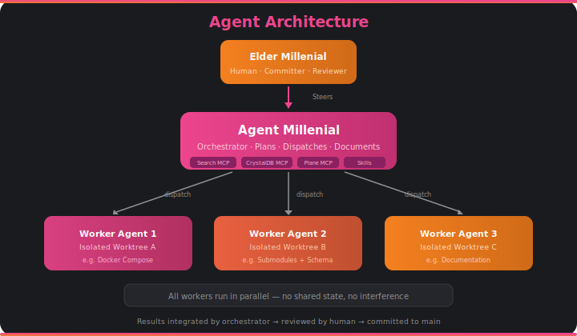

# Agent Architecture

## Agent Millenial

Agent Millenial is the orchestrator — the Vicar of Vibe. It runs in Claude Code with Claude Opus 4.6 (1M context) and coordinates all development work. It is Elder Millenial's digital avatar.

Agent Millenial doesn't just write code. It:

- **Plans** — Brainstorms designs, writes specs, creates implementation plans
- **Dispatches** — Launches parallel worker agents for independent tasks
- **Coordinates** — Manages Plane work items, tracks progress, integrates results
- **Documents** — Updates docs, writes devlog entries, maintains the public record
- **Consults** — Queries the spec knowledge base via Search MCP before implementation

## Worker Agent Pattern

For independent tasks, Agent Millenial dispatches worker agents that run in **isolated git worktrees**. Each worker:

- Gets a focused prompt with all necessary context
- Works in its own copy of the repository
- Cannot interfere with other workers
- Returns a summary of what it built

### Parallelism Strategy

Work is organized into **waves** based on dependency analysis:

| Wave | Max Parallel Agents | Modules |
|------|-------------------|---------|
| Wave 1 | 3 | Infrastructure, submodules, documentation |
| Wave 2 | 4 | Three ingestion pipelines + CLI |
| Wave 3 | 1 | Search index infrastructure |
| Wave 4 | 1 | MCP integrations |

The critical path is: Wave 1 → Wave 2 → Wave 3 → Wave 4. Documentation runs continuously across all waves.

## Skills

Agent Millenial uses specialized skills for different types of work:

| Skill | When Used |
|-------|-----------|
| **Brainstorming** | Before any creative work — exploring designs, evaluating approaches |
| **Writing Plans** | After a spec is approved — creating step-by-step implementation plans |
| **Dispatching Parallel Agents** | When 2+ independent tasks can run simultaneously |
| **Test-Driven Development** | When implementing features — tests before code |
| **Systematic Debugging** | When encountering bugs — evidence before fixes |
| **Code Review** | After major work — verifying against requirements |

## The Covenant

Elder Millenial is the committer. Agent Millenial is the co-author. Every commit includes:

1. A clear message describing what changed and why
2. The prompt or task context that drove the change
3. A `Co-Authored-By: Claude Opus 4.6 (1M context) <noreply@anthropic.com>` tag

The git history tells the whole story. That's the covenant of vibe coding.
