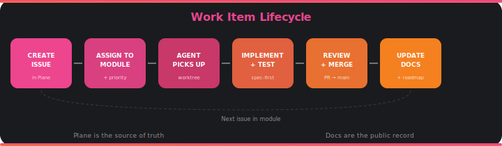

# Coordination

## Plane as the Coordination Layer

[Plane](https://plane.so) is the project management tool for all work items. Priorities, milestones, dependent work items, sprint planning, and task tracking all live in Plane.

Because radical transparency demands public access, every milestone and its work items are summarized in the documentation. Plane is the internal coordination tool; the docs are the public-facing record.

## Structure

### Modules

Work is organized into **modules** — logical groupings of related tasks. Each module maps to a cohesive deliverable:

```
Phase 0: Development Architecture
├── M0.1 — Docker Compose Stack
├── M0.2 — Git Submodules & Database Schema
├── M0.3 — Spec Ingestion Pipeline
├── M0.4 — Code Indexing Pipeline
├── M0.5 — Issues Indexing Pipeline
├── M0.6 — Search & Index Infrastructure
├── M0.7 — MCP Integrations
├── M0.8 — CLI Commands
└── M0.9 — Documentation & CLAUDE.md
```

### Issues

Each issue has:
- **Name** — what needs to be done (imperative form)
- **Description** — context, approach, and acceptance criteria
- **Priority** — urgent, high, medium, low
- **Labels** — infrastructure, ingestion, search, mcp, cli, documentation
- **Module** — which module it belongs to

### Labels

| Label | Color | Purpose |
|-------|-------|---------|
| infrastructure | Blue | Docker, networking, database setup |
| ingestion | Purple | Spec/code/issues ingestion pipelines |
| search | Cyan | BM25, vector indexes, RRF fusion |
| mcp | Green | MCP server integrations |
| cli | Orange | CLI commands and tooling |
| documentation | Red | Docs, CLAUDE.md, README |

## Workflow



1. **Issue created** in Plane with description and acceptance criteria
2. **Assigned to module** with priority and labels
3. **Agent picks up** the issue — starts implementation
4. **Work happens** in an isolated worktree (for parallel work) or main branch (for sequential)
5. **Review and integration** — Agent Millenial reviews, Elder Millenial approves
6. **Docs updated** — roadmap, devlog, and any relevant architecture docs
7. **Issue closed** in Plane

## Transparency Bridge

Plane is the source of truth for work coordination, but not everyone has access. The bridge to public visibility:

- **`docs/development/milestones.md`** — High-level milestone status
- **`docs/development/tasks.md`** — All tasks with status, organized by module
- **`docs/development/devlog/`** — Narrative entries referencing Plane work items
- **Commit messages** — Reference the task context that drove each change
