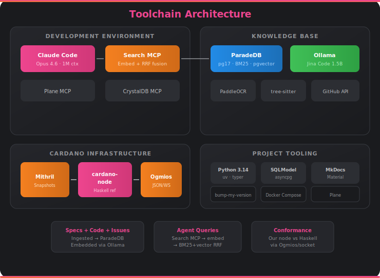

# Toolchain

Every tool in the stack was chosen for a reason. Here's what we use, why, and how it fits together.

## Architecture

## Tools

### Core Development

| Tool | Version | Purpose |
|------|---------|---------|
| **Python** | 3.14 | Primary implementation language |
| **uv** | Latest | Package management and virtual environments |
| **typer** | 0.15+ | CLI framework for `vibe-node` commands |
| **SQLModel** | 0.0.37+ | Database schema definitions and validation |
| **asyncpg** | 0.31+ | Async PostgreSQL driver |

### AI & Embeddings

| Tool | Version | Purpose |
|------|---------|---------|
| **Claude Code** | Latest | AI-assisted development environment |
| **Claude Opus 4.6** | 1M context | Primary model for all development |
| **Ollama** | Latest | Cross-platform embedding inference (Mac Metal, Linux NVIDIA, CPU) |
| **Jina Code Embeddings 1.5B** | GGUF Q8_0 | Code-specialized embedding model (1536-dim) |

### Knowledge Base

| Tool | Version | Purpose |
|------|---------|---------|
| **ParadeDB** | pg17 | Document database with BM25 (pg_search) + vector (pgvector) search |
| **PaddleOCR** | v5 (Docker sidecar) | PDF-to-Mathpix-markdown conversion with equation detection |
| **pandoc** | 3.9+ | LaTeX-to-markdown conversion with KaTeX math |
| **tree-sitter-haskell** | Latest | AST-aware function-level Haskell code chunking |
| **Docker Compose** | Latest | Container orchestration for all dev infrastructure |

### Cardano Infrastructure

| Tool | Version | Purpose |
|------|---------|---------|
| **cardano-node** | Latest | Haskell reference node for conformance testing |
| **Mithril** | Latest | Fast snapshot-based chain sync |
| **Ogmios** | Latest | JSON/WebSocket interface to cardano-node |

### Documentation & Project Management

| Tool | Version | Purpose |
|------|---------|---------|
| **MkDocs Material** | 9.7+ | Documentation site with Mermaid diagrams and math rendering |
| **Plane** | Hosted | Work item tracking — modules, issues, priorities, milestones |
| **bump-my-version** | 1.2+ | Semantic versioning with dev tags |

### MCP Integrations

| MCP | Purpose |
|-----|---------|
| **Search MCP** | Embed queries + RRF fused search across specs, code, and issues |
| **CrystalDB MCP** | Raw SQL access to ParadeDB for ad-hoc queries |
| **Plane MCP** | Work item management from within Claude Code |

---

## Tool Descriptions

### Python 3.14

Python is the primary language for vibe-node — and the choice is strategic, not just comfortable. No existing alternative Cardano node uses Python, which means our implementation is original by construction and avoids MOSS/JPlag structural similarity concerns entirely. Python 3.14 brings the latest performance improvements, and the language's expressiveness lets us move fast during the spec-implementation-test cycle. When Python genuinely can't meet memory or throughput requirements, we reach for Rust/C extensions — but only when profiling proves it necessary, not before.

### Claude Code + Opus 4.6

Claude Code is the AI-assisted development environment where Agent Millenial lives. Powered by Claude Opus 4.6 with a 1M token context window, it can hold entire subsystems in context at once — the spec, the Haskell reference implementation, the test output, and the code being written. This isn't autocomplete. It's an orchestrator that plans implementations, dispatches parallel worker agents in isolated worktrees, queries the knowledge base for spec references, and documents everything in the commit history. The 1M context means we can feed it an entire formal spec section alongside the Haskell implementation and ask it to build our Python version.

### Ollama

Ollama serves our embedding model (Jina Code 1.5B) with a single Docker container that works on Mac (Metal GPU), Linux (NVIDIA), and CPU — no platform-specific configuration, no CUDA drivers, no GPU reservation config. We chose it over vLLM specifically because Docker containers on Mac cannot access Apple Metal, and reproducibility matters more than raw throughput for a development tool. Ollama exposes an OpenAI-compatible `/v1/embeddings` endpoint, so our code doesn't care what's serving the model. The embedding model is pinned to a SHA256 digest and verified on every pull.

### Jina Code Embeddings 1.5B

This is the embedding model that powers all semantic search across the knowledge base. Built on Qwen2.5-Coder-1.5B by Jina AI, it understands code structure — not just text. It produces 1536-dimensional vectors optimized for code-to-code, text-to-code, and code-to-text retrieval across 15+ programming languages (including Haskell via the Qwen2.5-Coder pretraining). We use the official GGUF Q8_0 quantization (1.6 GB) pulled directly from Jina's HuggingFace repo, ensuring verifiable authenticity. Any deficiencies in embedding quality are mitigated by BM25 keyword search via reciprocal rank fusion — exact function names and type signatures are captured by keyword matching even when the embedding model misses semantic nuance.

### ParadeDB

ParadeDB is PostgreSQL 17 with two critical extensions: pg_search (BM25 full-text search) and pgvector (vector similarity search). This gives us Elasticsearch-quality keyword search and vector search in a single database — no separate search cluster, no data synchronization, no operational complexity. Reciprocal rank fusion (RRF) combines both search types in a single query, and the results are filterable by era, release tag, repository, date range, and content type. We chose ParadeDB over separate Elasticsearch + Pinecone/Weaviate stacks because one database is simpler, more reliable, and easier to snapshot/restore.

### tree-sitter-haskell

tree-sitter is a parser framework that produces concrete syntax trees fast enough for real-time use. We use the Haskell grammar to parse every `.hs` file in the Cardano codebase at function level — extracting function definitions, type signatures, data declarations, class definitions, and instance declarations with exact line ranges. This is what lets us ask "show me how `applyBlock` changed between releases 8.x and 9.x" — each function is a separately indexed, separately embedded chunk with its module name, file path, and era. Without AST-aware parsing, we'd be stuck with arbitrary token windows that split functions mid-definition.

### pandoc

pandoc converts the formal Cardano specifications from LaTeX to markdown with preserved mathematical notation. The Cardano specs are dense with inference rules, set theory, and formal notation — `\begin{equation*}` environments, custom `@{}` column separators, and hundreds of custom macros. We use pandoc with `--katex` and `--to=markdown-raw_html+tex_math_dollars` to produce clean markdown with `$...$` math delimiters that render correctly in MkDocs via MathJax. Post-processing strips HTML entities and unsupported column specs. This is how we make the Shelley formal spec browsable and searchable.

### PaddleOCR

PaddleOCR converts the Ouroboros academic papers (which exist only as PDFs) into Mathpix markdown with `$...$` and `$$...$$` math delimiters — preserving the mathematical notation that's critical for understanding formal protocol descriptions. It runs as a Docker sidecar service on Python 3.13 (PaddleOCR doesn't have Python 3.14 wheels), exposing an HTTP API that our ingestion pipeline calls. Each PDF is processed page-by-page via PyMuPDF rendering to images, then OCR'd with PaddleOCR's text detection and recognition models. The heuristic math detector wraps lines with high density of mathematical symbols in dollar-sign delimiters. The papers are auto-downloaded from IACR ePrint and Dagstuhl on first ingestion. Note: processing is slow on CPU (~minutes per page on ARM64 Docker) — a GPU setup would dramatically improve throughput.

### Mithril

Mithril is IOG's fast chain sync protocol. Instead of syncing the Cardano blockchain from genesis (which takes days), Mithril downloads a cryptographically verified snapshot of the chain state and lets the cardano-node start from there. Our Docker Compose stack runs the Mithril client as an init container that downloads the latest preprod snapshot, verifies it against the genesis and ancillary keys, and exits — then the cardano-node starts from the snapshot. This is what makes `vibe-node infra up` give you a synced node in minutes instead of days.

### Ogmios

Ogmios is a JSON/WebSocket bridge to the cardano-node. Instead of speaking the raw Ouroboros miniprotocols over Unix sockets (which is what we'll eventually implement), Ogmios lets us query chain state, submit transactions, and compare block validation through a friendly HTTP API. During development, this is our primary interface for conformance testing — we can ask Ogmios "what does the Haskell node think about block X?" and compare it to our own implementation's answer. It's the oracle of truth made accessible.

### Plane

Plane is our project management tool — modules, issues, labels, priorities, and milestones all live there. It replaces the "just use GitHub Issues" approach with a proper coordination layer that supports dependent work items, sprint planning, and structured task tracking. Because radical transparency demands public access, every milestone and work item is summarized in the documentation — Plane is the internal coordination tool, the docs are the public-facing record. Agent Millenial interacts with Plane via MCP to create issues, update status, and track progress without leaving the development environment.

### MkDocs Material

MkDocs Material is the documentation framework — it renders our markdown pages into a searchable, navigable site with dark/light mode, Mermaid diagram support, MathJax for mathematical notation, and code syntax highlighting. We use it with custom CSS matching the SteelSwap brand palette (pink-to-orange gradients, warm dark backgrounds) and SVG infographics for the public-facing methodology documentation. The docs deploy automatically to GitHub Pages via a GitHub Actions workflow on every push to main.
