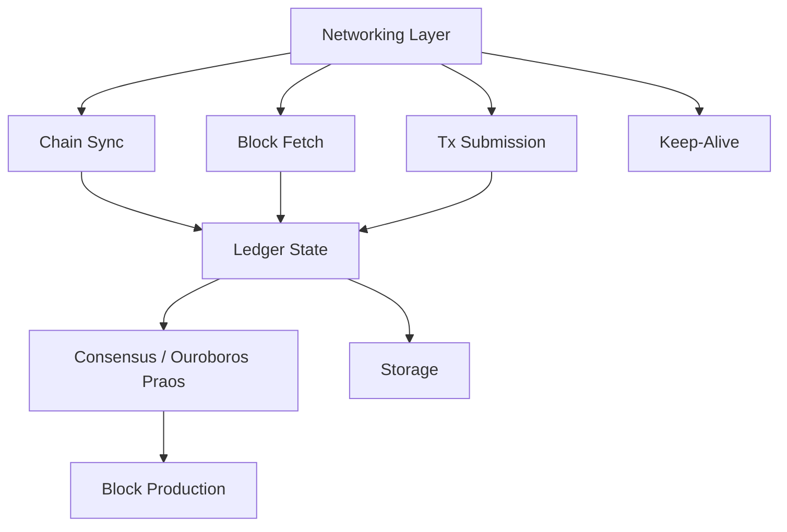

# Architecture Overview

!!! note "Under Construction"
    Architecture documentation will be built incrementally as the node takes shape. Each major subsystem gets its own design doc with rationale, alternatives considered, and conformance testing approach.

## High-Level Components

## Design Principles

- **Correctness first.** The Haskell node is the oracle. If we disagree, we're wrong.
- **Stream everything.** Minimize memory by processing data incrementally.
- **Python until proven otherwise.** Reach for Rust/C extensions only when profiling demands it.
- **Test at the boundary.** Conformance tests against the Haskell node are the gold standard.
