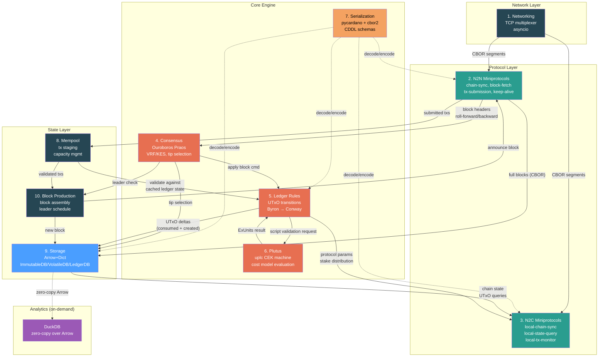
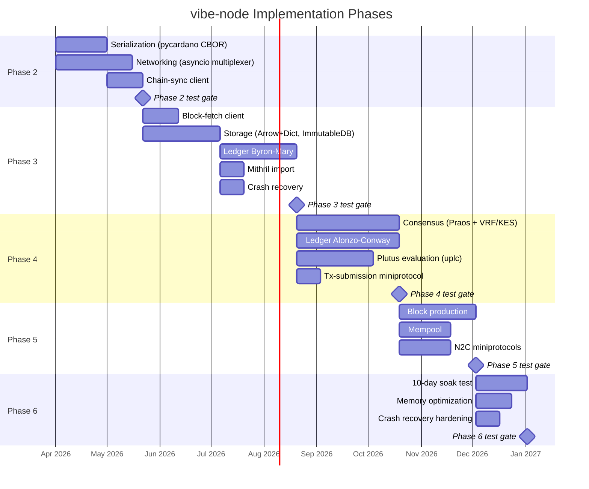
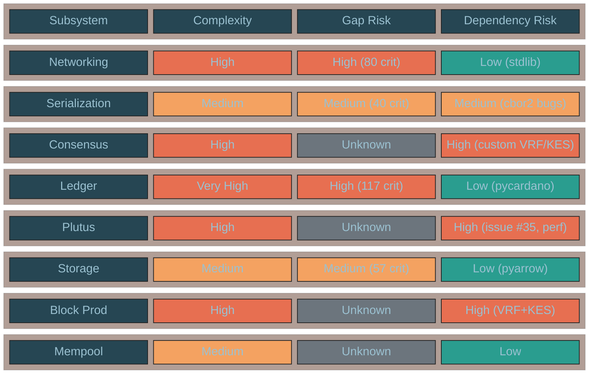

# Architecture Blueprint

This is the authoritative design document for vibe-node. It synthesizes all Phase 1 research — subsystem decomposition, data architecture benchmarks, library audit, gap analysis, and test strategy — into a single blueprint that guides implementation through Phases 2-6.

## Design Philosophy

Four principles govern every implementation decision:

1. **Spec-first, Haskell as oracle.** We implement from the published formal specifications (Shelley, Alonzo, Babbage, Conway ledger specs, Ouroboros papers, CDDL schemas). When the spec is ambiguous, the Haskell node is the source of truth. Every divergence between spec and Haskell is recorded in the [gap analysis](../specs/gap-analysis.md).

2. **Incremental conformance.** Each phase produces a testable deliverable verified against the running Haskell node. We never build a subsystem in isolation — every layer is proven before the next builds on it.

3. **Measure everything.** No optimization without profiling. No architecture claim without benchmarks. Memory, throughput, and conformance are measured in CI from day one.

4. **Lean dependencies.** Every dependency is attack surface. We use mature, well-maintained libraries (pycardano, pyarrow, uplc) and build only what doesn't exist (VRF, KES). Total non-stdlib dependency footprint: ~37 MB core, ~137 MB with analytics.

---

## System Architecture

### Data Flow Diagram

This diagram shows the actual data flowing between subsystems — blocks, transactions, UTxOs, and protocol state — not just dependency arrows.

### Key Design Decisions

| Decision | Choice | Alternative Rejected | Rationale |
|----------|--------|---------------------|-----------|
| **Storage engine** | Arrow + Python dict | LMDB, DuckDB, SQLite, Lance | 86x faster block apply, 9x faster lookups vs LMDB. See [Data Architecture](data-architecture.md) |
| **Serialization** | pycardano (wraps cbor2 + PyNaCl) | Custom CBOR codec | Covers all eras, 27 contributors, MIT license. See [Library Audit](library-audit.md) |
| **Plutus evaluator** | uplc (OpShin) | Custom CEK machine, pyaiken | 87 builtins, 811 conformance tests, full cost model. See [Library Audit](library-audit.md) |
| **Networking** | asyncio (stdlib) | trio | Zero dependencies, TaskGroup for structured concurrency, ecosystem compatibility |
| **Crypto (general)** | pycardano (Ed25519) + cryptography (Blake2b/KES) | Custom bindings | Mature, well-maintained, 3.14 wheels available |
| **Crypto (VRF)** | Custom libsodium FFI | None available | No Python lib implements ECVRF-ED25519-SHA512-Elligator2 |
| **Analytics** | DuckDB zero-copy over Arrow | Separate OLAP DB | Zero data movement — DuckDB reads Arrow tables directly |
| **Language** | Python 3.14 | Rust, Go, etc. | No existing alternative node uses Python (MOSS/JPlag clean), rapid development |

---

## Acceptance Criteria Mapping

Each of the 9 acceptance criteria from the challenge maps to specific phase deliverables:

| # | Acceptance Criterion | Phase | Subsystems | Test Gate |
|---|---------------------|-------|------------|-----------|
| 1 | **Sync from Mithril snapshot or genesis to tip** | 3 | Storage, Serialization, N2N | Sync preprod from Mithril to tip |
| 2 | **Produce valid blocks** accepted by other nodes | 5 | Block Production, Consensus, Mempool | Blocks accepted by Haskell nodes on preview/preprod |
| 3 | **All node-to-node miniprotocols** | 2-3 | Networking, N2N Miniprotocols | chain-sync, block-fetch, tx-submission, keep-alive operational |
| 4 | **All node-to-client miniprotocols** | 5 | Networking, N2C Miniprotocols | local-chain-sync, local-tx-submission, local-state-query, local-tx-monitor operational |
| 5 | **Run in private devnet** alongside 2 Haskell nodes | 4-5 | All | 3-node devnet stable for 24h |
| 6 | **Match or beat Haskell** in average memory over 10 days | 6 | Storage, Ledger | RSS <= Haskell RSS, measured continuously |
| 7 | **Agree on tip selection** within 2160 slots for 10 days | 4-6 | Consensus, Ledger | Tip delta < 2160 slots for 10 continuous days |
| 8 | **Recover from power-loss** without human intervention | 3-6 | Storage | Kill -9 + restart, resumes within 3 seconds |
| 9 | **Agree with Haskell** on block/tx validity and chain tip | 4-6 | Ledger, Consensus, Plutus | Zero divergence on conformance test suite |

---

## Per-Subsystem Implementation Approach

### Spec Rules and Gap Analysis (from database)

| Subsystem | Spec Rules | QA Gaps (total) | Critical | Important | Risk |
|-----------|-----------|-----------------|----------|-----------|------|
| **Serialization** | 222 | 158 | 40 | 28 | Medium |
| **Networking** | 337 | 244 | 80 | 78 | High |
| **Miniprotocols (N2N)** | 71 | 45 | 10 | 14 | Medium |
| **Miniprotocols (N2C)** | — | — | — | — | Medium |
| **Consensus** | 50 | — | — | — | High |
| **Ledger** | 490 | 414 | 117 | 106 | High |
| **Plutus** | — | — | — | — | High |
| **Mempool** | — | — | — | — | Medium |
| **Storage** | 345 | 239 | 57 | 89 | Medium |
| **Block Production** | — | — | — | — | High |

!!! note "Gap counts"
    Dashes indicate subsystems not yet through QA-validated gap analysis. Consensus, Plutus, Mempool, N2C, and Block Production gap analysis will be completed as those phases begin.

### Test Specifications (from database)

| Subsystem | Unit | Conformance | Property | Integration | Replay | Total |
|-----------|------|-------------|----------|-------------|--------|-------|
| **Serialization** | 1,284 | 141 | 500 | 5 | 8 | 1,938 |
| **Networking** | 1,972 | 198 | 683 | 82 | — | 2,935 |
| **Miniprotocols (N2N)** | 344 | 42 | 92 | 30 | 2 | 510 |
| **Consensus** | 259 | 28 | 104 | 6 | — | 397 |
| **Ledger** | 2,921 | 280 | 1,058 | 33 | 6 | 4,298 |
| **Storage** | 1,844 | 114 | 691 | 141 | 1 | 2,791 |
| **Total** | **8,624** | **803** | **3,128** | **297** | **17** | **12,869** |

---

### 1. Serialization

**Approach:** USE pycardano for CBOR encoding/decoding across all eras. pycardano wraps cbor2 (pure Python mode to avoid C extension bugs) and handles Cardano-specific CBOR tags (tag 24 for embedded CBOR, tag 258 for sets). Build era-specific block decoders on top of pycardano's `CBORSerializable` base class.

**Key modules:** `vibe.cardano.serialization` — CBOR codecs, CDDL validation, era-specific block decoders

**Haskell reference:** `cardano-ledger-binary`, per-era CDDL schemas

**Critical gaps:** 40 critical, 28 important (158 total QA-validated)

**Risk:** Medium — pycardano covers most cases; main risk is CBOR round-trip fidelity on edge cases at scale

**Phase:** 2

### 2. Networking / Multiplexer

**Approach:** BUILD a TCP multiplexer on asyncio stdlib. The Cardano multiplexer is a custom segment-framed protocol with backpressure over long-lived connections. We implement the bearer abstraction, segment framing, and mini-protocol dispatch from the ouroboros-network-framework spec.

**Key modules:** `vibe.core.multiplexer` — TCP bearer, segment framing, connection manager

**Haskell reference:** `network-mux`, `ouroboros-network-framework`

**Critical gaps:** 80 critical, 78 important (244 total QA-validated)

**Risk:** High — most spec gaps of any subsystem; custom implementation from spec

**Phase:** 2

### 3. N2N Miniprotocols

**Approach:** BUILD typed state machines for chain-sync, block-fetch, tx-submission, and keep-alive. Each miniprotocol is a state machine with well-defined transitions from the ouroboros-network-protocols spec.

**Key modules:** `vibe.cardano.network` — chain-sync client, block-fetch client, tx-submission client/server, keep-alive

**Haskell reference:** `ouroboros-network-protocols`, `ouroboros-network`

**Critical gaps:** 10 critical, 14 important (45 total QA-validated)

**Risk:** Medium — well-specified protocols; state machine pattern is clean

**Phase:** 2 (chain-sync), 3 (block-fetch, tx-submission)

### 4. N2C Miniprotocols

**Approach:** BUILD local protocol servers using the same state machine framework as N2N. Local chain-sync, local tx-submission, local state-query, and local tx-monitor serve client applications (wallets, explorers).

**Key modules:** `vibe.cardano.network` — local protocol server implementations

**Haskell reference:** `ouroboros-network-protocols` (local variants)

**Critical gaps:** Not yet QA-validated

**Risk:** Medium — mirrors N2N patterns; state-query has the most complex query set

**Phase:** 5

### 5. Consensus (Ouroboros Praos)

**Approach:** BUILD from the Ouroboros Praos paper and ouroboros-consensus package. Leader election via VRF, chain selection by block number (density), tip selection with the *k*-deep finality rule. VRF requires custom libsodium FFI. KES uses sum-composition over Ed25519 from the `cryptography` library.

**Key modules:** `vibe.cardano.consensus` — protocol state, chain selection, leader check, VRF/KES, hard fork combinator

**Haskell reference:** `ouroboros-consensus`, `ouroboros-consensus-protocol`, `cardano-crypto-praos`

**Critical gaps:** Not yet QA-validated (50 spec rules identified)

**Risk:** High — VRF/KES are custom builds; consensus edge cases not fully covered by specs; hard fork combinator is complex

**Phase:** 4

### 6. Ledger Rules

**Approach:** BUILD the STS (small-step transition semantics) framework from the formal specs. Implement UTxO transitions, delegation, protocol parameters, rewards, and governance for each era (Byron through Conway). USE pycardano for transaction types and address handling.

**Key modules:** `vibe.cardano.ledger` — per-era STS rules, UTxO state, delegation, governance

**Haskell reference:** `cardano-ledger` (all era packages), `libs/small-steps`

**Critical gaps:** 117 critical, 106 important (414 total QA-validated) — highest gap count of any subsystem

**Risk:** High — largest subsystem (490 spec rules), most complex era transitions, highest gap count

**Phase:** 3 (Byron-Mary), 4-5 (Alonzo-Conway)

### 7. Plutus

**Approach:** USE uplc (OpShin) for UPLC evaluation with full cost model. All 87 builtins through Conway/PlutusV3, 811 acceptance tests from Haskell conformance suite. Fix consensus-critical issue #35 (duplicate map keys) upstream. Use pyaiken as conformance testing oracle.

**Key modules:** `vibe.cardano.plutus` — script validation bridge, cost model application, phase-2 validation context

**Haskell reference:** `plutus-core`, `plutus-ledger-api`

**Critical gaps:** Not yet QA-validated

**Risk:** High — pure Python CEK machine is 10-100x slower than Haskell; issue #35 is consensus-critical; cost model verified against Aiken not Haskell

**Phase:** 4 (evaluation), 5 (production use)

### 8. Mempool

**Approach:** BUILD from ouroboros-consensus Mempool module. Transaction staging with validation against a cached ledger state snapshot. Capacity management based on max block body size. Re-validation on tip change.

**Key modules:** `src/vibe_node/mempool` — tx buffer, capacity manager, re-validation

**Haskell reference:** `ouroboros-consensus` (Mempool)

**Critical gaps:** Not yet QA-validated

**Risk:** Medium — well-defined in Haskell; main complexity is re-validation performance

**Phase:** 5

### 9. Storage

**Approach:** USE PyArrow for Arrow tables + Python dict for O(1) lookups. ImmutableDB as chunked flat files (CBOR, append-only). VolatileDB and LedgerDB as Arrow tables with dict indexes. Crash recovery via periodic Arrow IPC snapshots + diff replay log. DuckDB for zero-copy analytics. SQLite for chain metadata.

**Key modules:** `vibe.core.storage` — storage abstractions; `vibe.cardano.storage` — ChainDB coordinator, ImmutableDB, VolatileDB, LedgerDB

**Haskell reference:** `ouroboros-consensus` (Storage)

**Critical gaps:** 57 critical, 89 important (239 total QA-validated)

**Risk:** Medium — Arrow+Dict is benchmarked and proven; main risk is crash recovery correctness

**Phase:** 3

### 10. Block Production

**Approach:** BUILD from ouroboros-consensus and cardano-ledger. Leader schedule check via VRF, block body construction from mempool, header creation with KES signature and VRF proof.

**Key modules:** `src/vibe_node/forge` — leader schedule, block assembly, header signing

**Haskell reference:** `ouroboros-consensus` (block forging) + `cardano-ledger` (block format)

**Critical gaps:** Not yet QA-validated

**Risk:** High — requires VRF + KES (custom builds) + correct leader schedule + valid block format

**Phase:** 5

---

## Implementation Roadmap

### Phase Gantt Chart

### Phase 2 — Serialization and Networking

**Goal:** Decode real mainnet blocks and sync headers via chain-sync.

**Subsystems:** Serialization (pycardano CBOR), Networking (asyncio multiplexer), Chain-sync client

**Deliverables:**

- CBOR block decoder for all eras using pycardano
- TCP multiplexer with segment framing and mini-protocol dispatch
- Chain-sync client that follows the tip of a Haskell node
- Keep-alive mini-protocol

**Test gate:**

- Decode 10,000 real mainnet blocks; block hash matches Haskell output for every block
- Chain-sync client successfully syncs headers from Docker Compose Haskell node
- Multiplexer handles connection lifecycle (connect, multiplex, disconnect, reconnect)

**Scope:** ~222 serialization spec rules, ~337 networking spec rules, ~71 miniprotocol spec rules

### Phase 3 — Storage and Pre-Plutus Ledger

**Goal:** Full block sync from Mithril snapshot, validate pre-Plutus eras.

**Subsystems:** Block-fetch, Storage (Arrow+Dict), Ledger (Byron-Mary), Mithril import, Crash recovery

**Deliverables:**

- Block-fetch client that downloads full blocks
- Arrow+Dict storage engine (ImmutableDB, VolatileDB, LedgerDB)
- Mithril snapshot import pipeline
- Crash recovery with Arrow IPC snapshots + diff replay log
- Ledger validation for Byron, Shelley, Allegra, Mary eras

**Test gate:**

- Import Mithril snapshot and sync to preprod tip
- Agree with Haskell on block validity for all Byron-Mary blocks
- Kill -9 the node, restart, resume sync within 3 seconds
- Memory footprint on preprod under 2 GiB

**Scope:** ~345 storage spec rules, ~490 ledger spec rules (Byron-Mary subset)

### Phase 4 — Consensus and Full Ledger

**Goal:** Full ledger validation (all eras), tip selection agreement with Haskell.

**Subsystems:** Consensus (Ouroboros Praos), Ledger (Alonzo-Conway), Plutus (uplc), Tx-submission

**Deliverables:**

- VRF verification (custom libsodium FFI)
- KES verification (sum-composition over Ed25519)
- Chain selection by block number with *k*-deep finality
- Alonzo-Conway ledger rules (phase-2 script validation, governance)
- Plutus script evaluation via uplc with cost model
- Tx-submission miniprotocol (accept/reject transactions)

**Test gate:**

- Agree with Haskell on tip selection within 2160 slots for 24 continuous hours
- Zero divergence on Alonzo-Conway block validity
- Plutus script evaluation matches Haskell on 1000 real mainnet scripts (budget and result)
- 3-node private devnet stable for 24h

**Scope:** ~50 consensus spec rules, Alonzo-Conway ledger subset, Plutus evaluation

### Phase 5 — Block Production and N2C

**Goal:** Produce valid blocks, serve local queries.

**Subsystems:** Block Production, Mempool, N2C miniprotocols

**Deliverables:**

- Leader schedule computation from VRF
- Block body construction from mempool
- Block header creation with KES signature and VRF proof
- Mempool with capacity management and re-validation
- All N2C miniprotocols (local-chain-sync, local-tx-submission, local-state-query, local-tx-monitor)

**Test gate:**

- Produce blocks accepted by Haskell nodes on preview/preprod
- Mempool accepts/rejects same transactions as Haskell node
- Local state query returns correct UTxO, stake distribution, and protocol parameters
- 3-node devnet (1 vibe-node + 2 Haskell) produces and validates blocks for 48h

### Phase 6 — Hardening

**Goal:** Production readiness. Meet all acceptance criteria.

**Deliverables:**

- 10-day continuous soak test on preprod/mainnet
- Memory optimization (NumPy hash table fallback if needed)
- Crash recovery stress testing (random kills every 30 minutes for 24h)
- Performance profiling and optimization pass

**Test gate:**

- 10-day soak: tip agreement within 2160 slots, zero consensus divergence
- Average RSS <= Haskell node average RSS over 10 days
- Survive 48 random power-loss events without human intervention
- All 9 acceptance criteria passing simultaneously

---

## Risk Analysis

### Per-Subsystem Risk Heatmap

### Dependency Risk Table

| Dependency | Purpose | Known Risks | Mitigation | Fallback |
|-----------|---------|-------------|------------|----------|
| **pycardano** | CBOR serialization, ledger types, Ed25519 | CBOR round-trip fidelity on edge cases; Python 3.14 untested | Conformance test against Haskell-encoded blocks; contribute fixes upstream | Fork if maintenance stalls |
| **uplc** | Plutus script evaluation, cost model | Issue #35 (duplicate map keys) is consensus-critical; cost model verified against Aiken not Haskell; pure Python performance | Fix #35 upstream; verify costs against `cardano-cli evaluate-script`; Cython/Rust acceleration | pyaiken (Rust-backed) as evaluation backend |
| **pyarrow** | Arrow tables, IPC persistence | Large dependency (~20 MB); API stability across versions | Pin version; use focused subset (Table, IPC, compute) | NumPy arrays + custom IPC (much worse DX) |
| **duckdb** | Analytics over Arrow tables | Large dependency (~100 MB); not on hot path | Optional — node runs without it; only used for stake distribution and debugging | Direct Arrow compute functions for aggregation |
| **cryptography** | Blake2b hashing, KES primitives | Large surface area; OpenSSL dependency | Use only specific primitives; pin version | hashlib (stdlib) for Blake2b; PyNaCl for Ed25519 |
| **libsodium (VRF)** | Custom FFI for ECVRF | Platform-specific builds; IOG fork required | Docker-based CI; static linking; test against mainnet VRF proofs | No fallback — VRF is mandatory for consensus |

### Implementation Risk Register

| Risk | Likelihood | Impact | Mitigation |
|------|-----------|--------|------------|
| **Plutus evaluation too slow for sync** | High | High | Profile first; Cython hot path compilation (5-20x); Rust/PyO3 rewrite if needed (50-100x); pyaiken fallback |
| **CBOR round-trip fidelity at scale** | Medium | Critical | Conformance test every mainnet block against Haskell hash; fix upstream in pycardano/cbor2 |
| **Memory footprint exceeds Haskell at 15M UTxOs** | Medium | High | Projected 4.4 GiB vs 24 GiB recommended; NumPy hash table drops to 3.4 GiB; continuous monitoring |
| **Consensus edge cases not in specs** | High | Critical | Test against Haskell node as oracle; fuzz protocol state transitions; study Haskell test suite for edge cases |
| **VRF/KES custom implementation bugs** | Medium | Critical | Test every VRF proof and KES signature from 10,000 mainnet block headers; compare bit-for-bit with Haskell |
| **uplc issue #35 (duplicate map keys)** | Certain | Critical | Fix upstream before Phase 4; add regression test; verify against Haskell on affected mainnet scripts |
| **Hard fork combinator complexity** | High | High | Study ouroboros-consensus HFC closely; implement incrementally era-by-era; test with known hard fork boundaries |
| **Timeline pressure (Amaru/Dingo)** | Medium | Medium | Phase 2-3 is the critical path; sync capability is the proof point; ship incrementally |

---

## Mithril Integration

Mithril provides certified snapshots of the Cardano chain state, enabling sync in minutes rather than days. Snapshots contain the Haskell node's internal database format.

**Import pipeline:**

1. **ImmutableDB chunks** — CBOR-encoded blocks in epoch files. Our ImmutableDB uses the same chunked flat file pattern, so these copy directly with minimal transformation (just rebuilding slot-to-offset indexes).

2. **Ledger state (UTxO set)** — Haskell serializes this as CBOR. We deserialize and bulk-load into an Arrow table + dict. Arrow's batch construction is ideal — build all columns in one shot.

3. **Volatile blocks** — Recent blocks not yet finalized. Parse from CBOR and load into VolatileDB.

The Arrow+Dict architecture is actually faster for Mithril import than LMDB would be — we build the entire table in one batch rather than inserting key-by-key.

See [Data Architecture — Mithril Snapshot Import](data-architecture.md#mithril-snapshot-import) for the full pipeline diagram.

---

## Crash Recovery

The node must recover from power loss without human intervention (acceptance criterion #8).

**Strategy:** Periodic Arrow IPC snapshots + append-only diff replay log.

| Parameter | Value | Rationale |
|-----------|-------|-----------|
| **Snapshot interval** | Every 2,000 slots (~6.7 hours) | Matches Haskell's LedgerDB snapshot frequency |
| **Snapshot format** | Arrow IPC with LZ4 compression | 1.8x smaller than CBOR, zero-copy reload |
| **Diff replay log** | Append-only file, fsynced after each block | At most one block of work lost on crash |
| **Max replay depth** | 2,160 blocks (*k* parameter) | Beyond this, re-sync from Mithril/peers |

**Cold start at mainnet scale:**

- Load Arrow IPC (2.4 GiB, memory-mapped): ~instant
- Rebuild dict index (15M entries): ~1 second
- Replay up to 2,000 blocks of diffs: ~1 second (at 0.37 ms/block)
- **Total: ~2-3 seconds**

See [Data Architecture — Crash Recovery](data-architecture.md#crash-recovery) for the full recovery flow diagram.

---

## Memory Budget (Mainnet Projection)

| Component | Memory | Notes |
|-----------|--------|-------|
| Arrow UTxO table (15M x 175B) | 2.4 GiB | Columnar, zero-copy queryable |
| Python dict index (15M entries) | 1.4 GiB | 99 B/entry; NumPy fallback: 0.3 GiB |
| Diff layer (2,160 blocks x ~600 deltas) | ~0.3 GiB | Bounded deque |
| Python runtime + misc | ~0.3 GiB | Interpreter, imports, buffers |
| **Total (dict index)** | **~4.4 GiB** | |
| **Total (NumPy index)** | **~3.3 GiB** | Fallback if memory-constrained |

**vs Haskell:** 24 GiB recommended (mainnet), 3.4 GiB measured (preprod). Our architecture targets 4-5 GiB on mainnet — about 5x less than the Haskell recommendation.

---

## Package Structure

The package structure is defined in [Node Subsystems](subsystems/index.md#proposed-python-package-structure). In summary:

- **`vibe-core`** — Protocol-agnostic abstractions (multiplexer, state machines, storage interfaces, consensus interface)
- **`vibe-cardano`** — Cardano-specific implementations (ledger rules, miniprotocols, Ouroboros Praos, CBOR codecs, Plutus bridge)
- **`vibe-tools`** — Development infrastructure (spec ingestion, search MCP, database access)
- **`src/vibe_node/`** — Node binary, mempool, block production (the application layer)

This separation allows `vibe-core` to be reused across blockchain implementations while `vibe-cardano` contains all Cardano-specific logic.

---

## What's Next

Phase 2 starts with serialization and networking — the foundation everything else builds on. The first testable deliverable: decode 10,000 real mainnet blocks and sync headers from a Haskell node via chain-sync.

The vibes are immaculate. The blueprint is set. Time to build.
