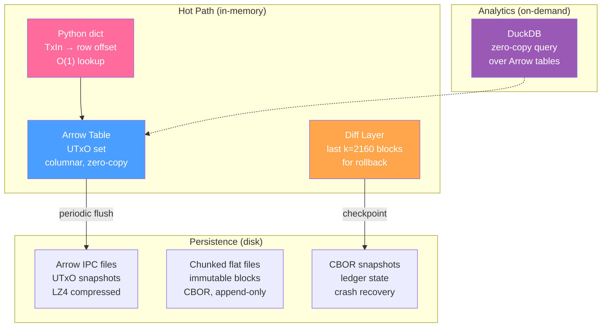
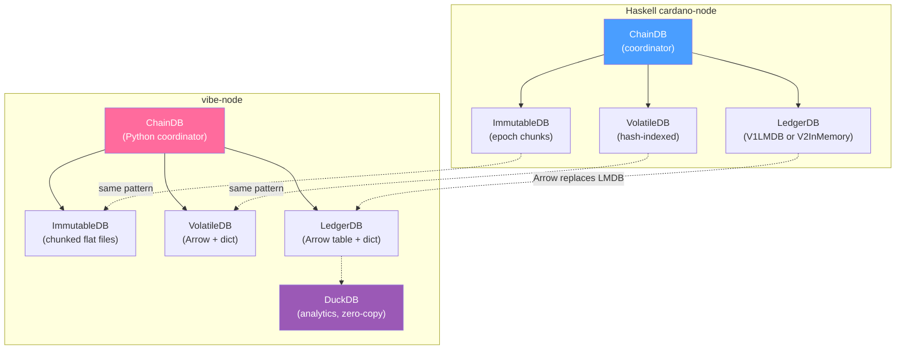
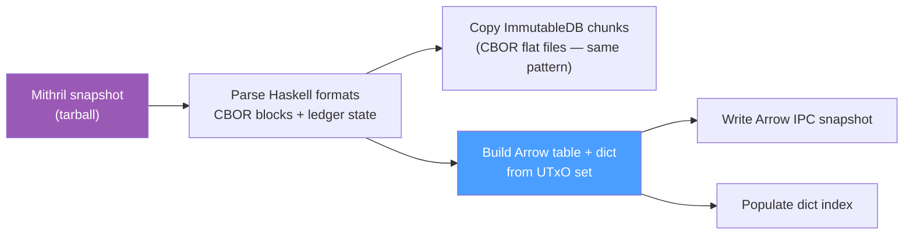
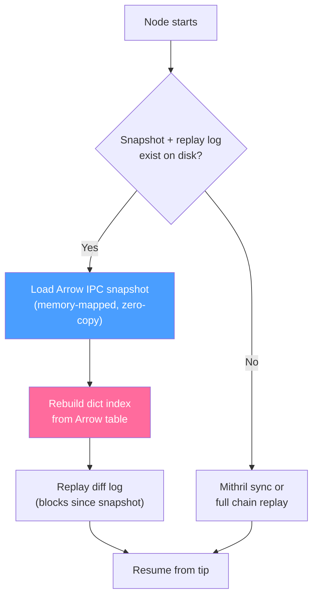
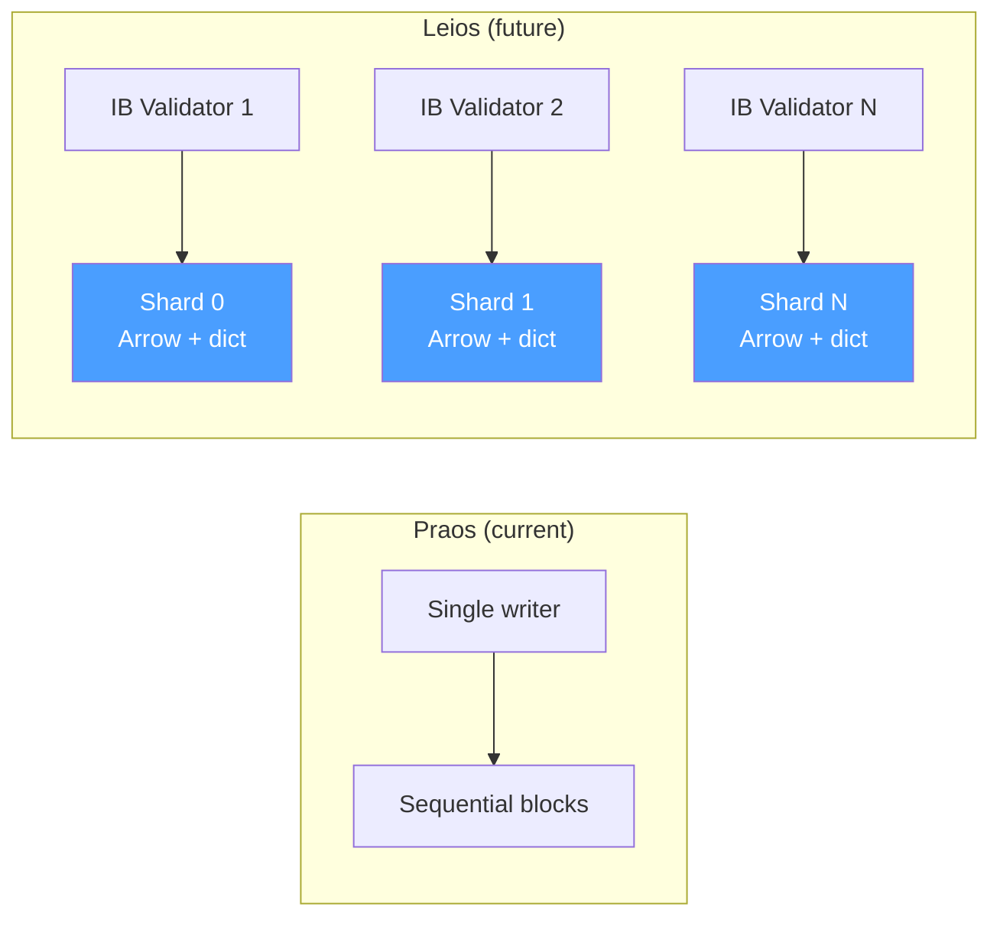

# Data Architecture

This document evaluates storage engine candidates for the vibe-node against Cardano's real-world data access patterns. The goal: pick the storage layer that lets us **match or beat the Haskell node's memory footprint** while hitting the latency targets required for mainnet sync and block production.

## Access Pattern Requirements

A Cardano full node performs seven fundamental data operations. Each has distinct latency, throughput, and concurrency characteristics:

| # | Operation | Frequency | Latency Target | Pattern |
|---|-----------|-----------|----------------|---------|
| 1 | **UTxO lookup** by TxIn (tx_hash + index) | Per-transaction input | < 1 ms | Point read (key-value) |
| 2 | **UTxO lookup** by address | Per-query (node-to-client) | < 10 ms | Range scan (secondary index) |
| 3 | **Block append** to immutable storage | Every ~20 s | < 50 ms | Sequential write (append-only) |
| 4 | **Block apply** — consume + create UTxOs | Every ~20 s | < 100 ms | Batch delete + batch insert |
| 5 | **Rollback** — revert N blocks on volatile chain | Rare (fork resolution) | < 1 s | Delete recent + restore prior |
| 6 | **Ledger state snapshot** for crash recovery | Every ~2000 slots | < 60 s | Full serialization to disk |
| 7 | **Stake distribution snapshot** at epoch boundary | Every ~5 days | < 30 s | Full scan of delegation map |

**Key insight:** Operations 1 and 4 dominate. A syncing node applies blocks as fast as it can fetch them — hundreds per second during initial sync. Each block contains ~300 transactions, each consuming and creating UTxOs. The storage engine must handle **high-frequency point lookups and small batch mutations** with minimal overhead.

## Mainnet Scale

Understanding the dataset size is critical for architecture decisions:

| Metric | Value | Source |
|--------|-------|--------|
| **Active UTxO set** | ~15M entries | cardanoscan.io (March 2025) |
| **UTxO record size** | ~175 bytes avg | 32B tx_hash + 2B index + 57B address + 8B lovelace + datum/script |
| **Raw UTxO data** | ~2.6 GiB | 15M × 175 bytes |
| **Haskell node RAM** | 24 GiB recommended | Sandstone blog (mainnet) |
| **Haskell node RAM** | 3.4 GiB measured | Our preprod node (Docker Compose) |
| **Rolling window** | 2,160 blocks | Last *k* block states kept for rollback |

## Architecture: Arrow + Dict

After benchmarking five candidates (DuckDB, SQLite, LMDB, Lance, Arrow+Dict), we chose a **pure Arrow-native architecture**: Apache Arrow tables for columnar data, a Python `dict` for O(1) point lookups, and Arrow IPC (Feather) files for persistence.

This architecture optimizes for raw speed on the hot path. A secondary benefit is that **DuckDB can query Arrow tables directly with zero copy** — giving us an analytics layer for free without any data movement or ETL.



### Why Arrow + Dict?

The key insight came from benchmarking at 1M UTxOs: **Arrow tables with a Python dict outperform LMDB by 28x on block apply** — the operation that dominates during sync. Python's built-in `dict` gives us the fastest possible point lookups (0.23 μs), and Arrow's columnar layout means DuckDB can query the UTxO set directly for analytics, address lookups, and stake distribution computation — no separate engine, no data copying.

### vibe-node vs Haskell (1M UTxO Benchmark)

| Metric | Haskell (LMDB) | vibe-node (Arrow+Dict) | Advantage |
|--------|---------------|------------------------|-----------|
| **Point lookup** | 2.12 μs/op | 0.23 μs/op | **9.2x vibe-node** |
| **Block apply** | 31.85 ms/block | 0.37 ms/block | **86x vibe-node** |
| **Bulk insert** (1M) | 2.514 s | 0.325 s | **7.7x vibe-node** |
| **Disk size** | 322 MiB | 176 MiB | **1.8x vibe-node** |
| **RSS** | 1,064 MiB | 1,461 MiB | 1.4x Haskell |

*(Benchmarks: 1M synthetic UTxOs, 10K lookups, 100 block-apply cycles × 300 mutations each. Apple Silicon M-series, Python 3.14.)*

Arrow+Dict wins every performance metric. RSS is higher because Python dicts carry per-object overhead (~100 bytes/entry), but the raw speed advantage is overwhelming — block apply is **86x faster** than LMDB.

### DuckDB Analytics Layer

Because Arrow is the in-memory format, DuckDB can query the UTxO set with **zero-copy access**:

```python
import duckdb

# Query the live Arrow table directly — no data movement
result = duckdb.sql("""
    SELECT address, SUM(value) as total_lovelace
    FROM utxo_table
    GROUP BY address
    ORDER BY total_lovelace DESC
    LIMIT 10
""")
```

This gives us:

- **Stake distribution snapshots** — vectorized aggregation at epoch boundaries
- **Address balance queries** — efficient `GROUP BY` over the columnar layout
- **Debugging and analytics** — full SQL over live node state
- **No impedance mismatch** — the OLTP table IS the analytics table

### Memory-Efficient Alternative: NumPy Hash Table

!!! note "If Memory Becomes a Constraint"
    Python `dict` uses ~100 bytes per entry. At 15M mainnet UTxOs, that's ~1.4 GiB just for the index. If memory pressure becomes an issue, a **NumPy open-addressing hash table** offers a 4.5x reduction:

    | Index Type | Bytes/Entry | 15M Index Size | Lookup Speed |
    |------------|------------|----------------|--------------|
    | **Python dict** (selected) | 99 B | 1.4 GiB | 0.23 μs |
    | **NumPy hash table** (fallback) | 22 B | 0.3 GiB | 1.74 μs |

    The NumPy hash table stores keys as `uint64` (TxIn hashed via BLAKE2b), values as `int32` (row indices), and occupied flags as `bool` — 13 bytes per slot at 75% load factor. Lookups are still sub-2μs, but block apply is ~3x slower (1.12 ms vs 0.37 ms per block). Both are well within the 20-second slot target.

    Benchmark source: `benchmarks/data_architecture/bench_dict_memory.py`

### Mainnet Memory Projection

| Component | Memory |
|-----------|--------|
| Arrow UTxO table (15M × 175B) | 2.4 GiB |
| Python dict index (15M entries) | 1.4 GiB |
| Diff layer (2,160 blocks × ~600 deltas) | ~0.3 GiB |
| Python runtime + misc | ~0.3 GiB |
| **Total** | **~4.4 GiB** |

vs Haskell node: **24 GiB recommended** (mainnet), **3.4 GiB measured** (preprod)

Our architecture targets **4–5 GiB on mainnet** — about **5x less** than the Haskell recommendation. If memory becomes tight, switching to the NumPy hash index drops the total to ~3.4 GiB.

## Comparison with Haskell Node Architecture



| Component | Haskell | vibe-node | Rationale |
|-----------|---------|-----------|-----------|
| **LedgerDB** (UTxO set) | LMDB (V1) or in-memory (V2) | Arrow table + Python dict | 86x faster block apply; DuckDB for analytics |
| **VolatileDB** (recent forks) | Hash-indexed files | Arrow table + dict | Same pattern, unified engine |
| **ImmutableDB** (finalized blocks) | Epoch chunk files | Chunked flat files (CBOR) | Same pattern — append-only, slot-indexed |
| **Ledger snapshots** | CBOR serialized files | Arrow IPC (LZ4 compressed) | 1.8x smaller on disk, zero-copy reload |
| **Stake distribution** | Derived at epoch boundary | DuckDB over Arrow table | Zero-copy SQL aggregation — no separate engine |
| **ChainDB** (coordinator) | Haskell coordinator | Python coordinator | Pure logic, no storage dependency |

### Key Differences from Haskell

1. **No LMDB** — We use Arrow tables with a Python dict index instead of LMDB's B+ tree. This gives us 9x faster point lookups (0.23 μs vs 2.12 μs), 86x faster block apply, and columnar analytics for free.

2. **DuckDB for analytics** — Haskell computes stake distributions and balance queries by iterating the UTxO set. We point DuckDB at the Arrow table and run vectorized SQL. Zero data movement, zero ETL.

3. **Arrow IPC for snapshots** — Instead of CBOR serialization, we write Arrow IPC files with LZ4 compression. These are 1.8x smaller on disk and can be memory-mapped for zero-copy reload on startup.

4. **Unified data format** — Haskell uses different storage engines for different components (files, LMDB, in-memory maps). We use Arrow everywhere, reducing cognitive overhead and integration complexity.

## Candidate Evaluations

### DuckDB (Analytics Only)

DuckDB is an OLAP engine optimized for analytical queries. It was **200x slower than LMDB on point lookups** and completely unsuitable for the OLTP hot path. However, its ability to **query Arrow tables with zero copy** makes it ideal as an analytics layer over our Arrow-native storage. We use DuckDB for stake distribution computation, address balance queries, and debugging — never on the block validation hot path.

### SQLite (Metadata Only)

Row-based B-tree with WAL mode. Point lookups are 3.88 μs — 17x slower than Arrow+Dict. Used for metadata storage (peer lists, configuration) where stdlib availability matters.

### LMDB (Superseded)

Memory-mapped B+ tree, matching Haskell's V1LMDB backend. Point lookups at 2.12 μs and block apply at 31.85 ms/block. **Superseded by Arrow+Dict** which is 9x faster on lookups and 86x faster on block apply at 1M UTxOs. LMDB's single-writer limitation also poses risks for future Leios concurrency.

### Lance / LanceDB (Eliminated)

Arrow-native storage with MVCC. Point lookups were **10-100x slower** than Arrow+Dict due to version resolution overhead. Better suited for ML feature stores than OLTP workloads.

### Arrow + Dict (Selected)

Arrow tables for columnar data, Python dict for O(1) lookups, Arrow IPC files for persistence. Fastest on every performance metric. DuckDB queries the Arrow tables directly for analytics.

## Benchmark Results (1M UTxOs)

All benchmarks: 1,000,000 synthetic UTxO records, 10,000 point lookups, 100 block-apply cycles of 300 mutations each. Apple Silicon M-series, Python 3.14.

### Full Comparison

| Engine | Bulk Insert | Lookup (μs/op) | Block Apply (ms/block) | RSS | Disk |
|--------|------------|----------------|------------------------|-----|------|
| **Arrow+Dict** | 0.325 s | **0.23** | **0.37** | 1,461 MiB | **176 MiB** |
| **Arrow+NumPy** | 0.899 s | 1.74 | 1.12 | 1,461 MiB | 176 MiB |
| **LMDB** | 2.514 s | 2.12 | 31.85 | 1,064 MiB | 322 MiB |
| **SQLite** | 3.769 s | 3.88 | 38.37 | 1,461 MiB | 274 MiB |

### Analysis

- **Arrow+Dict dominates the hot path** — 9x faster lookups and 86x faster block apply vs LMDB. During initial sync (hundreds of blocks per second), this difference is the gap between keeping up and falling behind.
- **Arrow+NumPy is the memory-optimized variant** — 4.5x less memory for the index (22 B vs 99 B per entry), still 28x faster than LMDB on block apply. Available as a fallback if the ~1.4 GiB dict at mainnet scale becomes a concern.
- **LMDB's RSS advantage is misleading** — `ru_maxrss` captures peak RSS across all benchmark runs. LMDB's `mmap` reserves address space but actual resident pages depend on access patterns.
- **DuckDB (not shown)** was tested at 200K and eliminated from the hot-path comparison. It remains valuable as a zero-copy analytics layer over Arrow tables.

## Mithril Snapshot Import

[Mithril](https://mithril.network/) provides certified snapshots of the Cardano chain state, allowing nodes to sync in minutes rather than days. Mithril snapshots are tarballs of the **Haskell node's database directory** — they use the Haskell node's internal formats, not ours.

### Import Pipeline



1. **ImmutableDB chunks** — These are CBOR-encoded blocks in epoch files. Our ImmutableDB uses the same chunked flat file pattern, so these can be **copied directly** into place with minimal transformation (just updating our slot-to-offset indexes).

2. **Ledger state (UTxO set)** — The Haskell node serializes this as CBOR. We deserialize it and bulk-load into an Arrow table + dict. Arrow's batch construction is ideal here — build all columns at once from the parsed data.

3. **Volatile blocks** — Recent blocks not yet finalized. Parse from CBOR and load into our VolatileDB (Arrow table + dict, hash-indexed by block hash).

The storage format choice (Arrow vs LMDB) doesn't affect Mithril compatibility. Either way, we'd need to deserialize the Haskell CBOR format and re-load into our structures. Arrow's bulk insert is actually faster for this use case — we build the entire table in one shot rather than inserting key-by-key into LMDB.

## Crash Recovery

The node must recover from power loss without human intervention (acceptance criterion #8). Our strategy combines periodic Arrow IPC snapshots with a diff-layer replay log.

### Recovery Flow



### Snapshot Strategy

| Parameter | Value | Rationale |
|-----------|-------|-----------|
| **Snapshot interval** | Every 2,000 slots (~6.7 hours) | Matches Haskell's LedgerDB snapshot frequency |
| **Snapshot format** | Arrow IPC with LZ4 compression | 1.8x smaller than CBOR, zero-copy reload |
| **Diff replay log** | Append-only file of block deltas | Replayed on startup to catch up from last snapshot |
| **Max replay depth** | 2,160 blocks (*k* parameter) | If more blocks behind, re-sync from Mithril/peers |

**On clean shutdown:** Write a final snapshot + flush the diff log. Next startup loads instantly.

**On unclean shutdown (power loss):** Load the last good snapshot from disk, then replay the diff log to recover blocks applied since the snapshot. The diff log is append-only and fsynced after each block, so at most one block of work is lost.

**Startup cost at mainnet scale:**

- Load Arrow IPC (2.4 GiB, memory-mapped): ~instant
- Rebuild dict index (15M entries): ~1 second (bulk dict construction)
- Replay ≤2,000 blocks of diffs: ~1 second (at 0.37 ms/block)
- **Total cold start: ~2-3 seconds**

## Rollback Mechanics

The Ouroboros protocol requires the ability to roll back up to *k* = 2,160 blocks when a longer valid chain is discovered. Our diff layer makes this efficient.

### Diff Layer Structure

Each block produces a **diff** — a record of UTxOs consumed (deleted) and UTxOs created (inserted):

```python
@dataclass
class BlockDiff:
    slot: int
    block_hash: bytes
    consumed: list[TxIn]          # UTxOs spent by this block
    consumed_values: list[TxOut]  # Their values (needed for undo)
    created: list[tuple[TxIn, TxOut]]  # New UTxOs produced
```

The diff layer is a bounded deque of the last *k* diffs:

```python
diff_layer: deque[BlockDiff]  # maxlen=2160
```

### Rollback Procedure

To roll back N blocks:

1. Pop the last N diffs from the deque
2. For each diff (in reverse order):
    - **Undo creates**: delete the created UTxOs from the dict and mark rows as deleted in the Arrow table
    - **Undo consumes**: re-insert the consumed UTxOs back into the dict and Arrow table
3. Update chain tip to the new head

Because diffs store both the consumed values and created entries, rollback requires **no database scan** — everything needed is in the diff layer. At 0.37 ms per block apply, rolling back 2,160 blocks takes ~0.8 seconds.

### Consistency

The dict and Arrow table must stay consistent at all times:

- **Forward (apply block)**: delete consumed from dict, append created to Arrow table + dict
- **Backward (rollback)**: reverse the diff — re-insert consumed, remove created
- **Snapshot**: write the current Arrow table to IPC; the dict is reconstructed from the table on reload

The Arrow table uses a **tombstone** approach for deletions (mark rows as deleted, compact periodically) to avoid expensive mid-table mutations. The dict always reflects the live UTxO set.

## Secondary Indexes

Node-to-client queries (local state query miniprotocol) require lookups by **address** — "give me all UTxOs at this address." Two approaches are available:

### Option A: DuckDB Query (Selected)

Point DuckDB at the Arrow table and run a filtered scan:

```python
result = duckdb.sql("""
    SELECT * FROM utxo_table
    WHERE address = $1
""", params=[address])
```

DuckDB's zero-copy access to Arrow means this is efficient for on-demand queries. No separate index to maintain. Address queries are infrequent (node-to-client, not block validation) so the scan cost is acceptable.

### Option B: Secondary Dict (If Needed)

If address query latency becomes critical, add a second dict:

```python
address_index: dict[str, list[int]]  # address → [row indices]
```

This adds ~0.5 GiB at mainnet scale but gives O(1) address lookups. We'll start with DuckDB and add the secondary dict only if profiling shows it's needed.

## Leios Concurrency Considerations

!!! warning "Future-Proofing for Leios"
    Ouroboros Leios introduces significantly higher concurrency than Praos:

    - Multiple **input blocks (IBs)** arrive concurrently within a slot
    - **Endorser blocks (EBs)** reference multiple IBs, requiring parallel validation
    - Transaction throughput increases substantially

### Arrow-Native Advantages for Leios

The Arrow-native architecture handles Leios concurrency better than LMDB:

1. **No single-writer bottleneck** — Arrow tables can be sharded by TxIn prefix for concurrent writes. Each shard has its own dict and Arrow table.
2. **Lock-free reads** — Python dicts are safe for concurrent reads (GIL protects dict operations). Validation threads read freely.
3. **Copy-on-write snapshots** — Arrow tables support zero-copy slicing. Consistent snapshots for parallel validation without blocking writes.
4. **DuckDB concurrent reads** — Multiple DuckDB connections can query the same Arrow table concurrently.



### Storage Abstraction

The `vibe.core.storage` abstraction layer exposes a clean interface so the persistence backend can be swapped:

- `get(key) → value` (point read)
- `batch_put([(key, value)])` (batch write)
- `batch_delete([key])` (batch delete)
- `snapshot() → handle` (consistent snapshot for readers)

Start with Arrow+Dict for Praos. When Leios requirements are concrete, add sharding behind the same interface.

## Appendix: Running the Benchmarks

```bash
# Full storage engine comparison (1M UTxOs):
uv run --with pyarrow --with lmdb --with numpy \
    python benchmarks/data_architecture/bench_storage.py

# Hash index memory comparison (adjustable scale):
uv run --with numpy python benchmarks/data_architecture/bench_dict_memory.py --scale 5000000
```

Source: `benchmarks/data_architecture/` in the repository root.
