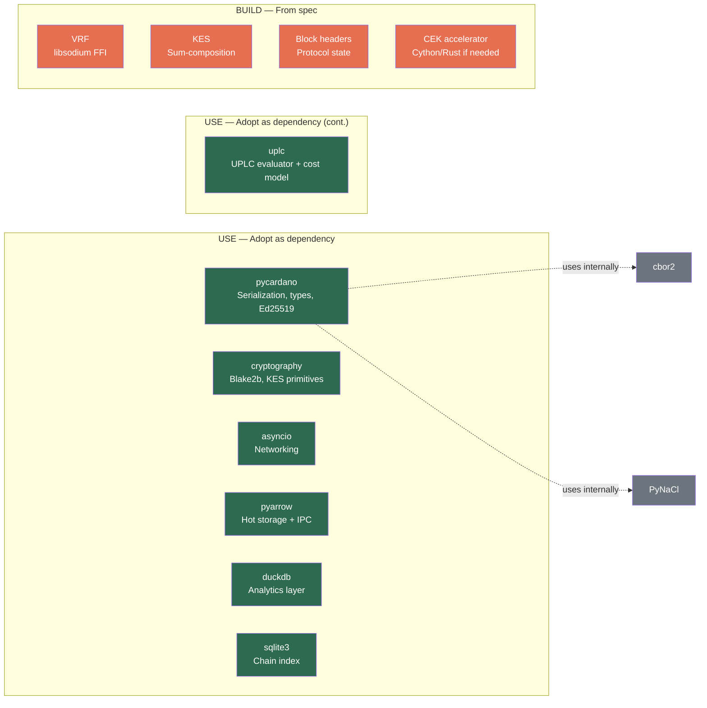

# Python Library Audit

This document evaluates Python library candidates for each vibe-node subsystem. Every dependency is a trade-off: less code to write vs. more attack surface to maintain. We apply a consistent decision framework and score each candidate against six criteria.

## Decision Framework

Each library receives one of four verdicts:

| Verdict | Meaning | When to Apply |
|---------|---------|---------------|
| **USE** | Adopt as a dependency; contribute upstream for gaps | Well-maintained, covers majority of needs, compatible license |
| **FORK** | Fork and maintain ourselves | Good code but poorly maintained or abandoned; we need control |
| **REUSE** | Extract specific code with attribution (license permitting) | Small, well-isolated pieces worth lifting; rest of library not useful |
| **BUILD** | Implement from spec | Nothing suitable exists, or existing options introduce unacceptable coupling |

### Evaluation Criteria

Every candidate is scored on six dimensions (1–5 scale):

| Criterion | What We Measure |
|-----------|----------------|
| **Maintenance** | Release cadence, last release date, open issue triage, CI health |
| **License** | Compatibility with AGPL-3.0 (our license); contribution strategy |
| **Python 3.14** | Wheels or confirmed support for Python 3.14 (our target runtime) |
| **Performance** | Adequate for node-level throughput (not just wallet-level) |
| **Coupling** | Can we use the pieces we need without pulling in the whole library? |
| **Bus Factor** | Number of active maintainers; community breadth |

---

## Summary Table

| Subsystem | Verdict | Library/Approach | Rationale |
|-----------|---------|-----------------|-----------|
| **Serialization & Ledger Types** | USE | pycardano (uses cbor2 internally) | Cardano CBOR serialization, transaction types, address handling — all eras |
| **Crypto (general)** | USE | pycardano (uses PyNaCl internally) | Ed25519 signing/verification, address derivation |
| **Crypto (hashing)** | USE | cryptography | Blake2b hashing, KES primitives (not covered by pycardano) |
| **Crypto (VRF)** | BUILD | Custom libsodium FFI | No Python library implements Cardano's ECVRF-ED25519-SHA512-Elligator2 |
| **Crypto (KES)** | BUILD | Sum-composition over Ed25519 | Key-evolving signatures require custom tree-based implementation |
| **Networking** | USE | asyncio (stdlib) | Zero-dependency; sufficient for multiplexed TCP; broader ecosystem support |
| **Plutus** | USE | uplc (OpShin) + pyaiken for conformance testing | All 87 builtins, full cost model, 811 conformance tests; contribute fixes upstream |
| **Storage** | USE | PyArrow + DuckDB + SQLite (stdlib) | Arrow tables + dict for hot state; DuckDB for analytics; SQLite for metadata |

---

## Detailed Evaluations

### 1. Serialization, Ledger Types & Cryptography — pycardano

pycardano is the most mature Python library for the Cardano ecosystem. It provides CBOR serialization (via cbor2), Ed25519 cryptography (via PyNaCl), transaction types for all eras, and address handling. Rather than building our own layers on top of the same underlying libraries, **we use pycardano directly** and contribute back improvements as we find gaps.

#### pycardano

| Criterion | Score | Notes |
|-----------|-------|-------|
| Maintenance | 4 | v0.19.2 (Mar 2026); active development; Conway/Chang support added |
| License | 4 | MIT — compatible with AGPL-3.0; contribution flows are one-way (we can use MIT in AGPL) |
| Python 3.14 | 3 | No explicit 3.14 wheels published; likely works but untested |
| Performance | 3 | Designed for wallet-level throughput, but adequate for our initial sync targets |
| Coupling | 3 | Types are separable from the transaction builder; we use the type/serialization/crypto layers only |
| Bus Factor | 3 | ~27 contributors; Jerry (cffls) is the primary maintainer; Catalyst-funded |

**Verdict: USE.** pycardano provides the Cardano-specific serialization, type definitions, and Ed25519 crypto we need. Using it directly avoids reimplementing cbor2 wrappers, CBOR tag handling, address encoding, and Ed25519 signing that pycardano already does correctly and has been tested against mainnet.

#### What pycardano gives us

| Capability | pycardano Module | What We Avoid Building |
|-----------|-----------------|----------------------|
| **CBOR serialization** | `serialization.py` (uses cbor2) | CDDL tag handling, canonical encoding, `CBORSerializable` base class |
| **Transaction types** | `transaction.py` | `Transaction`, `TransactionBody`, `TransactionOutput`, `Value`, multi-asset maps |
| **Address handling** | `address.py` | Bech32 encoding, network discrimination, stake address derivation |
| **Hash types** | `hash.py` | `TransactionHash`, `ScriptHash`, `DatumHash`, `BlockHash` |
| **Native scripts** | `nativescript.py` | Timelock, multi-sig, and other native script types |
| **Plutus types** | `plutus.py` | `PlutusData`, `PlutusV1Script`, `PlutusV2Script`, `PlutusV3Script` |
| **Ed25519 signing** | `crypto.py` (uses PyNaCl) | Key generation, signing, verification |

#### What we build on top of pycardano

pycardano was designed for wallet use (construct and submit transactions). A node needs additional structures that pycardano doesn't cover:

| Component | Why pycardano Doesn't Cover It | Our Approach |
|-----------|-------------------------------|-------------|
| **Block headers** | Wallets don't parse block headers | Build in `vibe.cardano.consensus` using pycardano's CBOR primitives |
| **Protocol state** | Epoch boundaries, stake snapshots, protocol parameters | Build in `vibe.cardano.ledger` |
| **Per-era block types** | pycardano uses one `Transaction` class for all eras | Extend with era-specific block wrappers |
| **Streaming deserialization** | pycardano materializes full objects | Build lazy/streaming decoder for sync performance if profiling shows need |
| **VRF crypto** | Cardano's ECVRF not implemented in any Python library | Custom libsodium FFI (see below) |
| **KES key evolution** | Sum-composition over Ed25519; consensus-only | Build from spec using `cryptography` primitives |
| **UPLC evaluation** | Script evaluation with cost accounting | Build from Plutus Core spec (see Plutus section) |

#### Contributing back to pycardano

We will **contribute upstream** whenever we find and fix issues. Specifically:

- **CBOR round-trip fidelity** — if we find cases where pycardano doesn't round-trip canonical CBOR correctly for node-level use, we fix it upstream
- **Python 3.14 support** — if we hit compatibility issues, we contribute fixes
- **Conway-era gaps** — if governance structures or new certificate types are missing, we add them
- **Performance improvements** — if profiling reveals hot spots in pycardano's serialization path, we optimize upstream rather than forking
- **cbor2 pure Python mode** — pycardano already uses `cbor2pure` to avoid C extension bugs with Cardano's CBOR; any fixes go upstream to both projects

This follows our project principle: **contribute upstream, don't fork**.

#### Era Coverage

| Era | pycardano Coverage | Node Gaps |
|-----|-------------------|-----------|
| Byron | Minimal (bootstrap addresses) | Byron block headers, epoch boundary blocks |
| Shelley | Good | Block headers, protocol state transitions |
| Allegra–Mary | Good | Timelock scripts, multi-asset mint/burn rules |
| Alonzo | Good | Phase-2 validation context, cost model application |
| Babbage | Good | Reference inputs, inline datums at block level |
| Conway | Partial (maturing) | DRep voting, governance actions, treasury withdrawals |

#### Serialization Considerations

pycardano uses cbor2 internally. Key points for node use:

- **cbor2 pure Python mode** — pycardano uses `cbor2pure` (a pure Python fork) to avoid C extension deserialization bugs with Cardano's CBOR. This is already handled.
- **Canonical encoding** — pycardano supports `canonical=True` via cbor2; we must verify round-trip fidelity against real mainnet blocks and fix upstream if needed
- **Tag handling** — Cardano-specific tags (tag 24 for embedded CBOR, tag 258 for sets) are handled by pycardano's `CBORSerializable`

### 2. Cryptography — What We Build Separately

pycardano covers Ed25519 signing/verification via PyNaCl. The following cryptographic components are **not covered by any Python library** and must be built:

#### cryptography (Blake2b, KES primitives)

| Criterion | Score | Notes |
|-----------|-------|-------|
| Maintenance | 5 | v46.0.5 (Feb 2026); extremely active release cadence |
| License | 5 | Apache-2.0 / BSD — compatible with AGPL-3.0 |
| Python 3.14 | 5 | Published wheels for 3.14 |
| Performance | 5 | OpenSSL-backed; native performance |
| Coupling | 4 | Large library, but well-organized; we only need specific primitives |
| Bus Factor | 5 | pyca team; most-downloaded crypto package in Python |

**Verdict: USE** for primitives pycardano doesn't cover:

- **Blake2b hashing** — used throughout Cardano for block hashes, transaction hashes, VRF inputs
- **KES implementation** — KES uses a sum-composition scheme over Ed25519; we build the composition logic using `cryptography` for underlying Ed25519 operations

#### VRF (Cardano-specific)

**Verdict: BUILD.** Cardano uses ECVRF-ED25519-SHA512-Elligator2 (IETF draft-irtf-cfrg-vrf-03) via a custom fork of libsodium (`cardano-crypto-praos`). No Python library implements this. Our approach:

1. Write Python FFI bindings to libsodium's `crypto_vrf_ietfdraft03_*` functions using `cffi` or `ctypes`
2. Use IOG's [libsodium VRF fork](https://github.com/input-output-hk/libsodium) which adds the VRF API
3. Test VRF outputs against known Haskell-node-produced VRF proofs from mainnet blocks

#### KES (Key-Evolving Signatures)

**Verdict: BUILD.** KES is a consensus-only primitive — pycardano doesn't need it because wallets never evolve operational keys. We implement:

1. Sum-composition KES using Ed25519 primitives from `cryptography`
2. Key evolution tree (binary tree of Ed25519 key pairs)
3. Test against Haskell node's KES outputs from mainnet block headers

---

### 3. Networking

The Cardano node uses a custom TCP multiplexer carrying typed miniprotocols (chain-sync, block-fetch, tx-submission, keep-alive, etc.). This is a long-lived connection model with backpressure.

#### asyncio (stdlib)

| Criterion | Score | Notes |
|-----------|-------|-------|
| Maintenance | 5 | Part of CPython; maintained by core team |
| License | 5 | PSF — compatible with everything |
| Python 3.14 | 5 | It *is* Python 3.14 |
| Performance | 4 | Adequate for multiplexed TCP; Cardano protocol is not high-frequency |
| Coupling | 5 | Zero dependencies |
| Bus Factor | 5 | CPython core team |

#### trio

| Criterion | Score | Notes |
|-----------|-------|-------|
| Maintenance | 4 | v0.32.0; active development; 7k+ GitHub stars |
| License | 5 | MIT/Apache-2.0 — compatible with AGPL-3.0 |
| Python 3.14 | 4 | Likely works but no explicit 3.14 wheels verified |
| Performance | 4 | Structured concurrency model is cleaner; slightly better under load |
| Coupling | 3 | Trio's nursery model infects the entire call stack; harder to integrate with asyncio-based libraries |
| Bus Factor | 3 | Nathaniel Smith is the primary driver; smaller contributor pool than asyncio |

**Verdict: USE asyncio.** The decision is pragmatic:

- **Zero dependency cost** — asyncio is stdlib
- **Ecosystem compatibility** — most Python async libraries (httpx, websockets, etc.) target asyncio first
- **Sufficient for our workload** — Cardano's multiplexer carries a handful of miniprotocol streams per peer; this isn't a 100k-connection web server
- **Structured concurrency via TaskGroup** — Python 3.11+ added `asyncio.TaskGroup`, providing trio-style structured concurrency without the ecosystem lock-in

trio's structured concurrency model is genuinely better designed, but the ecosystem switching cost is not justified for our use case.

---

### 4. Ledger Types

pycardano's ledger type coverage is evaluated in **Section 1** above (Serialization, Ledger Types & Cryptography). Summary: **USE pycardano** for transaction types, address handling, hash types, native scripts, and Plutus data types. Build node-specific structures (block headers, protocol state, epoch boundaries) on top.

---

### 5. Plutus

A Cardano node must evaluate Plutus Core scripts (UPLC) with exact cost accounting to determine transaction validity. This is one of the hardest subsystems — the evaluator must match the Haskell node's behavior bit-for-bit on cost model outputs.

#### uplc (OpShin)

| Criterion | Score | Notes |
|-----------|-------|-------|
| Maintenance | 4 | v1.3.2 (Oct 2025); active development; last push Mar 2026 |
| License | 5 | MIT — fully compatible with AGPL-3.0 |
| Python 3.14 | 5 | CI tests 3.9 through 3.14 |
| Performance | 2 | Pure Python CEK machine; adequate for wallet use, likely bottleneck for node sync |
| Coupling | 3 | Depends on pycardano, pyblst, pycryptodome, secp256k1; heavy but we already use pycardano |
| Bus Factor | 2 | Primarily nielstron (OpShin creator); small community |

**Verdict: USE** and contribute back. The `uplc` package is far more complete than initially assessed:

- **All 87 builtins** implemented through Conway/PlutusV3, including BLS12-381 and bitwise ops
- **Full cost model system** with budget tracking, slippage, and per-Plutus-version cost parameters
- **Complete flat encoding/decoding** of UPLC scripts
- **Stack-based CEK machine** (not recursive) with proper partial application and polymorphic builtin handling
- **811 acceptance tests** from the official Haskell `plutus-conformance` test suite, with 247 cost budget tests
- **PlutusV1, V2, V3** all supported (V3 adds Constr/Case terms)

This covers the full UPLC evaluation pipeline. Building our own would duplicate ~3,000 lines of well-tested code that already passes the Haskell conformance suite.

#### What uplc gives us

| Capability | Implementation | Quality |
|-----------|---------------|---------|
| CEK machine | Stack-based iterative, budget-tracked | 811 conformance tests |
| All builtins (87) | Integer, ByteString, Crypto, BLS12-381, Bitwise | Complete through Conway |
| Cost model | Full costing function hierarchy, network config overlay | 247 cost tests (via Aiken) |
| Flat encoding | Serialize/deserialize UPLC to binary | Hypothesis roundtrip tests |
| PlutusV1/V2/V3 | Version-aware term validation | Conformance tested |
| Optimizer | 5 passes (dedup, inline, pre-eval, etc.) | Semantic preservation tested |

#### Consensus-Critical Issues to Fix

!!! danger "Issue #35: PlutusMap Duplicate Keys"
    **This is a consensus-critical bug.** The Haskell node preserves duplicate keys in CBOR-encoded PlutusData maps. The `uplc` package deduplicates them because `cbor2` drops duplicates during decoding. A script that checks for duplicate keys will produce **different results** than the Haskell node.

    **Status:** Open issue ([OpShin/uplc#35](https://github.com/OpShin/uplc/issues/35)). A fix branch exists but is incomplete.

    **Our plan:** Fix this and contribute upstream. This must be resolved before we can trust script evaluation results for consensus. We will create a specific unit test that exercises duplicate-key PlutusData to verify the fix.

Other issues to verify and contribute back:

| Issue | Severity | Plan |
|-------|----------|------|
| **Cost model verified against Aiken, not Haskell** | High | Run uplc against `cardano-cli evaluate-script` for independent verification |
| **`SerialiseData` CBOR fidelity** | High | Compare byte-for-byte against Haskell's `serialiseData` on real mainnet scripts |
| **Integer division edge cases** | Medium | Verify truncation-toward-zero behavior against Haskell for MIN_INT, division by zero |
| **Per-era base cost model TODO** | Medium | Code has a TODO about version-specific base models; audit impact |
| **`ConsByteString` byte truncation** | Low | Verify values outside 0-255 truncate to low 8 bits (matching Haskell) |

#### Performance Acceleration Plan

Pure Python CEK machine will be **10-100x slower than Haskell** for compute-heavy scripts. For a syncing node processing thousands of scripts per block, this is a likely bottleneck. Our acceleration roadmap:

| Phase | Approach | Expected Speedup | Effort |
|-------|----------|------------------|--------|
| **1. Profile first** | Identify actual bottlenecks during sync | Baseline | Low |
| **2. Cython** | Compile CEK step loop + builtin dispatch | 5-20x | Low — drop-in, same code |
| **3. Rust/PyO3** | Rewrite CEK inner loop if Cython isn't enough | 50-100x | High |
| **4. pyaiken fallback** | Use Aiken's Rust evaluator as alternative backend | ~100x | Low — but may diverge from Haskell |

**Phase 1 is mandatory before any optimization.** We don't know yet whether UPLC evaluation is actually the bottleneck vs. CBOR deserialization, storage I/O, or network latency. Profile against real mainnet blocks first.

#### pyaiken (Conformance Testing Oracle)

| Criterion | Score | Notes |
|-----------|-------|-------|
| Maintenance | 3 | Maintained by OpShin team; bindings to Rust aiken library |
| License | 4 | Apache-2.0 — compatible with AGPL-3.0 |
| Python 3.14 | 2 | Rust extension; may need rebuild for 3.14 |
| Performance | 4 | Rust-backed evaluation; much faster than pure Python |

**Verdict: USE as conformance testing oracle.** We run the same scripts through both `uplc` and `pyaiken` and compare results + budgets. Any divergence flags a potential consensus issue. We also compare against the Haskell node directly via `cardano-cli` for ground truth.

---

### 6. Storage

The Haskell node uses three storage layers: ImmutableDB (append-only chain history), VolatileDB (recent forks), and LedgerDB (ledger state snapshots). We need to choose backends that can handle:

- **ImmutableDB**: Sequential writes, random reads by slot/hash, ~100GB+ for mainnet
- **VolatileDB**: Small working set, frequent updates, fork tracking
- **LedgerDB**: Large key-value state (UTxO set: ~15M entries), snapshotting

#### PyArrow (Selected — Hot State)

| Criterion | Score | Notes |
|-----------|-------|-------|
| Maintenance | 5 | v23.0.1 (Feb 2026); very active; Apache Foundation backing |
| License | 5 | Apache-2.0 — compatible with AGPL-3.0 |
| Python 3.14 | 5 | Published wheels for 3.14 |
| Performance | 5 | Columnar tables + Python dict index: 0.23 μs lookups, 0.37 ms/block apply at 1M UTxOs |
| Coupling | 4 | ~20 MB dependency; rich API but we use a focused subset (Table, IPC, compute) |
| Bus Factor | 5 | Apache Arrow project; broad industry adoption |

**Why Arrow + Python dict for hot state:**

- **Fastest point lookups** — Python dict gives O(1) lookups at 0.23 μs, 9x faster than LMDB
- **86x faster block apply** — batch mutations via dict + columnar storage outperform LMDB's B+ tree by a wide margin
- **DuckDB analytics for free** — DuckDB can query Arrow tables with zero-copy, enabling SQL-based stake distribution computation, address queries, and debugging without any separate data pipeline
- **Arrow IPC for persistence** — LZ4-compressed IPC files are 1.8x smaller than LMDB on disk and support memory-mapped zero-copy reload
- **No single-writer bottleneck** — unlike LMDB, shardable for future Leios concurrency

**Limitations:**

- Python dict uses ~100 bytes/entry (~1.4 GiB at 15M UTxOs) — if memory is tight, a NumPy hash table (22 B/entry) can substitute with a 7x lookup speed trade-off
- No built-in transactional crash safety — we implement crash recovery via periodic Arrow IPC snapshots + append-only diff replay log

#### LMDB (py-lmdb) — Evaluated, Not Selected

| Criterion | Score | Notes |
|-----------|-------|-------|
| Maintenance | 4 | v1.7.3 (Jul 2025); healthy release cadence |
| License | 5 | OpenLDAP Public License — permissive |
| Python 3.14 | 3 | Supports 3.9+; no explicit 3.14 verification |
| Performance | 3 | 2.12 μs lookups, 31.85 ms/block apply at 1M UTxOs — 9x and 86x slower than Arrow+Dict |
| Coupling | 5 | Minimal API |
| Bus Factor | 3 | Single primary maintainer |

**Verdict: NOT SELECTED.** Benchmarks at 1M UTxOs showed Arrow+Dict outperforms LMDB on every metric except baseline RSS. LMDB's single-writer limitation is also a concern for Leios concurrency. The Haskell team is already developing an LSM-tree backend to replace LMDB — following their current choice doesn't future-proof us.

#### SQLite (stdlib)

| Criterion | Score | Notes |
|-----------|-------|-------|
| Maintenance | 5 | Part of CPython; SQLite itself is one of the most-tested C libraries in existence |
| License | 5 | Public domain — compatible with everything |
| Python 3.14 | 5 | It *is* Python 3.14 |
| Performance | 3 | Good for structured queries; not optimal for high-throughput key-value workloads |
| Coupling | 5 | Zero dependencies |
| Bus Factor | 5 | CPython core team + SQLite consortium |

**Why SQLite for metadata:**

- **Schema flexibility** — chain metadata (block index, slot-to-hash mapping, epoch boundaries) benefits from SQL queries
- **WAL mode** — concurrent readers with a single writer; good enough for metadata access patterns
- **Zero deployment cost** — no additional dependency to install or configure

#### DuckDB + PyArrow

| Criterion | Score | Notes |
|-----------|-------|-------|
| Maintenance | 5 | v1.5.0 (Mar 2026); very active; well-funded (DuckDB Labs) |
| License | 5 | MIT — compatible with AGPL-3.0 |
| Python 3.14 | 5 | Published wheels for 3.14 |
| Performance | 5 | Vectorized columnar execution; fastest analytical engine in Python |
| Coupling | 3 | Heavy dependency (~100MB); analytical-oriented, not transactional |
| Bus Factor | 5 | DuckDB Labs team; CWI Amsterdam backing |

**Verdict: SELECTED for analytics layer.** DuckDB is wrong for the OLTP hot path (point lookups, block mutations) but perfect as an **analytics layer over our Arrow tables**:

- **Zero-copy query over Arrow** — DuckDB reads Arrow tables directly without data movement
- **Stake distribution** — `GROUP BY` over 15M UTxOs at epoch boundaries, vectorized
- **Address balance queries** — SQL over the live UTxO set for node-to-client queries
- **Debugging and monitoring** — full SQL over live node state

DuckDB is never on the block validation hot path. It's an on-demand analytics engine that gets our Arrow tables for free.

#### RocksDB (python-rocksdb)

| Criterion | Score | Notes |
|-----------|-------|-------|
| Maintenance | 1 | Last significant update years ago; multiple abandoned forks on GitHub |
| License | 4 | Apache-2.0 / GPL-2.0 (RocksDB itself) — compatible |
| Python 3.14 | 1 | No evidence of 3.14 support; stale C++ bindings |
| Performance | 5 | RocksDB itself is excellent (used by Cardano's Haskell node via C FFI) |
| Coupling | 3 | Key-value API is clean, but C++ build dependency is heavy |
| Bus Factor | 1 | Python bindings are effectively unmaintained |

**Verdict: NOT SELECTED.** The Python bindings are abandoned. Arrow+Dict provides superior performance without C++ build dependency headaches.

#### Storage Architecture Decision

| Storage Layer | Backend | Rationale |
|---------------|---------|-----------|
| **ImmutableDB** | Chunked flat files | Append-only CBOR blocks; slot-indexed; same pattern as Haskell |
| **VolatileDB** | Arrow table + Python dict | Hash-indexed recent blocks; fast fork tracking |
| **LedgerDB** | Arrow table + Python dict | 15M+ UTxO entries; 0.23 μs lookups; 86x faster block apply than LMDB |
| **Ledger snapshots** | Arrow IPC (LZ4) | Periodic state dumps; 1.8x smaller than CBOR; zero-copy reload |
| **Analytics** | DuckDB over Arrow | Zero-copy SQL for stake distribution, address queries, debugging |
| **ChainIndex** | SQLite | Slot/hash lookups; epoch boundary queries; structured metadata |

See the full **[Data Architecture Evaluation](data-architecture.md)** for benchmarks and rationale.

---

## Recommendations Summary

### Dependency Footprint

Total runtime dependencies added by this audit:

| Package | Size | Purpose |
|---------|------|---------|
| pycardano | ~5 MB (incl. cbor2, PyNaCl) | Serialization, ledger types, Ed25519 |
| uplc | ~2 MB (incl. pyblst, secp256k1) | UPLC evaluator, cost model, flat encoding |
| cryptography | ~10 MB (incl. OpenSSL) | Blake2b, KES primitives |
| pyarrow | ~20 MB | Arrow tables, IPC, compute |
| duckdb | ~100 MB | Analytics over Arrow tables |

**Total: ~137 MB** of additional dependencies. asyncio and sqlite3 are stdlib (zero cost). The bulk is DuckDB (~100 MB), which is an optional analytics layer — the core node runs with pycardano + uplc + cryptography + pyarrow (~37 MB total).

### What We Build Ourselves

| Component | Spec Source | Estimated Complexity |
|-----------|-----------|---------------------|
| Block headers & protocol state | Cardano ledger formal specs | Medium — era-specific block wrappers on top of pycardano types |
| VRF bindings | IETF draft-irtf-cfrg-vrf-03 + IOG libsodium fork | Medium — FFI wrapper + test against Haskell VRF outputs |
| KES implementation | Ouroboros Praos spec (sum composition) | Medium — tree-based key evolution using Ed25519 primitives |
| UPLC performance layer | uplc package + Cython/Rust acceleration | Medium — CEK machine hot path compilation if profiling shows need |
| Multiplexer | ouroboros-network-framework | Medium — segment framing, backpressure, mini-protocol dispatch |
| Storage engine | ouroboros-consensus (Storage) | High — ImmutableDB/VolatileDB/LedgerDB abstractions over Arrow+Dict |

### Risk Register

| Risk | Mitigation |
|------|-----------|
| pycardano CBOR round-trip fidelity on edge cases | Conformance test suite comparing round-trip output against Haskell-encoded blocks; contribute fixes upstream |
| pycardano performance at node-level throughput | Profile early; build streaming deserializer if pycardano's per-object allocation is a bottleneck during sync |
| pycardano doesn't support Python 3.14 | Contribute 3.14 compatibility upstream; pycardano's dependencies (cbor2, PyNaCl) already support 3.14 |
| Python dict memory at mainnet scale (1.4 GiB for 15M entries) | NumPy hash table fallback (0.3 GiB) available; total architecture still well under Haskell's 24 GiB |
| VRF FFI bindings are fragile across platforms | Docker-based CI ensures consistent libsodium version; statically link if needed |
| uplc PlutusMap duplicate key bug (issue #35) causes consensus divergence | Fix upstream and add unit test exercising duplicate-key PlutusData; block on this before trusting script evaluation |
| uplc cost model verified against Aiken, not Haskell | Run independent verification against `cardano-cli evaluate-script`; compare budgets on real mainnet scripts |
| uplc pure Python CEK machine too slow for sync | Profile first; Cython compilation of hot path as Phase 2; Rust/PyO3 rewrite as Phase 3 if needed |
