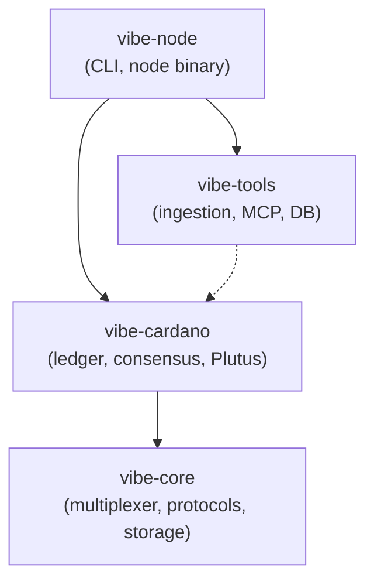

# Python Package Structure

## Design Decision: uv Workspace Monorepo with Namespace Packages

All vibe-node packages live in a single monorepo managed by [uv workspaces](https://docs.astral.sh/uv/concepts/projects/workspaces/). Packages share the `vibe` namespace using Python's [implicit namespace packages](https://peps.python.org/pep-0420/) (no `__init__.py` at the `vibe/` level), allowing `import vibe.core`, `import vibe.cardano`, etc.

## Package Layout

```
vibe-node/                              # Monorepo root
├── pyproject.toml                      # Workspace root — defines members
├── packages/
│   ├── vibe-core/                      # Protocol-agnostic abstractions
│   │   ├── pyproject.toml
│   │   └── src/vibe/core/
│   │       ├── __init__.py
│   │       ├── multiplexer/            # Multiplexing framework
│   │       ├── protocols/              # Typed state machine framework
│   │       ├── storage/                # Storage abstractions
│   │       └── consensus/              # Abstract consensus interface
│   ├── vibe-cardano/                   # Cardano-specific implementations
│   │   ├── pyproject.toml
│   │   └── src/vibe/cardano/
│   │       ├── __init__.py
│   │       ├── ledger/                 # Per-era ledger rules
│   │       ├── network/                # Cardano miniprotocol implementations
│   │       ├── consensus/              # Ouroboros Praos / Genesis
│   │       ├── serialization/          # CBOR codecs, CDDL-based encoding
│   │       └── plutus/                 # Plutus Core interpreter
│   └── vibe-tools/                     # Development infrastructure
│       ├── pyproject.toml
│       └── src/vibe/tools/
│           ├── __init__.py
│           ├── ingest/                 # Ingestion pipelines
│           ├── mcp/                    # Search MCP server
│           ├── db/                     # Database access
│           └── export/                 # Spec export
├── src/vibe_node/                      # Node binary (current code, migrates later)
│   ├── cli.py                          # CLI entry point
│   ├── node/                           # Node orchestration
│   ├── mempool/                        # Mempool
│   └── forge/                          # Block production
└── tests/
    ├── unit/                           # Per-package unit tests
    ├── property/                       # Hypothesis property tests
    ├── conformance/                    # A/B tests against Haskell node
    └── integration/                    # Docker Compose integration tests
```

## Namespace Package Convention

All packages use the `vibe` namespace:

| Package | Import | What It Contains |
|---------|--------|-----------------|
| `vibe-core` | `from vibe.core import ...` | Protocol-agnostic abstractions (multiplexer, state machines, storage patterns) |
| `vibe-cardano` | `from vibe.cardano import ...` | Cardano-specific implementations (ledger, consensus, serialization, Plutus) |
| `vibe-tools` | `from vibe.tools import ...` | Development infrastructure (ingestion, MCP, database) |

The `vibe/` directory in each package has **no** `__init__.py` — this makes it an implicit namespace package per [PEP 420](https://peps.python.org/pep-0420/). Each sub-package (`vibe/core/`, `vibe/cardano/`, `vibe/tools/`) **does** have `__init__.py`.

## Dependency Graph



- `vibe-core` has **no internal dependencies** — only external (asyncio, cbor2, cryptography)
- `vibe-cardano` depends on `vibe-core`
- `vibe-tools` depends on `vibe-cardano` (for type definitions) — optional/light dependency
- `vibe-node` (the CLI/binary) depends on everything

## Workspace Configuration

Root `pyproject.toml`:
```toml
[tool.uv.workspace]
members = ["packages/*"]
```

Each package `pyproject.toml` references workspace siblings:
```toml
# packages/vibe-cardano/pyproject.toml
[project]
name = "vibe-cardano"
dependencies = ["vibe-core"]

[tool.uv.sources]
vibe-core = { workspace = true }
```

## Mapping to Haskell Packages

| Haskell Package | Python Package | Module |
|----------------|---------------|--------|
| network-mux | vibe-core | `vibe.core.multiplexer` |
| typed-protocols | vibe-core | `vibe.core.protocols` |
| ouroboros-network-framework | vibe-core | `vibe.core.multiplexer` + `vibe.cardano.network` |
| ouroboros-network-protocols | vibe-cardano | `vibe.cardano.network` |
| ouroboros-network | vibe-cardano | `vibe.cardano.network` |
| ouroboros-consensus | vibe-cardano | `vibe.cardano.consensus` + `vibe.core.storage` |
| ouroboros-consensus-protocol | vibe-cardano | `vibe.cardano.consensus` |
| cardano-ledger (libs/small-steps) | vibe-core | `vibe.core.sts` (STS framework is protocol-agnostic) |
| cardano-ledger (eras/*) | vibe-cardano | `vibe.cardano.ledger` |
| cardano-ledger-binary | vibe-cardano | `vibe.cardano.serialization` |
| plutus-core | vibe-cardano | `vibe.cardano.plutus` |
| plutus-ledger-api | vibe-cardano | `vibe.cardano.plutus` |

## What Goes in vibe-core (Protocol-Agnostic)

These components have **no Cardano-specific knowledge**:

- **Multiplexer** — carries multiple concurrent streams over a single bearer (TCP). Any blockchain could use this.
- **Protocol state machines** — typed state machine framework for expressing and enforcing application protocols. Equivalent to Haskell's typed-protocols.
- **Storage abstractions** — append-only database, volatile database, state snapshots. The *pattern* is generic; the *contents* are Cardano-specific.
- **STS framework** — State Transition System framework from small-steps. The framework itself is generic; the rules are Cardano-specific.
- **Consensus interface** — abstract `ConsensusProtocol` with chain selection, leader check, forecasting. Ouroboros Praos is a *specific implementation*.

## Migration Path

Current code lives in `src/vibe_node/`. Migration happens incrementally:
1. **Phase 2:** Create `packages/vibe-core/` with multiplexer and protocol framework
2. **Phase 3:** Create `packages/vibe-cardano/` with serialization and storage
3. **Phase 4+:** Move remaining implementations into packages
4. `vibe-tools` is extracted from the current `src/vibe_node/` tooling code when convenient
