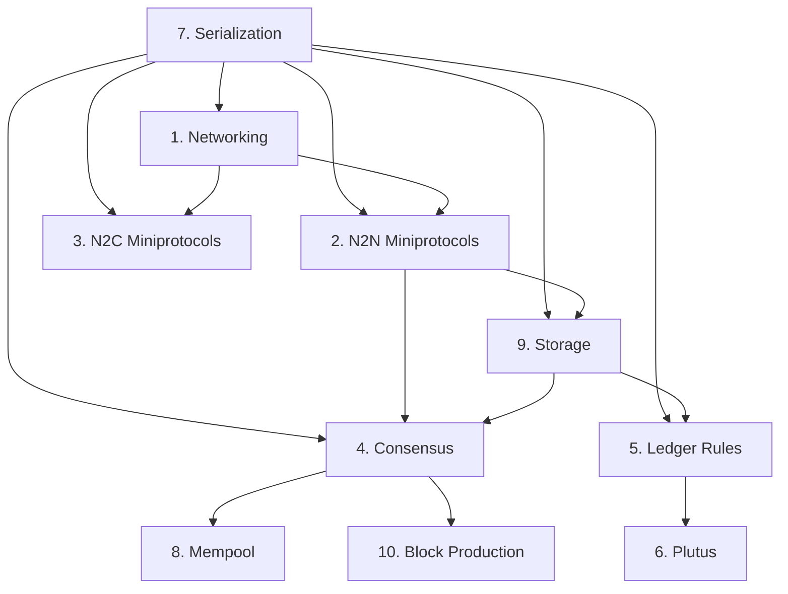

# Node Subsystems

This page maps the Cardano node into 10 major subsystems, each with clear boundaries, governing specifications, and inter-subsystem dependencies. This decomposition drives the implementation phase sequencing.

## Subsystem Map

| # | Subsystem | What It Does | Haskell Packages |
|---|-----------|-------------|-----------------|
| 1 | **[Networking / Multiplexer](networking.md)** | TCP connections, multiplexer, bearer abstraction | network-mux, ouroboros-network-framework |
| 2 | **[Miniprotocols (N2N)](miniprotocols-n2n.md)** | Chain-sync, block-fetch, tx-submission, keep-alive | ouroboros-network-protocols, ouroboros-network |
| 3 | **[Miniprotocols (N2C)](miniprotocols-n2c.md)** | Local chain-sync, local tx-submission, local state-query, local tx-monitor | ouroboros-network-protocols |
| 4 | **[Consensus](consensus.md)** | Leader election, VRF/KES, tip selection, chain growth | ouroboros-consensus, ouroboros-consensus-protocol |
| 5 | **[Ledger Rules](ledger.md)** | UTxO transitions, delegation, governance, multi-era | cardano-ledger eras/*, libs/small-steps |
| 6 | **[Plutus](plutus.md)** | Plutus Core interpreter, cost models, script validation | plutus-core, plutus-ledger-api |
| 7 | **[Serialization](serialization.md)** | CBOR encoding/decoding, CDDL schemas | libs/cardano-ledger-binary |
| 8 | **[Mempool](mempool.md)** | Transaction staging, validation, capacity | ouroboros-consensus (Mempool) |
| 9 | **[Storage](storage.md)** | ImmutableDB, VolatileDB, LedgerDB, ChainDB | ouroboros-consensus (Storage) |
| 10 | **[Block Production](block-production.md)** | Block assembly, header creation, leader schedule | ouroboros-consensus + cardano-ledger |

## Dependencies



## Implementation Phases

Each phase adds a testable capability verifiable against the running Haskell node:

| Phase | Subsystems | Testable Deliverable |
|-------|-----------|---------------------|
| **Phase 2** | Serialization + Networking + Chain-Sync | Decode real blocks from the Haskell node; sync headers via chain-sync miniprotocol |
| **Phase 3** | Block Fetch + Storage + Ledger Rules (Byron–Mary) | Fetch and validate blocks; agree with Haskell on block validity for pre-Plutus eras |
| **Phase 4** | Consensus + Mempool + Tx Submission | Agree on tip selection within 2160 slots; accept/reject same transactions |
| **Phase 5** | Plutus + Block Production + N2C + Alonzo–Conway ledger | Produce valid blocks accepted by Haskell nodes; serve local queries |
| **Phase 6** | Hardening | Recover from power-loss; match Haskell memory usage over 10 days |

## Proposed Python Package Structure

```
vibe-node/                          # Monorepo (uv workspaces)
├── packages/
│   ├── vibe-core/                  # Protocol-agnostic abstractions
│   │   ├── multiplexer/            # Multiplexing framework
│   │   ├── protocols/              # State machine framework for miniprotocols
│   │   ├── storage/                # Storage abstractions (append-only, volatile, snapshots)
│   │   └── consensus/              # Abstract consensus interface
│   ├── vibe-cardano/               # Cardano-specific implementations
│   │   ├── ledger/                 # Per-era ledger rules (Byron→Conway)
│   │   ├── network/                # Cardano miniprotocol implementations
│   │   ├── consensus/              # Ouroboros Praos / Genesis
│   │   ├── serialization/          # CBOR codecs, CDDL-based encoding
│   │   └── plutus/                 # Plutus Core interpreter, cost models
│   └── vibe-tools/                 # Development infrastructure (current code)
│       ├── ingest/                 # Ingestion pipelines
│       ├── mcp/                    # Search MCP
│       └── db/                     # Database access
├── src/vibe_node/                  # Node binary / CLI
│   ├── node/                       # Node orchestration
│   ├── mempool/                    # Mempool
│   └── forge/                      # Block production
└── tests/                          # Conformance tests against Haskell node
```

The `vibe-core` package contains protocol-agnostic abstractions reusable across blockchain implementations. `vibe-cardano` contains all Cardano-specific logic. This separation allows the generic infrastructure to be reused.

## Module-Level Decomposition

Each subsystem page contains a detailed module breakdown. At a high level:

- **Serialization** → CBOR codec, CDDL validation, era-specific encoders, block decoder
- **Networking** → TCP bearer, multiplexer, connection manager, peer discovery
- **Miniprotocols** → State machine framework, chain-sync client/server, block-fetch, tx-submission, keep-alive
- **Consensus** → Protocol state, chain selection, leader check, VRF/KES, hard fork combinator
- **Ledger** → STS framework, UTxO rules, delegation, protocol parameters, epoch/rewards, governance
- **Plutus** → Plutus Core AST, CEK machine, builtins, cost model, script validation bridge
- **Mempool** → Transaction buffer, validation against cached ledger state, capacity management
- **Storage** → ImmutableDB (append-only), VolatileDB (recent forks), LedgerDB (state snapshots), ChainDB (coordinator)
- **Block Production** → Leader schedule, block body construction, header creation, VRF proof
