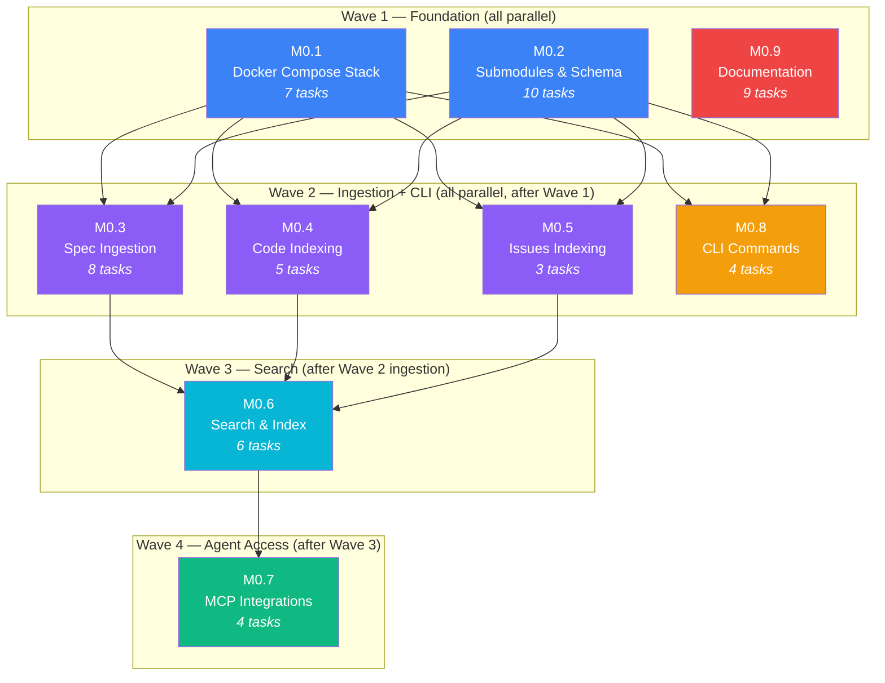
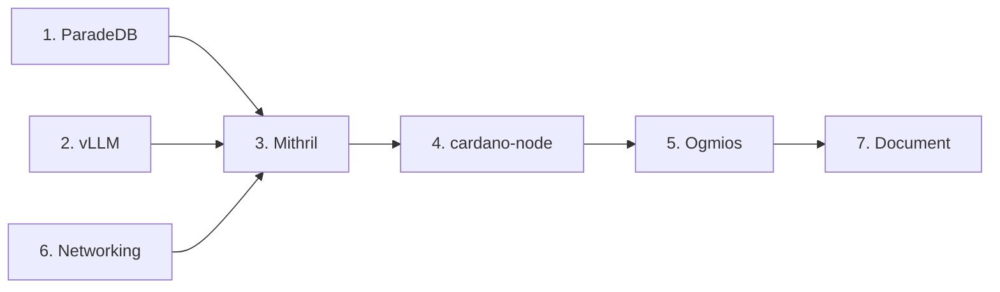
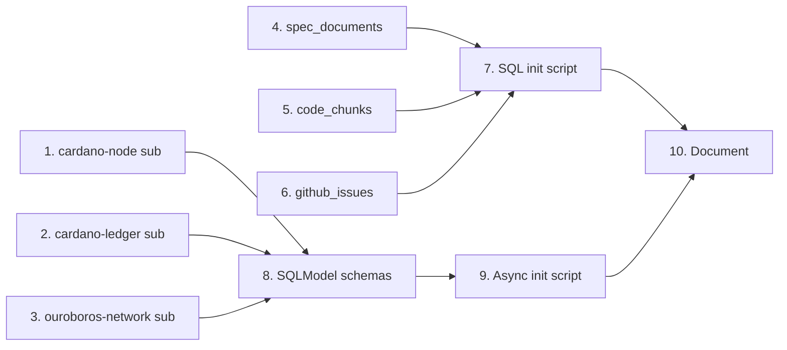
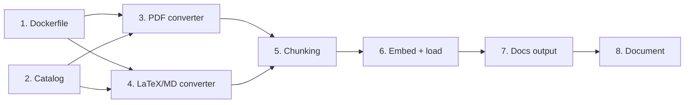
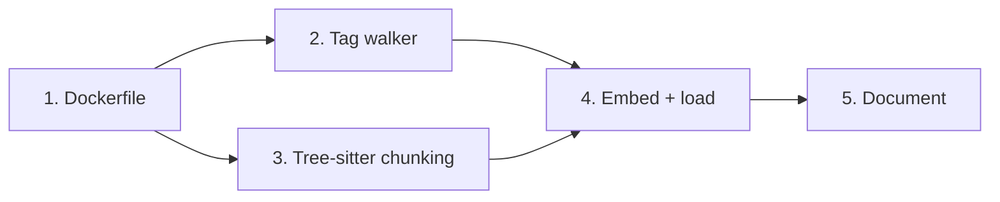
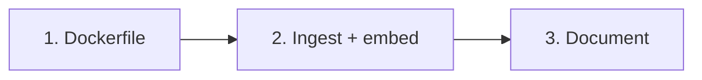
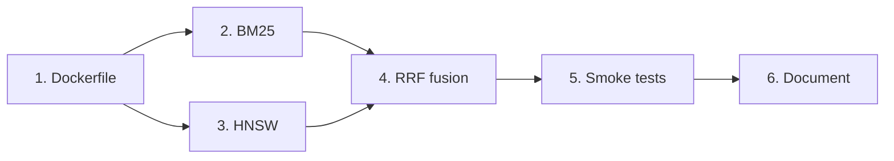
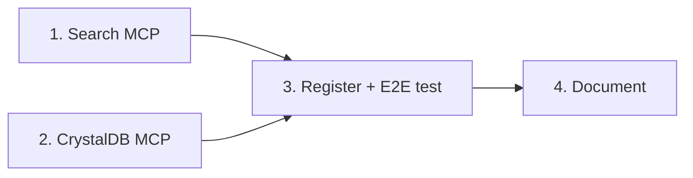
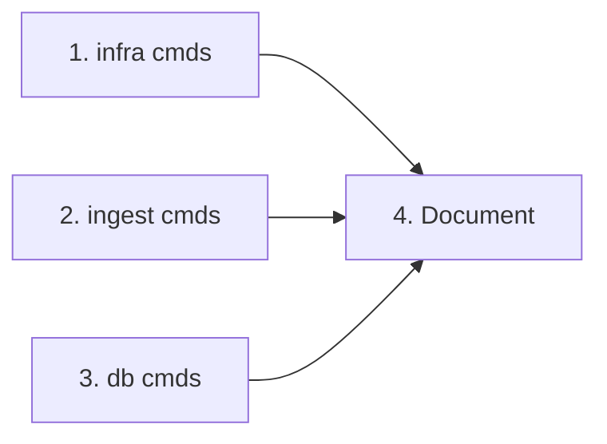
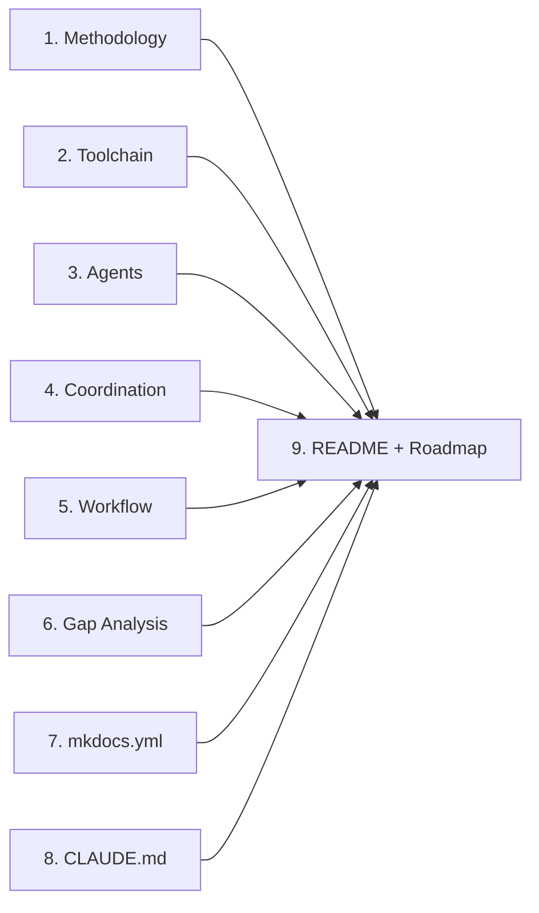

# Phase 0: Development Architecture — Tasks

**Phase 0 produces zero node code.** It builds the complete development infrastructure so that every subsequent phase has searchable specs, indexed Haskell source, a live Cardano node for conformance testing, and MCP integrations for Agent Millenial to consult during implementation.

All work items are tracked in [Plane](https://plane.so) and summarized here for full transparency.

**56 tasks across 9 modules.**

---

## Dependency Graph

### Parallelism Strategy

| Wave | Modules | Max Parallel Agents | Rationale |
|------|---------|-------------------|-----------|
| **Wave 1** | M0.1, M0.2, M0.9 | **3** | No dependencies between them. Docker Compose, git submodules + schema, and docs are fully independent. |
| **Wave 2** | M0.3, M0.4, M0.5, M0.8 | **4** | All four depend on Wave 1 completing. Three ingestion pipelines are independent of each other. CLI wraps compose and can be built in parallel with ingestion. |
| **Wave 3** | M0.6 | **1** | Search indexes require ingested data from all three pipelines. Cannot parallelize — but M0.9 documentation work continues alongside. |
| **Wave 4** | M0.7 | **1** | MCP servers depend on working search infrastructure. Final integration step. |

**Total critical path:** Wave 1 → Wave 2 → Wave 3 → Wave 4

**Maximum throughput:** 4 agents working simultaneously in Wave 2. Documentation (M0.9) spans all waves since doc tasks are independent of infrastructure.

### Task-Level Parallelism Within Modules

Within each module, tasks can often be parallelized further:

- **M0.1:** ParadeDB + vLLM services (parallel) → Mithril → cardano-node → Ogmios (sequential chain) + networking (parallel with services)
- **M0.2:** All three submodules (parallel) → all three schema tables (parallel) → SQLModel + init script (sequential) → docs
- **M0.3:** Dockerfile + catalog (parallel) → PDF/LaTeX/markdown converters (parallel) → chunking → embedding + loading → docs output → docs
- **M0.4:** Dockerfile (sequential) → tag walker + tree-sitter chunking (parallel after Dockerfile) → embedding + loading → docs
- **M0.5:** Dockerfile → ingestion implementation → docs (all sequential — smallest module)
- **M0.8:** All three subcommand groups (infra, ingest, db) can be built in parallel

---

## M0.1 — Docker Compose Stack

Core development infrastructure: ParadeDB, vLLM, Mithril, cardano-node, Ogmios with healthcheck orchestration and persistent volumes.

**Depends on:** Nothing (Wave 1)
**Blocks:** M0.3, M0.4, M0.5, M0.8

| # | Task | Priority | Status |
|---|------|----------|--------|
| 1 | **Create base docker-compose.yml with ParadeDB service** — Set up the foundational compose file with ParadeDB (pg17) including pg_search and pgvector extensions. | Urgent | Done |
| 2 | **Add Ollama service for embeddings** — Configure Ollama to serve embedding models for embedding inference with model weight caching. | Urgent | Done |
| 3 | **Add Mithril client service** — Container that downloads a recent mainnet/testnet snapshot and exits when complete. | High | Done |
| 4 | **Add cardano-node service with Mithril dependency** — Haskell cardano-node that starts after Mithril snapshot download completes via healthcheck chain. | High | Done |
| 5 | **Add Ogmios service with cardano-node dependency** — JSON/WebSocket interface to the running cardano-node, starts after node is healthy. | High | Done |
| 6 | **Configure Docker networking and volume definitions** — Define all named volumes and internal network for service-to-service communication. | Medium | Done |
| 7 | **Document M0.1: Docker Compose architecture** — Service dependency diagrams, run instructions, and troubleshooting guide in docs. | Medium | Done |

---

## M0.2 — Git Submodules & Database Schema

Add Haskell repos as git submodules for source exploration and define the ParadeDB schema using SQLModel with asyncpg.

**Depends on:** Nothing (Wave 1)
**Blocks:** M0.3, M0.4, M0.5, M0.8

| # | Task | Priority | Status |
|---|------|----------|--------|
| 1 | **Add cardano-node git submodule** — Add IntersectMBO/cardano-node at vendor/cardano-node, pinned to latest stable release. | Urgent | Done |
| 2 | **Add cardano-ledger git submodule** — Add IntersectMBO/cardano-ledger at vendor/cardano-ledger for ledger rules, formal specs, and CDDL schemas. | Urgent | Done |
| 3 | **Add ouroboros-network git submodule** — Add IntersectMBO/ouroboros-network at vendor/ouroboros-network for the networking stack and miniprotocols. | Urgent | Done |
| 4 | **Create ParadeDB schema: spec_documents table** — Table for converted spec content with era, version, embedding, and chunk metadata. | High | Done |
| 5 | **Create ParadeDB schema: code_chunks table** — Table for function-level Haskell source with release tag, module, line range, and embedding. | High | Done |
| 6 | **Create ParadeDB schema: github_issues table** — Table for GitHub issues with title, body, labels, dates, and embedding. | High | Done |
| 7 | **Create database initialization script** — SQL init script that enables extensions and creates all tables on first compose up. | High | Done |
| 8 | **Define SQLModel schemas for all ParadeDB tables** — SQLModel models (SpecDocument, CodeChunk, GitHubIssue) as single source of truth with asyncpg driver. | High | Done |
| 9 | **Create async database initialization script** — Async init script that creates tables from SQLModel, enables extensions, and adds vector columns. | High | Done |
| 10 | **Document M0.2: Submodules and database schema** — ER diagram, submodule table, and initialization instructions in docs. | Medium | Done |

---

## M0.3 — Spec Ingestion Pipeline

Containerized pipeline to convert Cardano specs (PDF/LaTeX/Markdown/CDDL) to Mathpix markdown via PaddleOCR and load into ParadeDB.

**Depends on:** M0.1 (ParadeDB + vLLM running), M0.2 (schema defined)
**Blocks:** M0.6

| # | Task | Priority | Status |
|---|------|----------|--------|
| 1 | **Create PaddleOCR Docker sidecar** — Build the container image with PaddleOCR as HTTP API for PDF conversion. | High | Done |
| 2 | **Catalog all spec source repositories and documents** — Create a manifest of every spec document with source repo, format, era, and version. | High | Done |
| 3 | **Implement PDF-to-Mathpix-markdown conversion** — Use PaddleOCR sidecar to convert PDF specs preserving mathematical equations. | High | Done |
| 4 | **Implement LaTeX, markdown, CDDL, and Literate Agda ingestion** — Pandoc-based LaTeX conversion and direct ingestion for markdown, CDDL, and Agda files. | High | Done |
| 5 | **Implement structural chunking for spec documents** — Chunk by document structure (sections, definitions, rules) rather than arbitrary token windows. | High | Done |
| 6 | **Implement spec embedding and ParadeDB loading** — Embed chunks via Ollama and load into spec_documents with full metadata and idempotency. | High | Done |
| 7 | **Write converted specs to docs/specs/ for mkdocs** — Output converted specs as browsable markdown pages with MathJax/KaTeX math rendering. | High | Done |
| 8 | **Document M0.3: Spec ingestion pipeline** — Pipeline flow diagram, source catalog, and run instructions in docs. | Medium | Done |

---

## M0.4 — Code Indexing Pipeline

Containerized pipeline to index Haskell source at function level using tree-sitter-haskell across all release tags for cardano-node, cardano-ledger, and ouroboros-network.

**Depends on:** M0.1 (ParadeDB + vLLM running), M0.2 (schema + submodules)
**Blocks:** M0.6

| # | Task | Priority | Status |
|---|------|----------|--------|
| 1 | **Install tree-sitter-haskell and tree-sitter-agda** — Set up tree-sitter for AST-aware Haskell and Agda function-level chunking. | High | Done |
| 2 | **Implement release tag walker across submodules** — Walk all release tags across the six Haskell submodules, filtering to stable releases. | High | Done |
| 3 | **Implement Haskell function-level chunking via tree-sitter** — Extract function definitions, type signatures, data declarations, and class instances with full metadata. | High | Done |
| 4 | **Implement code embedding, ParadeDB loading, and idempotency** — Embed chunks via Ollama, load into code_chunks with content-hash dedup, skip already-indexed releases. | High | Done |
| 5 | **Document M0.4: Code indexing pipeline** — Pipeline flow diagram, chunking strategy, era inference mapping, and run instructions. | Medium | Done |

---

## M0.5 — Issues Indexing Pipeline

Containerized pipeline to pull and index GitHub issues from cardano-node, cardano-ledger, and ouroboros-network repos.

**Depends on:** M0.1 (ParadeDB + vLLM running), M0.2 (schema defined)
**Blocks:** M0.6

| # | Task | Priority | Status |
|---|------|----------|--------|
| 1 | **Implement GitHub GraphQL client** — GraphQL client for issues, PRs, and comments with pagination and rate limiting. | Medium | Done |
| 2 | **Implement GitHub issues/PRs ingestion with embedding and idempotency** — Pull all issues, PRs, and comments from 7 repos, embed, and load into ParadeDB. | Medium | Done |
| 3 | **Document M0.5: Issues indexing pipeline** — Pipeline flow diagram, indexed repos list, and run instructions. | Medium | Done |

---

## M0.6 — Search & Index Infrastructure

BM25 + HNSW vector indexes, RRF fusion queries, and the index-build container with smoke tests.

**Depends on:** M0.3, M0.4, M0.5 (needs ingested data to index)
**Blocks:** M0.7

| # | Task | Priority | Status |
|---|------|----------|--------|
| 1 | **Implement BM25 indexes via pg_search** — Create BM25 full-text search indexes on all text content columns across all tables. | High | Done |
| 2 | **Implement HNSW vector indexes via pgvector** — Create HNSW vector similarity indexes on all embedding columns with tuned parameters. | High | Done |
| 3 | **Implement RRF fusion search** — Cross-table RRF combining BM25 and vector search results with metadata filtering. | High | Done |
| 4 | **Implement composable search templates** — Search config registry with composable templates for different query patterns. | High | Done |
| 5 | **Implement CLI search command** — `vibe-node db search` with table filtering, limit, and formatted output. | Medium | Done |
| 6 | **Document M0.6: Search and index infrastructure** — Search flow sequence diagram, index documentation, RRF fusion examples, and run instructions. | Medium | Done |

---

## M0.7 — MCP Integrations

Search MCP (embed + fused search) and CrystalDB MCP (raw SQL) for Agent Millenial to query the knowledge base during development.

**Depends on:** M0.6 (needs working search infrastructure)
**Blocks:** Nothing — this is the final deliverable

| # | Task | Priority | Status |
|---|------|----------|--------|
| 1 | **Build Search MCP server with 6 tools** — MCP server with search, find_similar, get_related, coverage, get_entity, compare_versions tools. | High | Done |
| 2 | **Configure CrystalDB MCP for ParadeDB access** — Set up CrystalDB MCP for raw SQL queries against the ParadeDB instance. | High | Done |
| 3 | **Add MCPs to .mcp.json and test end-to-end** — Register both MCPs and verify natural language search and raw SQL both work from Claude Code. | High | Done |
| 4 | **Document M0.7: MCP integrations** — MCP architecture diagram, search tool documentation with filter schema, and usage examples. | Medium | Done |

---

## M0.8 — CLI Commands

`vibe-node` CLI subcommands for infrastructure management, ingestion pipeline execution, and database operations.

**Depends on:** M0.1 (wraps docker compose), M0.2 (db commands need schema)
**Blocks:** Nothing

| # | Task | Priority | Status |
|---|------|----------|--------|
| 1 | **Implement vibe-node infra subcommand group** — `up`, `down`, `status`, `logs` commands wrapping docker compose with clear error reporting. | High | Done |
| 2 | **Implement vibe-node ingest subcommand group** — `specs`, `code`, `issues` commands running ingestion pipelines with progress reporting. | High | Done |
| 3 | **Implement vibe-node db subcommand group** — `reset`, `status`, `snapshot`, `restore`, `search`, `create-indexes`, `rebuild-manifest`, `backfill-completion` commands. | High | Done |
| 4 | **Document M0.8: CLI commands** — Full command reference with usage examples and failure behavior documentation. | Medium | Done |

---

## M0.9 — Documentation & CLAUDE.md

How We Build section, specs section structure, gap analysis methodology page, mkdocs config updates, and CLAUDE.md development discipline additions.

**Depends on:** Nothing — runs in parallel across all waves
**Blocks:** Nothing

| # | Task | Priority | Status |
|---|------|----------|--------|
| 1 | **Create How We Build: Methodology page** — Overview of the vibe-coding philosophy, dual objectives, and development cycle. | High | Done |
| 2 | **Create How We Build: Toolchain page** — Complete toolchain documentation with versions, purposes, and architecture diagram. | High | Done |
| 3 | **Create How We Build: Agent Architecture page** — Agent Millenial orchestrator, worker agent patterns, skills catalog, and interaction diagram. | High | Done |
| 4 | **Create How We Build: Coordination page** — Plane as coordination layer, module/issue/label structure, and work item flow diagram. | High | Done |
| 5 | **Create How We Build: Workflow page** — Step-by-step development workflow from spec consultation through gap documentation. | High | Done |
| 6 | **Create Gap Analysis methodology page** — Philosophy (spec as ideal, code as reality, delta as errata), entry format, and discovery process. | High | Done |
| 7 | **Update mkdocs.yml with full nav and arithmatex** — Complete navigation structure and MathJax math rendering for spec documents. | High | Done |
| 8 | **Update CLAUDE.md with spec consultation discipline** — Development discipline requiring spec consultation, gap documentation, and search MCP usage. | High | Done |
| 9 | **Update README and roadmap with Phase 0 status** — Refresh status tables and milestones to reflect Phase 0 completion. | Medium | Done |

