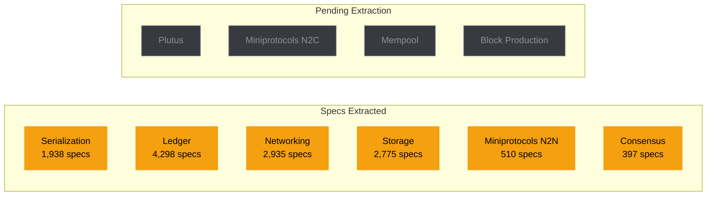

# Test Matrix

Per-subsystem test readiness matrix. This is the at-a-glance view of where we stand on testing for each of vibe-node's 10 subsystems. Data sourced from the spec ingestion pipeline and QA-validated gap analysis.

For the full test strategy, taxonomy, and per-phase plan, see the [Test Strategy](test-strategy.md).

## Readiness Overview

## Per-Subsystem Test Matrix

### Ledger

The largest subsystem by rule count and test spec volume. Covers UTxO validation, delegation, governance, and all era-specific transition rules.

| Metric | Value |
|--------|-------|
| **Status** | Extracted |
| **Rules extracted** | 490 |
| **Total test specs** | 4,298 |
| **Critical gaps** | 117 |
| **Important gaps** | 106 |
| **Phase** | 3 |

| Test Type | Critical | High | Medium | Low | Total |
|-----------|:--------:|:----:|:------:|:---:|:-----:|
| Unit | 1,013 | 1,281 | 597 | 30 | **2,921** |
| Property | 213 | 470 | 355 | 20 | **1,058** |
| Conformance | 76 | 111 | 91 | 2 | **280** |
| Integration | 10 | 19 | 4 | 0 | **33** |
| Replay | 2 | 4 | 0 | 0 | **6** |

!!! danger "Consensus-Critical"
    PlutusMap duplicate key handling ([uplc#35](https://github.com/SteelSwap/uplc/issues/35)) affects ledger validation. Conformance tests must verify exact match with Haskell node behavior.

---

### Networking

Covers the TCP multiplexer, connection manager, peer discovery, and the underlying transport layer.

| Metric | Value |
|--------|-------|
| **Status** | Extracted |
| **Rules extracted** | 337 |
| **Total test specs** | 2,935 |
| **Critical gaps** | 80 |
| **Important gaps** | 78 |
| **Phase** | 4 |

| Test Type | Critical | High | Medium | Low | Total |
|-----------|:--------:|:----:|:------:|:---:|:-----:|
| Unit | 763 | 844 | 340 | 25 | **1,972** |
| Property | 117 | 336 | 220 | 10 | **683** |
| Conformance | 75 | 81 | 40 | 2 | **198** |
| Integration | 15 | 44 | 23 | 0 | **82** |
| Replay | 0 | 0 | 0 | 0 | **0** |

---

### Storage

Covers on-disk block storage, immutable/volatile database, ledger state snapshots, and crash recovery.

| Metric | Value |
|--------|-------|
| **Status** | Extracted |
| **Rules extracted** | 345 |
| **Total test specs** | 2,775 |
| **Critical gaps** | 57 |
| **Important gaps** | 89 |
| **Phase** | 5 |

| Test Type | Critical | High | Medium | Low | Total |
|-----------|:--------:|:----:|:------:|:---:|:-----:|
| Unit | 648 | 780 | 386 | 30 | **1,844** |
| Property | 149 | 337 | 195 | 10 | **691** |
| Conformance | 24 | 48 | 37 | 5 | **114** |
| Integration | 38 | 65 | 37 | 1 | **141** |
| Replay | 0 | 1 | 0 | 0 | **1** |

---

### Serialization

Covers CBOR encoding/decoding, CDDL schema compliance, and era-specific type serialization.

| Metric | Value |
|--------|-------|
| **Status** | Extracted |
| **Rules extracted** | 222 |
| **Total test specs** | 1,938 |
| **Critical gaps** | 40 |
| **Important gaps** | 28 |
| **Phase** | 2 |

| Test Type | Critical | High | Medium | Low | Total |
|-----------|:--------:|:----:|:------:|:---:|:-----:|
| Unit | 487 | 535 | 251 | 11 | **1,284** |
| Property | 107 | 261 | 125 | 7 | **500** |
| Conformance | 66 | 50 | 24 | 1 | **141** |
| Integration | 0 | 4 | 1 | 0 | **5** |
| Replay | 5 | 2 | 1 | 0 | **8** |

---

### Miniprotocols (N2N)

Covers node-to-node miniprotocols: chain-sync, block-fetch, tx-submission, and keep-alive.

| Metric | Value |
|--------|-------|
| **Status** | Extracted |
| **Rules extracted** | 71 |
| **Total test specs** | 510 |
| **Critical gaps** | 10 |
| **Important gaps** | 14 |
| **Phase** | 4 |

| Test Type | Critical | High | Medium | Low | Total |
|-----------|:--------:|:----:|:------:|:---:|:-----:|
| Unit | 124 | 160 | 57 | 3 | **344** |
| Property | 15 | 47 | 30 | 0 | **92** |
| Conformance | 18 | 13 | 11 | 0 | **42** |
| Integration | 4 | 13 | 13 | 0 | **30** |
| Replay | 0 | 1 | 1 | 0 | **2** |

---

### Consensus

Covers Ouroboros Praos: VRF lottery, KES signatures, chain selection, and the security parameter (k=2160).

| Metric | Value |
|--------|-------|
| **Status** | Extracted |
| **Rules extracted** | 51 |
| **Total test specs** | 397 |
| **Critical gaps** | 0* |
| **Important gaps** | 0* |
| **Phase** | 5 |

| Test Type | Critical | High | Medium | Low | Total |
|-----------|:--------:|:----:|:------:|:---:|:-----:|
| Unit | 93 | 113 | 52 | 1 | **259** |
| Property | 30 | 52 | 22 | 0 | **104** |
| Conformance | 12 | 11 | 5 | 0 | **28** |
| Integration | 0 | 5 | 1 | 0 | **6** |
| Replay | 0 | 0 | 0 | 0 | **0** |

*38 raw gap analysis entries exist but have not yet been QA-validated.

---

### Plutus

Covers Plutus Core evaluation, cost model application, and script context construction.

| Metric | Value |
|--------|-------|
| **Status** | Not yet extracted |
| **Rules extracted** | -- |
| **Total test specs** | -- |
| **Phase** | 3 |

!!! info "Extraction Pending"
    Plutus spec extraction will be performed in Phase 2, ahead of the Phase 3 implementation. The [uplc](https://github.com/SteelSwap/uplc) library provides the evaluation engine; conformance tests will compare against `cardano-cli evaluate-script`.

---

### Miniprotocols (N2C)

Covers node-to-client miniprotocols: local chain-sync, local tx-submission, local state-query, and local tx-monitor.

| Metric | Value |
|--------|-------|
| **Status** | Not yet extracted |
| **Rules extracted** | -- |
| **Total test specs** | -- |
| **Phase** | 4 |

---

### Mempool

Covers transaction ordering, fee-based prioritization, size limits, and re-validation on rollback.

| Metric | Value |
|--------|-------|
| **Status** | Not yet extracted |
| **Rules extracted** | -- |
| **Total test specs** | -- |
| **Phase** | 6 |

---

### Block Production

Covers block forging, VRF proof inclusion, transaction selection, and operational certificate handling.

| Metric | Value |
|--------|-------|
| **Status** | Not yet extracted |
| **Rules extracted** | -- |
| **Total test specs** | -- |
| **Phase** | 6 |

## Summary

| Subsystem | Status | Rules | Test Specs | Critical Gaps | Phase |
|-----------|--------|:-----:|:----------:|:-------------:|:-----:|
| Serialization | Extracted | 222 | 1,938 | 40 | 2 |
| Ledger | Extracted | 490 | 4,298 | 117 | 3 |
| Networking | Extracted | 337 | 2,935 | 80 | 4 |
| Miniprotocols (N2N) | Extracted | 71 | 510 | 10 | 4 |
| Consensus | Extracted | 51 | 397 | 0* | 5 |
| Storage | Extracted | 345 | 2,775 | 57 | 5 |
| Plutus | Pending | -- | -- | -- | 3 |
| Miniprotocols (N2C) | Pending | -- | -- | -- | 4 |
| Mempool | Pending | -- | -- | -- | 6 |
| Block Production | Pending | -- | -- | -- | 6 |
| **Total** | **6/10** | **1,516** | **12,853** | **304** | |
