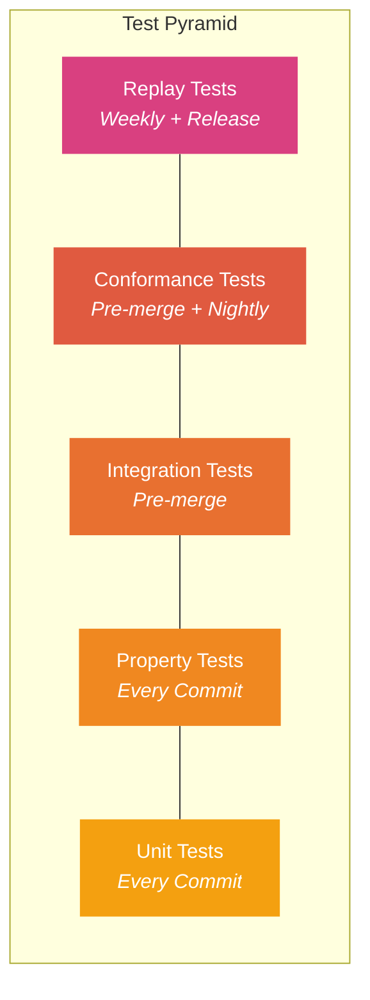
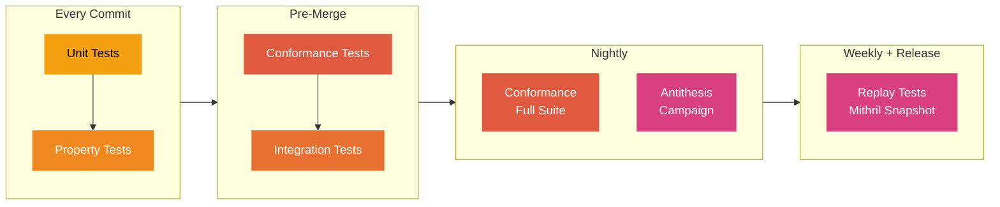

# Test Strategy

This document defines the testing strategy for vibe-node: the 5-type test taxonomy, per-phase test plan, conformance testing approach, and continuous verification infrastructure. Every implementation decision in this project is tested against the Haskell node as the oracle of truth.

## Test Taxonomy

vibe-node uses a 5-type test taxonomy, structured as a pyramid where cheaper, faster tests form the base and expensive, high-fidelity tests sit at the top.



### 1. Unit Tests

| Attribute | Value |
|-----------|-------|
| **Purpose** | Isolated function and module correctness |
| **Tooling** | pytest |
| **When** | Every commit (CI) |
| **Speed** | Seconds |
| **Scope** | Single function or class |

Unit tests verify that individual functions produce correct output for known inputs. They are the cheapest and fastest tests, forming the base of the pyramid. Examples include CBOR encoding/decoding of individual types, VRF output verification for known seeds, and UTxO balance calculations.

### 2. Property Tests

| Attribute | Value |
|-----------|-------|
| **Purpose** | Invariant verification across random inputs |
| **Tooling** | Hypothesis |
| **When** | Every commit (CI) |
| **Speed** | Seconds to minutes |
| **Scope** | Function invariants, round-trip properties |

Property tests use Hypothesis to generate random inputs and verify that invariants hold. Key properties include:

- **Round-trip serialization**: `decode(encode(x)) == x` for all CBOR types
- **Ledger preservation**: total ADA is conserved across valid state transitions
- **VRF determinism**: same key + slot always produces same output
- **Protocol state machines**: only valid transitions are accepted

!!! note "Antithesis Compatibility"
    Property tests are structured for compatibility with [Antithesis](https://antithesis.com/), the autonomous testing platform. See [Antithesis Integration](#antithesis-integration) for details.

### 3. Conformance Tests

| Attribute | Value |
|-----------|-------|
| **Purpose** | Bit-for-bit match with Haskell node output |
| **Tooling** | pytest + cardano-cli + Ogmios |
| **When** | Pre-merge + nightly |
| **Speed** | Minutes |
| **Scope** | Cross-implementation agreement |

Conformance tests are the gold standard. They compare vibe-node's behavior against the Haskell cardano-node for identical inputs. If they disagree, we are wrong. See [Conformance Testing Approach](#conformance-testing-approach) for the full methodology.

### 4. Integration Tests

| Attribute | Value |
|-----------|-------|
| **Purpose** | Multi-component interaction verification |
| **Tooling** | pytest + Docker Compose |
| **When** | Pre-merge |
| **Speed** | Minutes |
| **Scope** | Subsystem interactions |

Integration tests verify that subsystems work together correctly. Examples include the full sync pipeline (networking -> deserialization -> validation -> storage), miniprotocol handshake sequences, and mempool interaction with ledger validation.

### 5. Replay Tests

| Attribute | Value |
|-----------|-------|
| **Purpose** | Full block replay from real chain data |
| **Tooling** | Custom harness + Mithril snapshots |
| **When** | Weekly + release gates |
| **Speed** | Hours |
| **Scope** | End-to-end chain validation |

Replay tests download a recent Mithril snapshot and replay every block through vibe-node's validation pipeline, comparing the resulting ledger state against the Haskell node's state. This is the ultimate fidelity test — if we can replay mainnet history and arrive at the same state, the node is correct.

## Current Test Specification Coverage

The spec ingestion pipeline has extracted rules from 6 of the 10 subsystems and generated **12,887 test specifications** across all types and priorities. These specifications define *what* must be tested; implementation of the actual test code follows in each phase.

### Per-Subsystem Breakdown

| Subsystem | Rules Extracted | Test Specs | Unit | Property | Conformance | Integration | Replay | Gaps (Critical) | Gaps (Important) |
|-----------|:-:|:-:|:-:|:-:|:-:|:-:|:-:|:-:|:-:|
| **Ledger** | 490 | 4,298 | 2,921 | 1,058 | 280 | 33 | 6 | 117 | 106 |
| **Networking** | 337 | 2,935 | 1,972 | 683 | 198 | 82 | 0 | 80 | 78 |
| **Storage** | 345 | 2,775 | 1,844 | 691 | 114 | 141 | 1 | 57 | 89 |
| **Serialization** | 222 | 1,938 | 1,284 | 500 | 141 | 5 | 8 | 40 | 28 |
| **Miniprotocols (N2N)** | 71 | 510 | 344 | 92 | 42 | 30 | 2 | 10 | 14 |
| **Consensus** | 51 | 397 | 259 | 104 | 28 | 6 | 0 | 0* | 0* |
| **Plutus** | -- | -- | -- | -- | -- | -- | -- | -- | -- |
| **Miniprotocols (N2C)** | -- | -- | -- | -- | -- | -- | -- | -- | -- |
| **Mempool** | -- | -- | -- | -- | -- | -- | -- | -- | -- |
| **Block Production** | -- | -- | -- | -- | -- | -- | -- | -- | -- |
| **Total** | **1,516** | **12,853** | **8,624** | **3,128** | **803** | **297** | **17** | **304** | **315** |

*Consensus gap analysis is pending QA validation (38 raw entries exist).

!!! warning "Not Yet Extracted"
    Four subsystems have not yet been through the spec ingestion pipeline: **Plutus**, **Miniprotocols (N2C)**, **Mempool**, and **Block Production**. These will be extracted in Phase 2 as their implementation begins.

### Priority Distribution

| Priority | Unit | Property | Conformance | Integration | Replay | Total |
|----------|:-:|:-:|:-:|:-:|:-:|:-:|
| **Critical** | 3,128 | 631 | 271 | 67 | 7 | **4,104** |
| **High** | 3,713 | 1,503 | 314 | 150 | 8 | **5,688** |
| **Medium** | 1,683 | 947 | 208 | 79 | 2 | **2,919** |
| **Low** | 100 | 47 | 10 | 1 | 0 | **158** |

## Per-Phase Test Plan

Each implementation phase has specific test gates that must pass before advancing. Three tracks run in parallel, converging at integration points.

```mermaid
gantt
    title Test Gates — Parallel Tracks
    dateFormat X
    axisFormat

    section Track A — Networking
    Serialization unit + property       :a1, 0, 3s
    Multiplexer unit + property         :a2, after a1, 3s
    N2N miniprotocol FSM tests          :a3, after a2, 3s
    Chain-sync integration              :a4, after a3, 2s
    Block-fetch integration             :a5, after a4, 2s

    section Track B — Ledger
    Serialization (shared with A)       :b1, 0, 3s
    Byron–Mary ledger unit + property   :b2, after b1, 4s
    Alonzo–Conway ledger + Plutus       :b3, after b2, 4s
    Tx validation conformance           :b4, after b3, 2s

    section Track C — Storage
    Arrow+Dict unit + property          :c1, 0, 3s
    ImmutableDB + VolatileDB tests      :c2, after c1, 3s
    Mithril import integration          :c3, after c2, 2s

    section Integration
    Sync pipeline (A + B + C)           :crit, i1, after a5, 3s
    Consensus + tip agreement           :crit, i2, after i1, 3s
    Mempool + block production          :i3, after i2, 3s
    N2C miniprotocols                   :i4, after i2, 2s

    section Hardening
    Replay tests (Mithril mainnet)      :h1, after i3, 3s
    10-day soak test                    :crit, h2, after h1, 4s
    Memory + crash recovery             :h3, after h1, 3s
```

**Key parallel opportunities:**

- **Tracks A, B, C start simultaneously** — serialization is the shared foundation, then networking, ledger, and storage diverge into independent work streams
- **Track B (Ledger)** is the longest path — Byron through Conway ledger rules plus Plutus evaluation
- **Integration** is where tracks converge — sync pipeline requires networking (A) + storage (C) + ledger validation (B)
- **Hardening** gates on full integration — replay and soak tests need the complete system

### Phase 2 — Serialization & CBOR

**Subsystems under test:** Serialization

**Definition of done:**

- [ ] Decode 1,000 mainnet blocks from a Mithril snapshot and verify block hashes match
- [ ] Round-trip encode/decode all CDDL-defined types with zero byte-level differences
- [ ] Property tests pass for all era-specific block and transaction body types
- [ ] 100% of critical serialization test specs (487 unit, 107 property, 66 conformance) have implementations

**Test counts (minimum):**

| Type | Count |
|------|-------|
| Unit | 487 (critical) + 535 (high) |
| Property | 107 (critical) + 261 (high) |
| Conformance | 66 (critical) |

### Phase 3 — Ledger Rules & Validation

**Subsystems under test:** Ledger, Plutus (script evaluation)

**Definition of done:**

- [ ] All Conway-era UTXOW, UTXO, CERT, GOV, and DELEG rules pass against Haskell node test vectors
- [ ] Property tests verify ADA preservation across all transition types
- [ ] Plutus V1/V2/V3 script evaluation matches `cardano-cli evaluate-script` budget output
- [ ] Known consensus-critical issue (PlutusMap duplicate keys, uplc issue #35) is covered by explicit conformance test

**Test counts (minimum):**

| Type | Count |
|------|-------|
| Unit | 1,013 (critical) + 1,281 (high) |
| Property | 213 (critical) + 470 (high) |
| Conformance | 76 (critical) + 111 (high) |

!!! danger "Consensus-Critical: PlutusMap Duplicate Keys"
    Issue [uplc#35](https://github.com/SteelSwap/uplc/issues/35) documents that the Plutus specification allows duplicate keys in `PlutusMap`, but the Haskell implementation's behavior on lookups with duplicates is the de facto standard. Our conformance tests must verify that vibe-node matches the Haskell node's behavior exactly, not just the spec's definition. This is a consensus-critical divergence point.

### Phase 4 — Networking & Miniprotocols

**Subsystems under test:** Networking, Miniprotocols (N2N), Miniprotocols (N2C)

**Definition of done:**

- [ ] Multiplexer correctly demultiplexes concurrent miniprotocol streams
- [ ] Chain-sync, block-fetch, tx-submission, and keep-alive miniprotocols complete full handshake with Haskell node
- [ ] Property tests verify protocol state machine transitions (no invalid states reachable)
- [ ] Integration test: sync 1,000 blocks from a running Haskell node on preview testnet

**Test counts (minimum):**

| Type | Count |
|------|-------|
| Unit | 887 (critical networking + n2n) |
| Property | 132 (critical) |
| Conformance | 93 (critical) |
| Integration | 19 (critical) |

### Phase 5 — Consensus & Chain Selection

**Subsystems under test:** Consensus, Storage

**Definition of done:**

- [ ] VRF lottery evaluation matches Haskell node for known test vectors
- [ ] KES key evolution produces correct signatures across period boundaries
- [ ] Chain selection picks the same tip as the Haskell node in a 3-node private devnet
- [ ] Tip agreement within 2,160 slots maintained over 24-hour test run
- [ ] Crash recovery: node restarts from persisted state and re-syncs without data loss

**Test counts (minimum):**

| Type | Count |
|------|-------|
| Unit | 741 (critical consensus + storage) |
| Property | 179 (critical) |
| Conformance | 36 (critical) |
| Integration | 43 (critical) |

### Phase 6 — Block Production & Mainnet Readiness

**Subsystems under test:** Block Production, Mempool, all subsystems (end-to-end)

**Definition of done:**

- [ ] Produce valid blocks accepted by Haskell nodes on preview/preprod testnet
- [ ] Replay full Mithril mainnet snapshot with matching final ledger state
- [ ] All node-to-node and node-to-client miniprotocols functional
- [ ] Memory usage matches or beats Haskell node across 10-day benchmark
- [ ] Power-loss recovery verified via kill-9 + restart test suite

## Conformance Testing Approach

The Haskell cardano-node is the oracle of truth. Conformance testing verifies that vibe-node produces identical results for identical inputs.

### Infrastructure

The existing Docker Compose setup provides the conformance testing backbone:

```
docker-compose.yml
  |-- cardano-node (Haskell, preview/preprod)
  |-- ogmios (WebSocket JSON bridge)
  |-- vibe-node (our implementation)
```

All conformance tests run against this shared infrastructure. The Haskell node provides authoritative answers via Ogmios queries and cardano-cli commands.

### Conformance Test Categories

#### Block Decode Conformance

Decode a block from raw CBOR, re-encode it, and verify the bytes are identical:

```
mainnet_block.cbor --> vibe-node decode --> vibe-node encode --> compare bytes
                   --> Haskell decode  --> Haskell encode  --> reference bytes
```

This catches any serialization divergence, including field ordering, tag usage, and canonical encoding differences.

#### Transaction Validation Conformance

Submit identical transactions to both nodes and verify they agree on accept/reject:

```
For each test transaction:
  1. Submit to Haskell node via cardano-cli
  2. Submit to vibe-node
  3. Compare: both accept OR both reject with same error category
```

#### State Query Conformance

Compare ledger state queries between implementations:

- **UTxO set**: query UTxOs at same address, compare results
- **Protocol parameters**: compare all protocol parameter values
- **Stake distribution**: compare delegated stake per pool
- **Rewards**: compare reward account balances

#### Script Evaluation Conformance

Compare Plutus script evaluation budgets:

```
For each script:
  1. cardano-cli transaction evaluate-script --> (cpu, mem) budget
  2. vibe-node uplc evaluate                 --> (cpu, mem) budget
  3. Assert budgets match exactly
```

### Known Consensus-Critical Issues

These are documented divergences between the formal spec and the Haskell implementation that our conformance tests must explicitly cover:

| Issue | Subsystem | Severity | Description |
|-------|-----------|----------|-------------|
| [uplc#35](https://github.com/SteelSwap/uplc/issues/35) | Plutus | Critical | PlutusMap allows duplicate keys; Haskell lookup behavior on duplicates is the de facto standard |
| 304 critical gaps | Multiple | Critical | Spec-vs-implementation divergences identified by QA validation pipeline |
| 315 important gaps | Multiple | Important | Implementation details not specified but required for compatibility |

All 304 critical gaps must have corresponding conformance tests by the end of Phase 5. The 315 important gaps must be covered by Phase 6.

## Antithesis Integration

[Antithesis](https://antithesis.com/) is an autonomous testing platform that explores program state spaces far beyond what conventional testing reaches. The [Leios project](https://github.com/input-output-hk/ouroboros-leios/tree/main/antithesis) provides a reference for how Cardano protocol implementations can be tested on Antithesis.

### Hypothesis-to-Antithesis Bridge

Our Hypothesis property tests are structured to be compatible with Antithesis's testing model:

1. **Stateless properties** (e.g., serialization round-trips) map directly to Antithesis assertions
2. **Stateful properties** (e.g., ledger state transitions) use Hypothesis `RuleBasedStateMachine` which maps to Antithesis state exploration
3. **Invariant properties** (e.g., ADA conservation, valid chain selection) become Antithesis "always" assertions

### Candidate Properties for Antithesis

The following properties are candidates for Antithesis exploration, prioritized by consensus criticality:

**Consensus invariants:**

- Chain selection always picks the longest valid chain
- VRF lottery is fair (proportional to stake over sufficient samples)
- No valid block is ever rejected
- Tip agreement converges within k slots after network partition heals

**Ledger invariants:**

- Total ADA is conserved across all transitions
- No double-spend is possible
- Reward calculations are monotonically consistent
- Script evaluation is deterministic (same script + same arguments = same result)

**Networking invariants:**

- Miniprotocol state machines never reach invalid states
- Multiplexer delivers messages in order per miniprotocol
- Connection management respects peer limits

### Integration Plan

| Phase | Antithesis Activity |
|-------|-------------------|
| Phase 2 | Structure Hypothesis tests with Antithesis-compatible assertions |
| Phase 3 | Publish ledger state machine properties as Antithesis test suite |
| Phase 4 | Add network fault injection properties |
| Phase 5 | Full consensus invariant suite on Antithesis |
| Phase 6 | Multi-node Antithesis campaign (vibe-node + Haskell nodes) |

## CI Pipeline



| Stage | Trigger | Timeout | Failure Action |
|-------|---------|---------|----------------|
| Unit | Every push | 5 min | Block merge |
| Property | Every push | 10 min | Block merge |
| Conformance | PR + nightly | 30 min | Block merge (PR), alert (nightly) |
| Integration | PR | 15 min | Block merge |
| Replay | Weekly cron + release tag | 4 hours | Alert + block release |
| Antithesis | Nightly | 8 hours | Alert + investigate |
