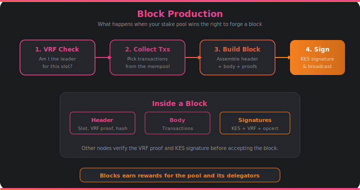

# Block Production

If you run a stake pool, block production is where it all comes together. This is the moment your node creates a new block, adds it to the chain, and earns rewards for you and your delegators.

## Winning the Slot

Block production starts with the VRF lottery (see [Consensus](consensus.md)). At each slot, your node checks whether your pool has been elected leader. This happens privately — nobody else can tell whether you won until you publish your block, and even then, the VRF proof demonstrates you won fair and square.

The probability of winning depends on your pool's active stake relative to the total staked ADA. A pool with 1% of total stake will produce roughly 1% of all blocks over an epoch. The randomness ensures that no one can predict which pools will produce which blocks, preventing targeted attacks.

## Forging a Block

When your pool wins a slot, the node has about one second to forge the block and get it out to the network. Here's what happens:

1. **Collect transactions** from the [mempool](mempool.md), selecting those that fit within the maximum block size and maximize fee revenue.
2. **Build the block body** containing the selected transactions.
3. **Create the block header** with the slot number, the VRF proof (proving you won the lottery), the hash of the previous block, and other metadata.
4. **Sign everything** with the node's KES (Key Evolving Signature) key. KES keys evolve over time — each signing period uses a different key, so compromising a key only affects a limited time window.

The finished block is then broadcast to all connected peers through the [miniprotocols](miniprotocols.md). Other nodes verify the VRF proof and KES signature before accepting it.

## The Operational Certificate

Stake pool operators don't use their cold keys directly. Instead, they create an **operational certificate** (opcert) that delegates block-signing authority to a hot KES key. The cold key stays offline and safe. If the KES key is compromised, the operator generates a new opcert with a new KES key — the pool's pledge and delegation are unaffected.

This layered key scheme is one of the reasons Cardano stake pools are considered safe for delegators. The keys that sign blocks are different from the keys that control the pool's registration and pledge.

## How It Connects

- Block production is triggered by [**consensus**](consensus.md) when the node's pool wins the VRF lottery.
- Transactions come from the [**mempool**](mempool.md), pre-validated by the [**ledger**](ledger.md).
- The new block is serialized to CBOR by [**serialization**](serialization.md) and sent to peers via [**networking**](networking.md).
- The block immediately enters [**storage**](storage.md) in the volatile store.
