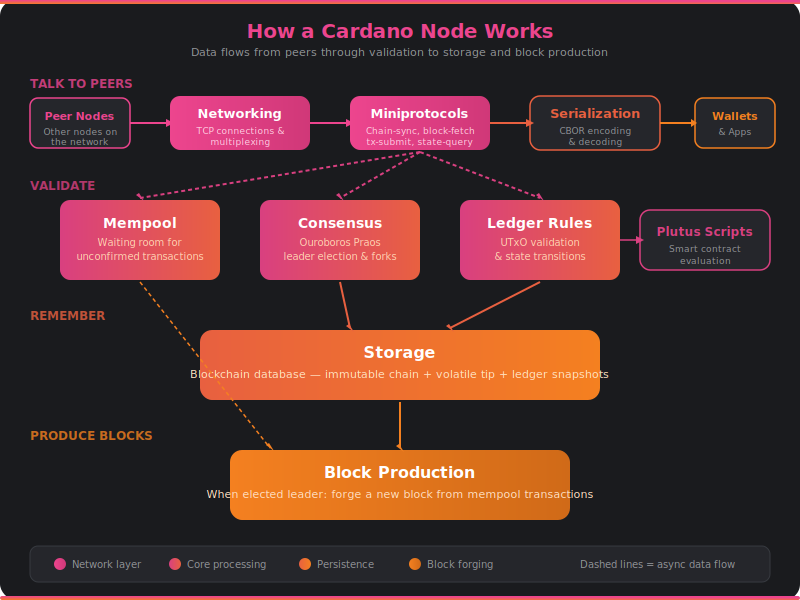

# How a Cardano Node Works

A Cardano node is the software that keeps the blockchain alive. Every time you send ADA, delegate to a stake pool, or vote on governance, a network of nodes is working behind the scenes to make it happen.

This section explains what a node actually does — in plain language, with diagrams. No code, no spec references, just the concepts.

## The Big Picture

A Cardano node does four things:

1. **Talks to peers** — Connects to other nodes around the world, sharing blocks and transactions over the internet.
2. **Validates everything** — Checks that every block and transaction follows the rules. No cheating allowed.
3. **Remembers the chain** — Stores the entire blockchain on disk so it can answer questions and recover from crashes.
4. **Produces blocks** — If the node runs a stake pool, it periodically wins the right to forge a new block.

That's it. Everything else is details about *how* it does those four things.

## The Node at a Glance

Data flows top to bottom: incoming connections arrive through the **networking** layer, which speaks structured **miniprotocols** to exchange blocks and transactions. Everything passes through **serialization** (CBOR encoding) on its way in and out.

The core processing layer is where the real work happens. The **mempool** holds unconfirmed transactions. **Consensus** (Ouroboros Praos) decides which chain is the right one. The **ledger rules** validate every transaction, calling out to **Plutus** when smart contracts are involved.

Validated blocks land in **storage** — the permanent record. And when the node's stake pool wins a slot, **block production** pulls transactions from the mempool and forges a new block for the network.

## The Subsystems

Dive into any subsystem to learn more:

| Subsystem | What it does |
|-----------|-------------|
| [Networking](networking.md) | Finds peers and maintains TCP connections |
| [Miniprotocols](miniprotocols.md) | The structured conversations between nodes and wallets |
| [Consensus](consensus.md) | Ouroboros Praos — how the network agrees on the chain |
| [Ledger Rules](ledger.md) | The rulebook for valid transactions |
| [Script Evaluation](plutus.md) | Running Plutus smart contracts on-chain |
| [Serialization](serialization.md) | Packing and unpacking data with CBOR |
| [Mempool](mempool.md) | The waiting room for pending transactions |
| [Storage](storage.md) | How the blockchain is stored on disk |
| [Block Production](block-production.md) | Forging new blocks when your pool wins a slot |

## Follow a Transaction

Want to see how all these pieces work together? Read [**The Journey of a Transaction**](transaction-lifecycle.md) — a step-by-step walkthrough of what happens from the moment you hit "send" in your wallet to the moment your transaction becomes permanent on the blockchain.
