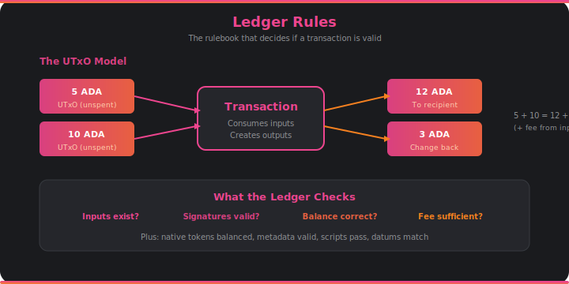

# Ledger Rules

Every time you send ADA or interact with a DeFi protocol, the ledger rules are the reason your transaction either succeeds or gets rejected. They're the rulebook of the Cardano blockchain — enforcing that no ADA is created from thin air and that every transaction plays fair.

## The UTxO Model

Cardano uses a model called **Extended UTxO** (Unspent Transaction Output). Instead of tracking account balances like a bank, Cardano tracks individual "coins" — each one is a UTxO with a specific value sitting at a specific address. When you "send" ADA, you're really consuming one or more UTxOs and creating new ones.

Think of it like paying with cash. You hand over a 10 ADA note and a 5 ADA note to pay for something that costs 12 ADA. The transaction consumes both inputs (15 ADA total), creates one output for the recipient (12 ADA), and creates another output back to you as change (3 ADA, minus the fee). The old notes are gone; new ones exist in their place.

This model has a powerful property: transactions can be validated independently. If two transactions spend different UTxOs, they can't conflict with each other. This makes parallel validation possible and eliminates entire classes of race conditions.

## What Gets Checked

When a transaction arrives, the ledger runs it through a gauntlet of checks:

- **Do the inputs exist?** Every UTxO being consumed must actually exist and not have been spent already.
- **Are the signatures valid?** The owner of each input must have signed the transaction.
- **Does the balance add up?** Total inputs must equal total outputs plus the fee. No ADA can appear or vanish.
- **Is the fee sufficient?** The fee must meet the minimum required by the current protocol parameters.
- **Are native tokens balanced?** If the transaction involves tokens (NFTs, fungible tokens), those must balance too.
- **Do scripts pass?** If any input is locked by a smart contract, that contract must approve the spend (see [Script Evaluation](plutus.md)).

The ledger also handles staking operations (delegation, pool registration), governance actions (votes, proposals), and protocol parameter updates — each with their own set of rules.

## How It Connects

- The ledger validates transactions arriving from the [**mempool**](mempool.md) and blocks arriving from [**consensus**](consensus.md).
- When transactions include smart contracts, the ledger calls out to [**Plutus**](plutus.md) for script evaluation.
- Validated state changes are persisted by [**storage**](storage.md) as ledger snapshots.
- All transaction data is encoded and decoded by [**serialization**](serialization.md).
