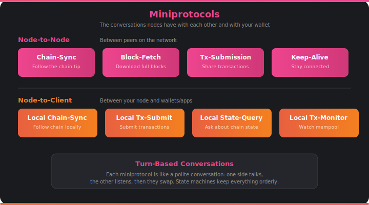

# Miniprotocols

When you check your wallet balance or submit a transaction, your wallet and its node are having a structured conversation. These conversations follow strict rules called miniprotocols — and the same kind of conversations happen between nodes on the network.

## What They Are

Miniprotocols are the language that Cardano nodes speak. Each one is a turn-based exchange: one side sends a message, the other responds, and they alternate. Think of it like a polite conversation where nobody interrupts. This turn-based design makes the protocols predictable, testable, and impossible to deadlock.

There are two families of miniprotocols. **Node-to-Node (N2N)** protocols are used between peers on the network — the conversations that keep the blockchain in sync across the world. **Node-to-Client (N2C)** protocols are used locally between a node and the wallets or applications connected to it.

## Node-to-Node Protocols

These are the conversations happening between every pair of connected nodes:

- **Chain-Sync** — "What blocks do you have that I don't?" One node follows the other's chain tip, asking for new block headers as they appear. This is how nodes stay up to date.
- **Block-Fetch** — "Send me the full contents of these blocks." After chain-sync identifies new blocks, block-fetch downloads the actual block data.
- **Tx-Submission** — "I have a new transaction. Want it?" Nodes share unconfirmed transactions with each other so they spread across the network before being included in a block.
- **Keep-Alive** — A periodic heartbeat that keeps connections from timing out during quiet periods.

## Node-to-Client Protocols

These are the conversations between your node and your wallet or application:

- **Local Chain-Sync** — Similar to N2N chain-sync, but optimized for local use. Your wallet uses this to follow the chain and know about new blocks.
- **Local Tx-Submission** — How your wallet sends a signed transaction to the node. The node validates it and, if it passes, adds it to the mempool.
- **Local State-Query** — "What's the current state of...?" Your wallet asks questions like "what's my UTxO set?" or "what are the current protocol parameters?" The node looks up the answer from its ledger state.
- **Local Tx-Monitor** — "What's in the mempool right now?" Lets applications watch for pending transactions before they're included in a block.

## How It Connects

- Miniprotocols run over TCP connections managed by the [**networking**](networking.md) layer, which multiplexes multiple protocols on a single connection.
- Every message is packed and unpacked by [**serialization**](serialization.md) using CBOR encoding.
- Chain-sync and block-fetch feed blocks into [**consensus**](consensus.md) for chain selection.
- Tx-submission feeds transactions into the [**mempool**](mempool.md).
- State-query reads from the [**ledger**](ledger.md) state.
