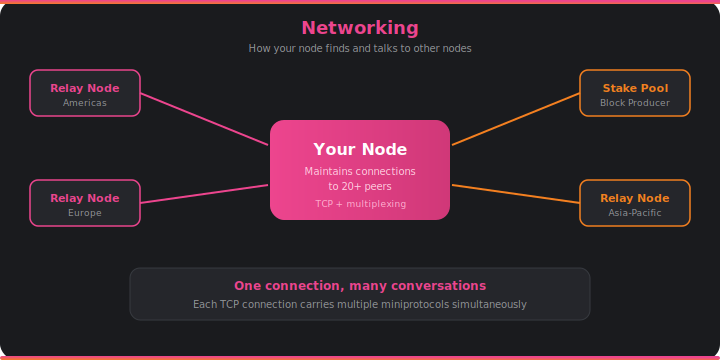

# Networking

If you've ever noticed that your wallet takes a moment to sync when you open it, that's the networking layer at work — your wallet's node is catching up with the rest of the world.

## What It Does

A Cardano node doesn't exist in isolation. It maintains connections to dozens of other nodes spread across the globe, forming a peer-to-peer network. When a new block is forged in Tokyo, the networking layer is what carries it to nodes in New York, London, and everywhere else within seconds.

Each connection uses TCP — the same reliable transport protocol that powers web browsing. But Cardano adds a twist: **multiplexing**. A single TCP connection between two nodes carries multiple independent conversations simultaneously. One conversation might be syncing block headers while another is sharing a new transaction. This is efficient — fewer connections means less overhead, and the conversations don't interfere with each other.

The networking layer also handles peer discovery and management. It decides which nodes to connect to, monitors connection health, and gracefully handles peers that go offline. A well-connected node is a healthy node — it hears about new blocks quickly and can share transactions with the network efficiently.

## How It Connects

- The conversations that travel over these connections are defined by the [**miniprotocols**](miniprotocols.md) — structured message exchanges for syncing chains, fetching blocks, and sharing transactions.
- All data sent over the wire is packed into compact binary format by the [**serialization**](serialization.md) layer.
- Incoming blocks flow into [**consensus**](consensus.md) for chain selection and the [**ledger**](ledger.md) for validation.
