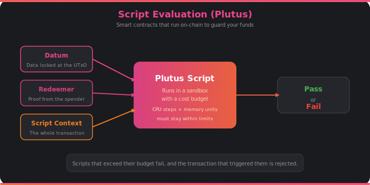

# Script Evaluation (Plutus)

If you've ever used a DEX, minted an NFT, or interacted with any Cardano DApp, a Plutus script ran on-chain to make it happen. Plutus is Cardano's smart contract platform — the programmable logic that lets developers create complex conditions for spending funds.

## How Smart Contracts Work on Cardano

On Cardano, a smart contract isn't a long-running program. It's a **validator** — a function that runs once when someone tries to spend a UTxO that's locked by a script. The validator looks at the transaction and answers a simple question: "Is this spend allowed?" If the answer is yes, the transaction proceeds. If not, it fails.

Every validator receives three pieces of information:

- **The datum** — data attached to the UTxO when it was created. Think of it as the contract's state. For a DEX, this might include the exchange rate and available liquidity.
- **The redeemer** — data provided by whoever is trying to spend the UTxO. This is their "proof" or "argument" for why the spend should be allowed. For a DEX swap, this might specify the minimum tokens they expect to receive.
- **The script context** — the entire transaction being validated. The script can inspect all inputs, outputs, fees, signatures, and metadata to make its decision.

## Cost Budgets

Every Plutus script runs inside a sandbox with strict resource limits. Each script execution consumes **CPU steps** (computation) and **memory units** (data), and the transaction must declare its budget upfront. If a script exceeds its budget, it fails. If the budget was honest, the transaction fee covers the execution cost.

This design is intentional: it makes transaction costs predictable. You know before submitting whether your transaction will succeed and exactly what it will cost. There's no "out of gas" surprise halfway through execution.

## How It Connects

- Plutus scripts are called by the [**ledger rules**](ledger.md) during transaction validation when a script-locked UTxO is spent.
- Scripts and their data (datums, redeemers) are encoded using [**serialization**](serialization.md) in CBOR format.
- Transactions with scripts wait in the [**mempool**](mempool.md) like any other transaction until they're included in a block.
