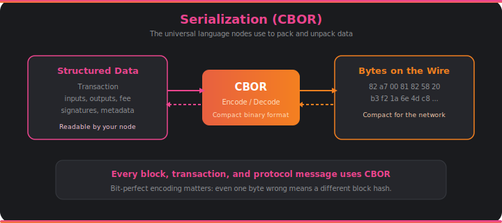

# Serialization (CBOR)

Every block you've ever synced, every transaction you've ever submitted, and every message between nodes has been serialized into bytes and back. Serialization is the invisible translator that lets the entire network speak the same language.

## What It Does

Serialization is the process of converting structured data — transactions, blocks, protocol messages — into compact binary bytes that can be sent over the network or stored on disk. Deserialization is the reverse: turning those bytes back into structured data the node can work with.

Cardano uses a format called **CBOR** (Concise Binary Object Representation). CBOR is like JSON's compact cousin — it can represent the same kinds of data (numbers, strings, arrays, maps) but in a fraction of the space. A transaction that might be hundreds of characters in a human-readable format compresses down to a tight sequence of bytes.

Why does compactness matter? Because every byte has a cost. More bytes means more bandwidth to transfer blocks between nodes, more disk space to store the blockchain, and slower sync times. Over millions of blocks, the savings add up enormously.

## Why Bit-Perfect Encoding Matters

Here's something that surprises people: on Cardano, the exact bytes of a serialized block matter, not just the data they represent. Two different CBOR encodings of the same transaction produce different hashes — and block hashes are how the chain links together. If a node serializes a block differently than the original producer, the hash won't match, and the block will be rejected.

This means serialization isn't just "nice to have." It's a consensus-critical component. Get one byte wrong and the chain breaks. Every node must produce bit-identical encoding for the same data, following the exact same CBOR conventions defined in the Cardano specification.

## How It Connects

- Every message in the [**miniprotocols**](miniprotocols.md) is serialized to CBOR before being sent over [**networking**](networking.md) connections.
- The [**ledger**](ledger.md) depends on exact serialization for transaction and block hash computation.
- [**Storage**](storage.md) writes CBOR-encoded blocks to disk.
- [**Block production**](block-production.md) must serialize new blocks identically to how other nodes would expect them.
