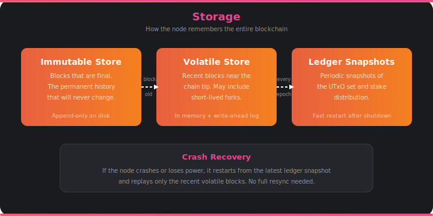

# Storage

The Cardano blockchain is about 120 GB of data and growing. Every block ever produced, every transaction ever confirmed — it all lives on disk. The storage layer is how the node remembers everything and how it gets back on its feet after a crash.

## Three Stores

The node organizes its data into three distinct stores, each with a different job:

**The Immutable Store** holds the permanent history — blocks that are deep enough in the chain that they'll never be rolled back. Once a block is buried under 2160 or more subsequent blocks (the security parameter *k*), it moves into the immutable store. This is an append-only structure on disk: data goes in and never changes. The entire history of Cardano, from genesis to about 20 minutes ago, lives here.

**The Volatile Store** holds the recent tip of the chain — the last *k* blocks that could still theoretically be rolled back in case of a fork. This is the "live" part of the chain where things are still settling. The volatile store needs to handle forks: it may temporarily track multiple competing chain branches until one wins out. When blocks age past the security window, they graduate to the immutable store.

**Ledger Snapshots** are periodic checkpoints of the full ledger state — the UTxO set, stake distribution, protocol parameters, and everything else the node needs to validate new blocks. Taking a snapshot is expensive (the UTxO set alone has millions of entries), so the node does it periodically rather than after every block. These snapshots are what make fast restarts possible.

## Crash Recovery

One of the acceptance criteria for this node is recovering from power loss without human intervention. The storage layer makes this possible. When the node restarts after a crash, it loads the most recent ledger snapshot, then replays only the blocks since that snapshot from the immutable and volatile stores. There's no need to resync the entire chain from the network — recovery takes seconds to minutes, not hours.

## How It Connects

- [**Consensus**](consensus.md) writes validated blocks to the volatile store and promotes them to the immutable store.
- [**Ledger**](ledger.md) state is periodically checkpointed as ledger snapshots.
- All data is stored in CBOR format, handled by [**serialization**](serialization.md).
- The [**miniprotocols**](miniprotocols.md) read from storage to serve block data to peers and clients.
