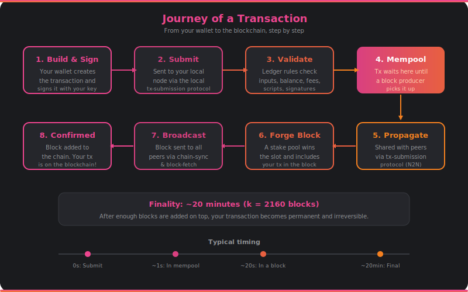

# The Journey of a Transaction

What happens when you hit "send" in your wallet? Here's the complete path your transaction takes, from your screen to the permanent blockchain.

## The Full Journey

### 1. Build and Sign

It starts in your wallet. You specify the recipient, the amount, and any other details (native tokens, metadata, smart contract interactions). Your wallet software assembles a transaction: it finds UTxOs in your address that cover the amount plus fees, constructs the outputs, calculates the fee, and signs the whole thing with your private key.

At this point, the transaction exists only on your device. Nobody else knows about it yet.

### 2. Submit to Your Node

Your wallet sends the signed transaction to your local Cardano node using the **local tx-submission** [miniprotocol](miniprotocols.md). This is a local connection — it doesn't go over the internet. If you use a light wallet, the wallet service submits on your behalf.

### 3. Validate

Your node runs the transaction through the full [ledger rules](ledger.md) gauntlet:

- Do the input UTxOs exist and haven't been spent?
- Is the signature valid?
- Do inputs and outputs balance (accounting for fees)?
- If smart contracts are involved, do the [Plutus scripts](plutus.md) approve?

If any check fails, the transaction is rejected and your wallet gets an error. Nothing was spent.

### 4. Enter the Mempool

Validation passes. The transaction enters the [mempool](mempool.md) — the node's local holding area for valid-but-unconfirmed transactions. Your wallet can now show the transaction as "pending."

### 5. Propagate Across the Network

Your node shares the transaction with its peers using the **tx-submission** [miniprotocol](miniprotocols.md). Those peers validate it and add it to their own mempools, then share it with their peers, and so on. Within seconds, the transaction has spread across the entire network.

### 6. Included in a Block

Somewhere in the world, a stake pool wins the VRF lottery for a slot. The [block producer](block-production.md) reaches into its mempool, selects your transaction (along with others), and forges a new block. Your transaction is now part of a block.

### 7. Block Propagates

The new block is broadcast to the network. Every node receives it via **chain-sync** and **block-fetch**, validates the block and all its transactions, and adds it to their chain. [Consensus](consensus.md) agrees this block extends the best chain.

### 8. Confirmed

Your transaction is now on the blockchain. Your wallet's node sees the new block, finds your transaction in it, and updates your balance. The transaction moves from "pending" to "confirmed."

## How Long Does It Take?

| Stage | Typical Time |
|-------|-------------|
| Submit to mempool | Under 1 second |
| Propagate to peers | 1-2 seconds |
| Included in a block | ~20 seconds (average) |
| Considered final (k=2160) | ~20 minutes |

The time to inclusion depends on slot occupancy — blocks appear roughly every 20 seconds on average (5% of 1-second slots). During high-demand periods, the mempool may be more competitive, but Cardano's deterministic fee model means your transaction won't be outbid after submission.

## When Things Go Wrong

A few things can prevent your transaction from landing:

- **Insufficient funds** — Your UTxOs don't cover the outputs plus fee. Rejected at validation.
- **UTxO already spent** — Someone else (or you, in another transaction) spent the same UTxO. Rejected at validation, or evicted from the mempool when a conflicting block arrives.
- **Script failure** — A Plutus validator returned false. Rejected at validation.
- **Mempool full** — During extreme congestion, older transactions may be evicted before inclusion. Re-submit to try again.

In all cases, your ADA is safe. Failed transactions don't spend anything. This is a fundamental property of the UTxO model: either the entire transaction succeeds, or nothing happens.
