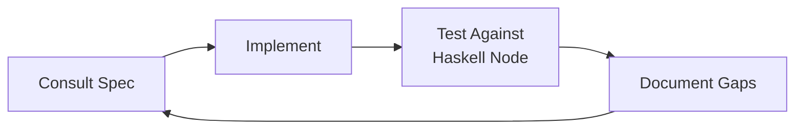

# How We Build

## The Vibe-Coding Philosophy

Vibe coding isn't sloppy coding with extra steps. It's AI-assisted development where the model does the heavy lifting and the human steers. The output still has to be correct, tested, and maintainable. The difference is radical transparency — every prompt is visible, every decision is documented, every dead end is on the record.

This project has two objectives:

1. **Build a spec-compliant Cardano node** in response to Pi Lanningham's open challenge
2. **Produce an era-aware spec gap analysis** that documents where the published Cardano specifications diverge from the Haskell node implementation — like errata for a scientific publication

These objectives reinforce each other. Understanding the spec deeply enough to document its gaps makes our node more correct. Building the node surfaces gaps we'd never find by reading alone.

## The Development Cycle

Every implementation step follows the same discipline:

1. **Consult the spec** — Use the Search MCP to find relevant spec sections before writing code
2. **Implement against the spec** — Code traces back to specific definitions and rules
3. **Test against the Haskell node** — The Haskell node is the oracle of truth. If we disagree, we're wrong.
4. **Document observed gaps** — Any divergence between spec and Haskell implementation gets recorded in the [Gap Analysis](../gap-analysis/index.md)

This isn't a waterfall. It's a tight loop that runs for every function, every protocol message, every ledger rule.

## Why Python?

Python is the primary language. We know its strengths (expressiveness, ecosystem, rapid development) and its limits (performance ceilings, GIL). We reach for Rust/C extensions only when Python genuinely can't meet memory or throughput requirements.

Python also avoids the MOSS/JPlag concern — no existing alternative Cardano node uses it. Our implementation is original by construction.

## The Public Record

The git history IS the proof that this node was vibe-coded:

- Every AI-assisted commit includes the model name, prompt context, and a `Co-Authored-By` tag
- The entire git history is public from day one
- Dead ends and failures are documented alongside successes
- Anyone can fork this project and understand every choice we made

We want someone to look at this a year from now and learn not just what we built, but how we built it.

## Next

- [Toolchain](toolchain.md) — Every tool we use, why we chose it
- [Agent Architecture](agents.md) — How Agent Millenial orchestrates the work
- [Coordination](coordination.md) — How Plane tracks work items
- [Workflow](workflow.md) — Step-by-step development process
