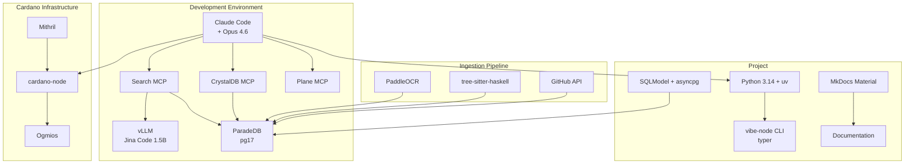

# Toolchain

Every tool in the stack was chosen for a reason. Here's what we use, why, and how it fits together.

## Architecture

## Tools

### Core Development

| Tool | Version | Purpose |
|------|---------|---------|
| **Python** | 3.14 | Primary implementation language |
| **uv** | Latest | Package management and virtual environments |
| **typer** | 0.15+ | CLI framework for `vibe-node` commands |
| **SQLModel** | 0.0.37+ | Database schema definitions and validation |
| **asyncpg** | 0.31+ | Async PostgreSQL driver |

**Why Python 3.14?** Latest stable release with the best performance characteristics. No existing alternative Cardano node uses Python, which avoids MOSS/JPlag structural similarity concerns entirely.

### AI & Embeddings

| Tool | Version | Purpose |
|------|---------|---------|
| **Claude Code** | Latest | AI-assisted development environment |
| **Claude Opus 4.6** | 1M context | Primary model for all development |
| **vLLM** | Latest | High-throughput embedding inference server |
| **Jina Code Embeddings 1.5B** | v1 | Code-specialized embedding model |

**Why Jina Code 1.5B?** Built on Qwen2.5-Coder-1.5B, it understands code structure (not just text). At 1.5B parameters (~3GB VRAM), it runs alongside the full compose stack. Deficiencies are mitigated by BM25 keyword search via fused retrieval.

### Knowledge Base

| Tool | Version | Purpose |
|------|---------|---------|
| **ParadeDB** | pg17 | Document database with BM25 (pg_search) + vector (pgvector) search |
| **PaddleOCR** | Latest | PDF-to-Mathpix-markdown conversion preserving equations |
| **tree-sitter-haskell** | Latest | AST-aware function-level Haskell code chunking |
| **Docker Compose** | Latest | Container orchestration for all dev infrastructure |

**Why ParadeDB?** BM25 keyword search and pgvector similarity search in one database. Reciprocal rank fusion (RRF) combines both for better retrieval than either alone. No need for a separate Elasticsearch instance.

### Cardano Infrastructure

| Tool | Version | Purpose |
|------|---------|---------|
| **cardano-node** | Latest | Haskell reference node for conformance testing |
| **Mithril** | Latest | Fast snapshot-based chain sync |
| **Ogmios** | Latest | JSON/WebSocket interface to cardano-node |

### Documentation & Project Management

| Tool | Version | Purpose |
|------|---------|---------|
| **MkDocs Material** | 9.7+ | Documentation site with Mermaid diagrams and math rendering |
| **Plane** | Hosted | Work item tracking — modules, issues, priorities, milestones |
| **bump-my-version** | 1.2+ | Semantic versioning with dev tags |

### MCP Integrations

| MCP | Purpose |
|-----|---------|
| **Search MCP** | Embed queries + RRF fused search across specs, code, and issues |
| **CrystalDB MCP** | Raw SQL access to ParadeDB for ad-hoc queries |
| **Plane MCP** | Work item management from within Claude Code |
