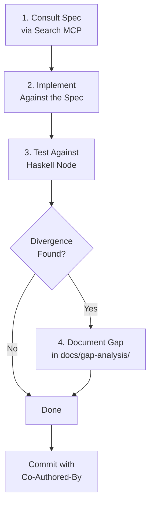

# Development Workflow

## The Spec-First Loop

Every piece of implementation follows the same four-step discipline. No exceptions.



### Step 1: Consult the Spec

Before writing any protocol logic or ledger rule, query the knowledge base:

```
Search MCP: search("Ouroboros Praos VRF verification", era="conway")
```

This returns ranked results from:
- Formal spec documents (with mathematical definitions)
- Haskell source code (function-level, per release)
- GitHub issues (historical bugs and ambiguities)

Read the spec. Understand what it requires. Note the specific section and equation numbers.

### Step 2: Implement Against the Spec

Write code that traces back to the spec:

```python
# Implements: Shelley Ledger Spec, Section 4.2, Equation (3)
# VRF verification for slot leader check
def verify_vrf_output(vrf_proof: bytes, slot: int, ...) -> bool:
    ...
```

### Step 3: Test Against the Haskell Node

The Haskell node is the oracle of truth. Use the Docker Compose stack:

- **Ogmios** — Query chain state, submit transactions, compare block validation
- **cardano-node** — Direct socket communication for miniprotocol testing
- **Conformance tests** — Compare our output against the Haskell node's for the same inputs

If the spec and the Haskell node disagree, **the Haskell node wins**. Document the divergence.

### Step 4: Document Gaps

Any divergence between spec and implementation gets recorded. See the [Gap Analysis](../gap-analysis/index.md) methodology for the entry format.

## Commit Workflow

Every AI-assisted commit includes three things:

```
Implement VRF verification for Ouroboros Praos slot leader check

Implements the VRF output verification following Shelley Ledger Spec
Section 4.2. Uses libsodium bindings for VRF proof verification.

Prompt: Implement VRF verification for the Praos slot leader
election, following the Shelley formal spec Section 4.2. Test
against the Haskell node's VRF validation via Ogmios.

Co-Authored-By: Claude Opus 4.6 (1M context) <noreply@anthropic.com>
```

1. **What changed and why** — the commit message itself
2. **Prompt context** — what was asked, so anyone can reproduce the interaction
3. **Co-Authored-By** — the AI model that co-authored the code

## PR Workflow

PRs are opened for Elder Millenial to review before merging to main:

1. Agent Millenial creates a branch and implements the work
2. Agent Millenial opens a PR with a summary of changes
3. Elder Millenial reviews — approves, requests changes, or discusses
4. On approval, merge to main
5. Update Plane issues and roadmap docs

## Gap Analysis Entry Format

When a divergence is discovered, record it in `docs/gap-analysis/`:

```markdown
## [Subsystem] — [Brief description of divergence]

**Spec reference:** [Document, section, page/equation number]
**Era:** [Which era this applies to]
**Spec says:** [What the spec defines]
**Haskell does:** [What the Haskell node actually implements]
**Delta:** [The specific difference]
**Implications:** [How this affects our implementation]
**Discovered during:** [Which phase/task uncovered this]
```

See the [Gap Analysis](../gap-analysis/index.md) page for the full methodology.
