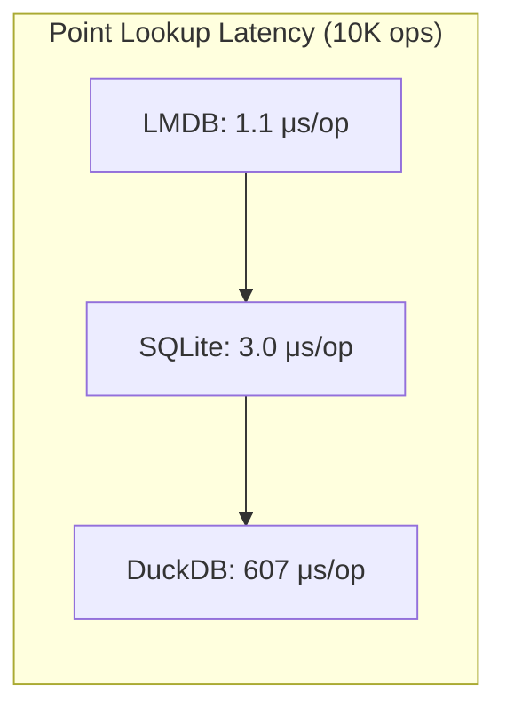
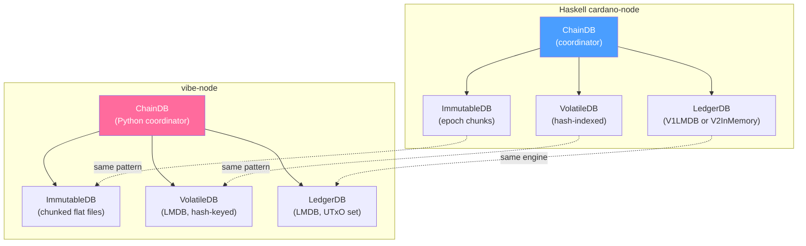

# Data Architecture Evaluation

This document evaluates storage engine candidates for the vibe-node against Cardano's real-world data access patterns. The goal: pick the storage layer that lets us **match or beat the Haskell node's memory footprint** while hitting the latency targets required for mainnet sync and block production.

## Access Pattern Requirements

A Cardano full node performs six fundamental data operations. Each has distinct latency, throughput, and concurrency characteristics:

| # | Operation | Frequency | Latency Target | Pattern |
|---|-----------|-----------|----------------|---------|
| 1 | **UTxO lookup** by TxIn (tx_hash + index) | Per-transaction input | < 1 ms | Point read (key-value) |
| 2 | **UTxO lookup** by address | Per-query (node-to-client) | < 10 ms | Range scan (secondary index) |
| 3 | **Block append** to immutable storage | Every ~20 s | < 50 ms | Sequential write (append-only) |
| 4 | **Block apply** — consume + create UTxOs | Every ~20 s | < 100 ms | Batch delete + batch insert |
| 5 | **Rollback** — revert N blocks on volatile chain | Rare (fork resolution) | < 1 s | Delete recent + restore prior |
| 6 | **Ledger state snapshot** for crash recovery | Every ~2000 slots | < 60 s | Full serialization to disk |
| 7 | **Stake distribution snapshot** at epoch boundary | Every ~5 days | < 30 s | Full scan of delegation map |

**Key insight:** Operations 1 and 4 dominate. A syncing node applies blocks as fast as it can fetch them — hundreds per second during initial sync. Each block contains ~300 transactions, each consuming and creating UTxOs. The storage engine must handle **high-frequency point lookups and small batch mutations** with minimal overhead.

This is fundamentally an **OLTP workload**, not an OLAP workload. Columnar storage and analytical query engines are a poor fit for the hot path.

## Candidate Evaluations

### Option A: Arrow + DuckDB + Feather

**Architecture:** Apache Arrow for in-memory columnar format, DuckDB as zero-copy SQL engine over Arrow tables, Feather/IPC files for immutable chain data.

| Aspect | Assessment |
|--------|-----------|
| Bulk insert | Good — 1.2M rows/s with Arrow batches (>122K rows per batch) |
| Point lookup | **Poor** — columnar storage requires scanning column segments; 200x slower than B-tree |
| Single-row mutations | **Very poor** — DuckDB is single-writer, each delete is a full-table operation internally |
| Rollback | Poor — no efficient way to "undo" N blocks of mutations |
| Memory | High — DuckDB maintains internal buffers, Arrow tables, metadata; 440 MiB RSS in benchmarks |
| Concurrency | Single writer — readers don't block, but only one write transaction at a time |

**Verdict: Eliminated.** DuckDB is an OLAP engine optimized for analytical queries over large datasets. A Cardano node's hot path is OLTP: millions of point lookups and small batch mutations per sync session. DuckDB was 200x slower than LMDB on point lookups and 9x slower than SQLite on block-apply cycles in our benchmarks. The architecture is fundamentally mismatched.

DuckDB + Arrow would be excellent for **offline chain analysis** (querying historical blocks, computing stake distributions from snapshots), but not for the live node's storage layer.

### Option B: LMDB (Lightning Memory-Mapped Database)

**Architecture:** Memory-mapped B+ tree, copy-on-write, ACID transactions, zero-copy reads via `mmap`. This is what the Haskell node uses for its UTxO-HD on-disk backend.

| Aspect | Assessment |
|--------|-----------|
| Bulk insert | **Excellent** — 0.334s for 200K records; direct B+ tree insertion |
| Point lookup | **Excellent** — 0.011s for 10K lookups (1.1 us each); memory-mapped pointer dereference |
| Range scan | **Excellent** — ordered cursors over B+ tree; 0.0004s for 515 rows |
| Block apply | Good — 2.265s for 100 blocks of 300 mutations each |
| Rollback | Good — transactions are atomic; can batch-delete and batch-insert in one txn |
| Memory | Moderate — mmap means OS manages page cache; RSS tracks working set, not full DB |
| Crash recovery | **Excellent** — ACID with copy-on-write; no write-ahead log needed; instant recovery |
| Disk size | Higher — no compression, B+ tree internal fragmentation; 88 MiB vs SQLite's 58 MiB |
| Concurrency | Single writer, unlimited readers; readers never block writers |

**Key characteristics:**

- **Zero-copy reads**: `mmap` means reading a value is a pointer dereference, not a `read()` syscall. The OS manages which pages are in RAM.
- **No tuning required**: Unlike RocksDB, there are no compaction strategies, bloom filter sizes, or write buffer configurations to get wrong.
- **ACID without WAL**: Copy-on-write B+ tree provides crash safety without a separate write-ahead log.
- **Haskell precedent**: The Haskell cardano-node uses LMDB for its `V1LMDB` LedgerDB backend (UTxO-HD on-disk mode). This means we can validate our behavior against a known-good reference.

**Risks:**

- Map size must be declared upfront (but can be grown without data loss)
- No built-in compression (larger disk footprint)
- Single writer limits write concurrency (acceptable for a node — block processing is inherently sequential)

### Option C: RocksDB

**Architecture:** LSM-tree (Log-Structured Merge-tree), high write throughput via memtable buffering, background compaction.

| Aspect | Assessment |
|--------|-----------|
| Bulk insert | Excellent — LSM trees excel at sequential writes |
| Point lookup | Good — bloom filters avoid unnecessary disk reads, but slower than LMDB's mmap |
| Range scan | Good — sorted SST files support efficient iteration |
| Block apply | Good — batch writes are a first-class operation |
| Rollback | Moderate — requires explicit undo logic; column families can help |
| Memory | **Concerning** — memtable + block cache + bloom filters consume significant RSS |
| Crash recovery | Good — WAL provides durability |
| Disk size | Good — LZ4/Snappy compression reduces footprint |
| Python bindings | **Fragmented** — multiple competing packages, none clearly dominant on Python 3.14 |

**Verdict: Viable but not preferred.** RocksDB's write amplification and compaction overhead add unpredictable latency spikes. Its memory profile is harder to control than LMDB's — the memtable, block cache, and bloom filters all consume RAM that's hard to account for. The Python binding ecosystem is fragmented (`rocksdb-py`, `python-rocksdb`, `rocksdb3` — none with clear long-term maintenance). Most importantly, the Haskell node doesn't use RocksDB, so we'd lose the ability to directly compare storage behavior.

### Option D: SQLite

**Architecture:** Row-based B-tree, WAL mode, single-file database, stdlib support in Python.

| Aspect | Assessment |
|--------|-----------|
| Bulk insert | Good — 0.425s for 200K records with WAL mode |
| Point lookup | Good — 0.030s for 10K lookups (3 us each); 3x slower than LMDB |
| Range scan | Good — 0.009s for 515 rows via index scan |
| Block apply | Good — 2.222s for 100 blocks; slightly faster than LMDB |
| Rollback | Good — transactions + savepoints provide clean undo semantics |
| Memory | **Best** — 239 MiB RSS; smallest footprint of all candidates |
| Crash recovery | Good — WAL mode provides atomic commits |
| Disk size | **Best** — 58 MiB; most compact storage |
| Python bindings | **Excellent** — stdlib `sqlite3` module; zero dependencies |

**Strengths:** Zero-config, zero-dependency, battle-tested, smallest memory and disk footprint. The WAL mode benchmarks show 3,600 writes/s and 70,000 reads/s — comfortably within our targets.

**Weaknesses:** Point lookups are 3x slower than LMDB (3 us vs 1.1 us). At mainnet scale (~35M UTxOs), the B-tree depth increases and this gap may widen. SQL parsing overhead adds latency to every operation. No zero-copy reads — every value is copied from the page cache through the SQLite engine into Python.

### Option E: Hybrid Architecture (Recommended)

**Architecture:** Different storage engines for different access patterns, matching the Haskell node's separation of concerns.

| Component | Engine | Rationale |
|-----------|--------|-----------|
| **UTxO set** (hot state) | LMDB | Fastest point lookups, zero-copy reads, matches Haskell's V1LMDB |
| **Immutable blocks** | Flat files (chunked) | Append-only; no query engine needed; matches Haskell's ImmutableDB |
| **Volatile blocks** | LMDB | Hash-indexed recent blocks; same engine as UTxO for simplicity |
| **Ledger snapshots** | CBOR files | Periodic serialization to disk; matches Haskell's snapshot format |
| **Secondary indexes** | LMDB (dupsort) | Address lookups, stake delegation maps |
| **Offline analysis** | DuckDB/Arrow (optional) | Export-and-query pattern for chain analytics; not on the hot path |

## Benchmark Results

Benchmarks run on Apple Silicon (M-series), Python 3.14.3, with 200K synthetic UTxO records. Each record is ~131 bytes (32-byte tx_hash, 2-byte index, 57-byte address, 8-byte value, 32-byte datum_hash).

### Raw Numbers

| Engine | Bulk Insert | Point Lookup (10K) | Range Scan (515 rows) | Block Apply (100 blocks) | RSS | DB Size |
|--------|------------|--------------------|-----------------------|--------------------------|-----|---------|
| **SQLite** | 0.425 s | 0.030 s | 0.009 s | 2.222 s | 239 MiB | 58 MiB |
| **DuckDB** | 2.326 s | 6.075 s | 0.005 s | 19.514 s | 439 MiB | 62 MiB |
| **LMDB** | 0.334 s | 0.011 s | 0.000 s | 2.265 s | 583 MiB | 88 MiB |

### Analysis



- **LMDB wins point lookups by 3x over SQLite and 550x over DuckDB.** This is the operation that matters most — every transaction input requires a UTxO lookup.
- **SQLite wins on memory and disk.** Its row-based B-tree is more compact than LMDB's page-aligned B+ tree. However, LMDB's RSS is misleading — `mmap` reserves virtual address space but only pages that are actively used consume physical RAM. Under memory pressure, the OS evicts LMDB pages automatically.
- **DuckDB is catastrophically slow for OLTP patterns.** 607 us per point lookup and 19.5s for block-apply cycles make it unusable for the node's hot path. This was expected — it's an OLAP engine.
- **Block-apply performance is comparable between SQLite and LMDB.** Both handle 100 blocks of 300 mutations each in ~2.2s. At mainnet's ~1 block per 20 seconds, both are 100x faster than needed.

### Memory Nuance

The RSS numbers deserve careful interpretation:

- **LMDB's 583 MiB RSS** includes memory-mapped pages. The OS manages this transparently — under memory pressure, pages are evicted without any action from the process. The actual "working set" (actively used pages) is much smaller.
- **SQLite's 239 MiB RSS** is closer to actual memory consumption, as SQLite manages its own page cache (`PRAGMA cache_size`).
- **For the acceptance criterion** ("match or beat Haskell on average memory"), LMDB gives us the same knob the Haskell node uses. We can measure and compare apples-to-apples.

## Mapping to Haskell's Storage Architecture

The Haskell cardano-node uses a four-database architecture coordinated by ChainDB. Here's how our hybrid maps:



### ImmutableDB — Chunked Flat Files

The Haskell ImmutableDB stores finalized blocks in epoch-sized chunk files with secondary indexes for slot-to-offset mapping. We replicate this exactly:

- **One file per epoch chunk** — append-only, never modified after the epoch is complete
- **Primary index**: slot number to file offset (binary search)
- **Secondary index**: block hash to (chunk, offset) — stored in a small LMDB database or flat index file
- **No query engine needed** — blocks are read by known offset, not searched

This is the simplest component. Flat files with indexes are the optimal storage for append-only sequential data.

### VolatileDB — LMDB (Hash-Keyed)

The Haskell VolatileDB stores recent blocks indexed by block hash (not slot, since multiple forks may exist). It maintains a successor map for chain selection.

- **LMDB key**: 32-byte block hash
- **LMDB value**: CBOR-encoded block
- **Successor index**: LMDB dupsort database mapping `predecessor_hash -> [successor_hash]`
- **Pruning**: when a block is copied to ImmutableDB, it's deleted from VolatileDB

LMDB's atomic transactions make the ImmutableDB-to-VolatileDB migration safe: we can atomically delete from volatile and know the block was already appended to immutable.

### LedgerDB — LMDB (UTxO Set + Snapshots)

This is the critical component. The Haskell node offers two backends:

- **V2InMemory**: Full UTxO set in RAM (~16 GiB on mainnet). Fast, but memory-hungry.
- **V1LMDB**: UTxO set in LMDB with in-memory diff layer for recent blocks. Lower memory, ~25% slower sync.

We use LMDB, matching the V1LMDB approach:

- **Main database**: `TxIn -> TxOut` mappings (the UTxO set)
- **Diff layer**: In-memory dict of recent block deltas (last *k* blocks) for fast rollback
- **Snapshots**: Periodic CBOR serialization of the diff-layer checkpoint to disk
- **Secondary indexes**: Address-to-UTxO mapping via LMDB dupsort for node-to-client queries

The in-memory diff layer is critical for rollback performance. When we need to revert N blocks, we pop N diffs and apply them in reverse — no database scan required.

### ChainDB — Python Coordinator

ChainDB is not a database — it's the orchestration layer that:

1. Receives new blocks from chain-sync
2. Runs chain selection (longest chain rule)
3. Routes blocks to VolatileDB or ImmutableDB
4. Triggers ledger state updates in LedgerDB
5. Handles rollbacks by coordinating across all three databases

This is pure Python logic with no storage engine dependency.

## Recommendation

**Use LMDB as the primary storage engine, with flat files for immutable blocks.**

The rationale:

1. **Fastest point lookups** — 1.1 us per UTxO lookup, the operation that dominates block validation
2. **Matches the Haskell reference** — the V1LMDB backend gives us an apples-to-apples comparison for memory and correctness
3. **Zero-copy reads** — `mmap` eliminates data copying between kernel and userspace
4. **ACID without complexity** — copy-on-write B+ tree provides crash safety with no WAL management
5. **No tuning required** — unlike RocksDB, there are no compaction strategies or bloom filter configurations
6. **Clean Python bindings** — `py-lmdb` is mature, well-documented, and installs cleanly on Python 3.14
7. **Memory profile is OS-managed** — the OS evicts mmap pages under pressure, giving us automatic memory adaptation

**SQLite remains available** as a fallback or for metadata storage (peer lists, configuration, chain analytics exports). Its stdlib availability and zero-dependency nature make it useful for non-performance-critical data.

**DuckDB + Arrow** is reserved for offline chain analysis tooling, not the node's hot path.

## Future Considerations

- **LSM-tree backend**: The Haskell team is developing an LSM-tree backend to replace LMDB for LedgerDB. We should monitor this and evaluate when it ships. LSM trees offer better write amplification characteristics at the cost of read performance.
- **Memory-mapped Arrow for ImmutableDB queries**: For chain analytics and historical queries, we could memory-map immutable block files as Arrow IPC and query with DuckDB — a read-only analytical path that doesn't affect node performance.
- **Compression**: LMDB doesn't compress data. If disk footprint becomes a concern, we can add application-level compression (LZ4 for values) while keeping keys uncompressed for ordered traversal.

## Appendix: Running the Benchmarks

```bash
# From the project root:
uv run --with duckdb --with pyarrow --with lmdb \
    python benchmarks/data_architecture/bench_storage.py
```

The benchmark generates 200K synthetic UTxO records and measures:

- **Bulk insert**: Insert all records in a single transaction
- **Point lookup**: 10K random key lookups
- **Range scan**: Prefix-based address scan (~500 results)
- **Block apply**: 100 cycles of delete-300 + insert-300 (simulating block processing)
- **RSS**: Process resident set size after all operations
- **DB size**: Total on-disk footprint

Source: `benchmarks/data_architecture/bench_storage.py` (in the repository root)
