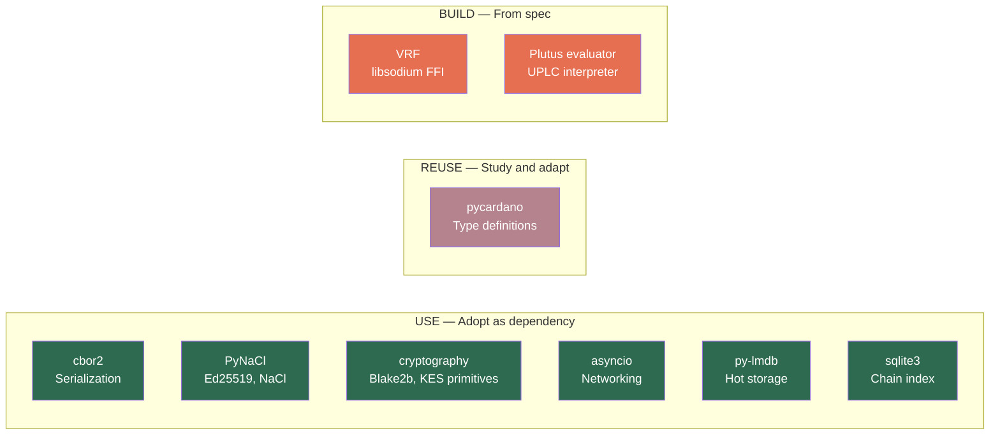

# Python Library Audit

This document evaluates Python library candidates for each vibe-node subsystem. Every dependency is a trade-off: less code to write vs. more attack surface to maintain. We apply a consistent decision framework and score each candidate against six criteria.

## Decision Framework

Each library receives one of four verdicts:

| Verdict | Meaning | When to Apply |
|---------|---------|---------------|
| **USE** | Adopt as a dependency; contribute upstream for gaps | Well-maintained, covers majority of needs, compatible license |
| **FORK** | Fork and maintain ourselves | Good code but poorly maintained or abandoned; we need control |
| **REUSE** | Extract specific code with attribution (license permitting) | Small, well-isolated pieces worth lifting; rest of library not useful |
| **BUILD** | Implement from spec | Nothing suitable exists, or existing options introduce unacceptable coupling |

### Evaluation Criteria

Every candidate is scored on six dimensions (1–5 scale):

| Criterion | What We Measure |
|-----------|----------------|
| **Maintenance** | Release cadence, last release date, open issue triage, CI health |
| **License** | Compatibility with AGPL-3.0 (our license); contribution strategy |
| **Python 3.14** | Wheels or confirmed support for Python 3.14 (our target runtime) |
| **Performance** | Adequate for node-level throughput (not just wallet-level) |
| **Coupling** | Can we use the pieces we need without pulling in the whole library? |
| **Bus Factor** | Number of active maintainers; community breadth |

---

## Summary Table

| Subsystem | Verdict | Library/Approach | Rationale |
|-----------|---------|-----------------|-----------|
| **Serialization** | USE (with caveats) | cbor2 (pure Python mode) | MIT, 3.14 wheels; C extension has deserialization bugs — must use pure Python build (see pycardano's cbor2pure) |
| **Crypto (general)** | USE | PyNaCl + cryptography | Ed25519/X25519 via PyNaCl; KES/hashing via cryptography |
| **Crypto (VRF)** | BUILD | Custom libsodium FFI | No Python VRF library implements Cardano's ECVRF-ED25519-SHA512-Elligator2 |
| **Networking** | USE | asyncio (stdlib) | Zero-dependency; sufficient for multiplexed TCP; broader ecosystem support |
| **Ledger types** | REUSE | pycardano (selected modules) | Extract transaction/address/UTxO types; avoid tx-builder coupling |
| **Plutus** | BUILD | From spec (with pyaiken for conformance testing) | uplc is wallet-grade; node needs precise cost accounting and all builtins |
| **Storage** | USE | LMDB + Arrow + Feather + SQLite | LMDB for persistence, Arrow for in-memory compute, Feather for immutable blocks, SQLite for metadata. See [Data Architecture](data-architecture.md). |

---

## Detailed Evaluations

### 1. Serialization

Cardano is CBOR-native — every block, transaction, and protocol message is CBOR-encoded per CDDL schemas. The serialization library is the most performance-critical dependency in the entire node.

#### cbor2

| Criterion | Score | Notes |
|-----------|-------|-------|
| Maintenance | 5 | v5.8.0 (Dec 2025); active releases; Alex Gronholm is a prolific OSS maintainer |
| License | 5 | MIT — fully compatible with AGPL-3.0 |
| Python 3.14 | 5 | Published wheels for 3.12, 3.13, 3.14 |
| Performance | 4 | C extension with readahead buffering (20–140% decode improvement); pure-Python fallback available |
| Coupling | 5 | Standalone CBOR codec; zero Cardano-specific opinions |
| Bus Factor | 3 | Primarily single-maintainer (agronholm), but 220+ GitHub stars and Debian-packaged |

!!! warning "C Extension Has Known Deserialization Bugs"
    The cbor2 C extension produces incorrect results for certain Cardano CBOR structures. **pycardano created [cbor2pure](https://github.com/Chia-Network/cbor2)** — a pure Python fork — to work around this. By default, pycardano uses cbor2pure for decoding and only falls back to the C extension when `CBOR_C_EXTENSION=1` is set.

    We must use the **pure Python mode** of cbor2 for correctness. This is slower than the C extension but is the only way to get bit-perfect deserialization for Cardano's CBOR. If performance becomes a bottleneck, we should investigate the specific C extension bugs and potentially contribute fixes upstream rather than accepting incorrect results.

**Verdict: USE (pure Python mode).** cbor2 implements RFC 8949 and supports deterministic encoding (critical for Cardano canonical CBOR). However, we must enforce pure Python mode due to C extension bugs that affect Cardano deserialization. Follow pycardano's approach: use cbor2 with the pure Python decoder by default. We will need to build our own CDDL-schema-aware encoding layer on top.

**Gaps to address:**

- Cardano's "canonical CBOR" requires deterministic map key ordering and minimal-length integer encoding — cbor2 supports `canonical=True` but we must verify round-trip fidelity against real mainnet blocks
- Tag handling for Cardano-specific tags (e.g., tag 24 for embedded CBOR, tag 258 for sets) needs wrapper code

#### pycardano (CBOR layer)

pycardano uses cbor2 internally via its `CBORSerializable` base class. This is a higher-level abstraction — useful for type definitions but not a replacement for a raw CBOR codec. We evaluate pycardano's type layer separately under "Ledger Types" below.

---

### 2. Cryptography

Cardano consensus requires Ed25519 signatures, VRF (ECVRF-ED25519-SHA512-Elligator2), KES (key-evolving signatures via sum-composition), and Blake2b hashing.

#### PyNaCl

| Criterion | Score | Notes |
|-----------|-------|-------|
| Maintenance | 5 | v1.6.2 (Jan 2026); libsodium updated to 1.0.20-stable; CVE-2025-69277 patched |
| License | 5 | Apache-2.0 — compatible with AGPL-3.0 |
| Python 3.14 | 5 | Explicit free-threaded 3.14 support added |
| Performance | 5 | Thin FFI over libsodium — native C performance |
| Coupling | 5 | Standalone; provides Ed25519, X25519, AEAD, hashing |
| Bus Factor | 5 | Maintained by pyca (Python Cryptographic Authority); same team as `cryptography` |

**Verdict: USE** for Ed25519 signing/verification and general NaCl primitives. PyNaCl gives us libsodium's Ed25519 at C speed with a clean Python API.

#### cryptography

| Criterion | Score | Notes |
|-----------|-------|-------|
| Maintenance | 5 | v46.0.5 (Feb 2026); extremely active release cadence |
| License | 5 | Apache-2.0 / BSD — compatible with AGPL-3.0 |
| Python 3.14 | 5 | Published wheels for 3.14 |
| Performance | 5 | OpenSSL-backed; native performance |
| Coupling | 4 | Large library, but well-organized; we only need specific primitives |
| Bus Factor | 5 | pyca team; most-downloaded crypto package in Python |

**Verdict: USE** as a complement to PyNaCl. We need `cryptography` for:

- **Blake2b hashing** (available via `cryptography.hazmat.primitives.hashes`)
- **KES implementation** — KES uses a sum-composition scheme over Ed25519; we'll build the composition logic but use `cryptography` for the underlying primitives
- Any additional primitives not covered by PyNaCl

#### VRF (Cardano-specific)

| Criterion | Score | Notes |
|-----------|-------|-------|
| Maintenance | N/A | No suitable Python library exists |
| License | N/A | — |
| Python 3.14 | N/A | — |
| Performance | — | Must match Haskell FFI speed |
| Coupling | — | — |
| Bus Factor | — | — |

**Verdict: BUILD.** Cardano uses ECVRF-ED25519-SHA512-Elligator2 (IETF draft-irtf-cfrg-vrf-03) via a custom fork of libsodium (`cardano-crypto-praos`). No Python library implements this. Our approach:

1. Write Python FFI bindings to libsodium's `crypto_vrf_ietfdraft03_*` functions using `cffi` or `ctypes`
2. Use IOG's [libsodium VRF fork](https://github.com/input-output-hk/libsodium) which adds the VRF API
3. Test VRF outputs against known Haskell-node-produced VRF proofs from mainnet blocks

The `rbcl` library (Python bindings for libsodium's Ristretto group) may be useful as a reference for the FFI pattern, but it doesn't cover VRF itself.

---

### 3. Networking

The Cardano node uses a custom TCP multiplexer carrying typed miniprotocols (chain-sync, block-fetch, tx-submission, keep-alive, etc.). This is a long-lived connection model with backpressure.

#### asyncio (stdlib)

| Criterion | Score | Notes |
|-----------|-------|-------|
| Maintenance | 5 | Part of CPython; maintained by core team |
| License | 5 | PSF — compatible with everything |
| Python 3.14 | 5 | It *is* Python 3.14 |
| Performance | 4 | Adequate for multiplexed TCP; Cardano protocol is not high-frequency |
| Coupling | 5 | Zero dependencies |
| Bus Factor | 5 | CPython core team |

#### trio

| Criterion | Score | Notes |
|-----------|-------|-------|
| Maintenance | 4 | v0.32.0; active development; 7k+ GitHub stars |
| License | 5 | MIT/Apache-2.0 — compatible with AGPL-3.0 |
| Python 3.14 | 4 | Likely works but no explicit 3.14 wheels verified |
| Performance | 4 | Structured concurrency model is cleaner; slightly better under load |
| Coupling | 3 | Trio's nursery model infects the entire call stack; harder to integrate with asyncio-based libraries |
| Bus Factor | 3 | Nathaniel Smith is the primary driver; smaller contributor pool than asyncio |

**Verdict: USE asyncio.** The decision is pragmatic:

- **Zero dependency cost** — asyncio is stdlib
- **Ecosystem compatibility** — most Python async libraries (httpx, websockets, etc.) target asyncio first
- **Sufficient for our workload** — Cardano's multiplexer carries a handful of miniprotocol streams per peer; this isn't a 100k-connection web server
- **Structured concurrency via TaskGroup** — Python 3.11+ added `asyncio.TaskGroup`, providing trio-style structured concurrency without the ecosystem lock-in

trio's structured concurrency model is genuinely better designed, but the ecosystem switching cost is not justified for our use case.

---

### 4. Ledger Types (pycardano Deep Evaluation)

This is the most consequential evaluation. pycardano is the only mature Python library with Cardano transaction types, address handling, and UTxO models. The question is: how much can we use, and at what cost?

#### Overview

| Criterion | Score | Notes |
|-----------|-------|-------|
| Maintenance | 4 | v0.19.2 (Mar 2026); active development; Conway/Chang support added |
| License | 4 | MIT — compatible with AGPL-3.0, but contribution flows are one-way (we can use MIT code in AGPL, not vice versa) |
| Python 3.14 | 3 | No explicit 3.14 wheels published; likely works but untested |
| Performance | 2 | Designed for wallet-level throughput (single tx at a time), not node-level (thousands of txs/second) |
| Coupling | 2 | Types are tightly coupled to the transaction builder; hard to use addresses without pulling in chain context |
| Bus Factor | 3 | ~27 contributors; Jerry (cffls) is the primary maintainer; Catalyst-funded |

#### Era Coverage

| Era | Coverage | Notes |
|-----|----------|-------|
| Byron | Minimal | Bootstrap addresses supported; no Byron-era transaction types |
| Shelley | Good | Basic transaction structure, certificates, pool registration |
| Allegra–Mary | Good | Timelocks, multi-asset values |
| Alonzo | Good | Plutus V1 script support, redeemers, datums |
| Babbage | Good | Plutus V2, inline datums, reference inputs |
| Conway | Partial | DRep voting, governance actions added in 0.19.x; still maturing |

#### Serialization Round-Trip Fidelity

pycardano's `CBORSerializable` base class delegates to cbor2 internally. Key concerns for node-level use:

- **Canonical encoding**: pycardano does not guarantee bit-for-bit round-trip fidelity for all block structures — it was designed to *construct* transactions, not *decode and re-encode* arbitrary blocks from the chain
- **Indefinite-length arrays**: Real mainnet blocks use indefinite-length CBOR arrays in some positions; pycardano may normalize these to definite-length on re-encoding
- **Unknown fields**: Future hard forks may add fields that pycardano's fixed type definitions silently drop

#### Coupling Analysis

pycardano's module structure:

```
pycardano/
├── transaction.py      # Transaction, TransactionBody, TransactionOutput, etc.
├── hash.py             # TransactionHash, ScriptHash, DatumHash, etc.
├── address.py          # Address encoding/decoding, network discrimination
├── nativescript.py     # Native script types
├── plutus.py           # PlutusData, PlutusV1Script, PlutusV2Script, etc.
├── serialization.py    # CBORSerializable base class (uses cbor2)
├── txbuilder.py        # Transaction builder (heavy dependencies)
├── backend/            # Chain backends (Blockfrost, Ogmios, etc.)
└── crypto.py           # Signing, verification (uses PyNaCl)
```

The good news: `transaction.py`, `hash.py`, `address.py`, and `serialization.py` are relatively self-contained. The bad news: `txbuilder.py` and `backend/` pull in chain context, fee calculation, and external API clients.

For a node, we need the *types* (transaction structures, address formats, hash types) but not the *builder* (fee estimation, coin selection, UTxO querying). The types are usable without the builder, but they carry assumptions:

- Types assume wallet-level usage (e.g., single-era at a time)
- No per-era polymorphism — the same `Transaction` class is used for all eras
- Missing node-level concepts: block headers, protocol state, epoch boundaries, stake snapshots

#### Performance Assessment

pycardano creates Python objects for every field of every transaction. For wallet use (build 1 tx, submit it), this is fine. For node use (validate 50,000+ transactions per block during sync), the per-object allocation overhead becomes significant:

- A single `TransactionOutput` with a multi-asset value creates dozens of Python objects (Value, MultiAsset, dict entries, AssetName instances)
- No support for lazy/streaming deserialization — the entire structure is materialized in memory
- No integration with zero-copy patterns (memoryview, Arrow buffers)

#### Verdict: REUSE

**REUSE** pycardano's type definitions as a *reference implementation* and starting point for our own types. Specifically:

1. **Study and adapt** the type hierarchy (`Transaction`, `TransactionBody`, `TransactionOutput`, `Value`, `Address`, hash types) — these are well-tested against mainnet
2. **Do not depend on pycardano at runtime** — the coupling to transaction building and the performance characteristics make it unsuitable for a node
3. **Build our own types** in `vibe.cardano.ledger` that are:
    - Per-era (separate `ShelleyTx`, `AlonzoTx`, `BabbageTx`, `ConwayTx` types)
    - Backed by cbor2 directly (not via `CBORSerializable`)
    - Designed for streaming/lazy deserialization where possible
    - Enriched with node-level concepts (block headers, epoch state, stake snapshots)
4. **Contribute upstream** when we find bugs in pycardano's CBOR handling — MIT license allows us to read, learn from, and contribute to their code even though our code is AGPL

**Why not USE?** The per-object allocation cost at node-level throughput, the lack of per-era types, and the tight coupling to transaction building make it a poor fit as a runtime dependency. We'd spend more time working around its assumptions than we'd save by using it.

**Why not FORK?** pycardano is actively maintained and MIT-licensed. Forking would create a maintenance burden with no clear benefit. Better to build our own types informed by pycardano's well-tested implementations.

---

### 5. Plutus

A Cardano node must evaluate Plutus Core scripts (UPLC) with exact cost accounting to determine transaction validity. This is one of the hardest subsystems — the evaluator must match the Haskell node's behavior bit-for-bit on cost model outputs.

#### uplc (OpShin)

| Criterion | Score | Notes |
|-----------|-------|-------|
| Maintenance | 3 | Maintained as part of OpShin toolchain; releases tied to OpShin development |
| License | 4 | MIT — compatible with AGPL-3.0 |
| Python 3.14 | 2 | Requires 3.9+; no 3.14 wheels verified |
| Performance | 2 | Pure Python evaluator; wallet-grade speed, not node-grade |
| Coupling | 3 | Usable standalone, but missing node-level cost model precision |
| Bus Factor | 2 | Primarily maintained by nielstron (OpShin creator) |

**Gaps for node use:**

- Cost model implementation may not match Haskell precisely (critical for determining tx validity)
- Missing builtins from Plutus V3 (Conway-era additions)
- No support for budget enforcement at the granularity required by the ledger rules
- No flat encoding/decoding of scripts (needed for on-chain storage)

#### pyaiken

| Criterion | Score | Notes |
|-----------|-------|-------|
| Maintenance | 3 | Maintained by OpShin team; bindings to Rust aiken library |
| License | 4 | Apache-2.0 — compatible with AGPL-3.0 |
| Python 3.14 | 2 | Rust extension; may need rebuild for 3.14 |
| Performance | 4 | Rust-backed evaluation; much faster than pure Python |
| Coupling | 3 | Provides `eval`, `flat`, `unflat` functions; limited API surface |
| Bus Factor | 2 | Same OpShin team |

**Verdict: BUILD** (with pyaiken as a conformance testing oracle).

We must build our own UPLC evaluator because:

1. **Cost model precision** — The evaluator must produce *identical* execution budgets to the Haskell node. Any divergence means disagreeing on which transactions are valid. This requires implementing the cost model from the formal Plutus spec.
2. **All builtins across all Plutus versions** — V1, V2, V3 each add builtins. The evaluator must support all of them with exact semantics.
3. **Flat encoding** — Scripts are stored in flat encoding on-chain; we need encode/decode support.
4. **Integration with ledger rules** — The evaluator must integrate tightly with our ledger validation pipeline for budget checking, script context construction, and phase-2 validation.

**Testing strategy:** Use pyaiken's `eval` function as a conformance oracle during development — evaluate the same scripts with our evaluator and pyaiken, comparing execution budgets and results.

---

### 6. Storage

The Haskell node uses three storage layers: ImmutableDB (append-only chain history), VolatileDB (recent forks), and LedgerDB (ledger state snapshots). We need to choose backends that can handle:

- **ImmutableDB**: Sequential writes, random reads by slot/hash, ~100GB+ for mainnet
- **VolatileDB**: Small working set, frequent updates, fork tracking
- **LedgerDB**: Large key-value state (UTxO set: ~15M entries), snapshotting

#### LMDB (py-lmdb)

| Criterion | Score | Notes |
|-----------|-------|-------|
| Maintenance | 4 | v1.7.3 (Jul 2025); healthy release cadence; 487k weekly downloads |
| License | 5 | OpenLDAP Public License — permissive, compatible with AGPL-3.0 |
| Python 3.14 | 3 | Supports 3.9+; no explicit 3.14 verification but C extension likely works |
| Performance | 5 | Memory-mapped B+ tree; zero-copy reads; single-writer/multi-reader; battle-tested in production |
| Coupling | 5 | Minimal API; key-value store with transactions; no ORM overhead |
| Bus Factor | 3 | James Watson is the primary maintainer; LMDB itself (C library) is maintained by Symas/OpenLDAP |

**Why LMDB for hot state:**

- **Memory-mapped I/O** — the OS page cache *is* the database cache; no double-buffering
- **Read transactions are lock-free** — critical for a node where reads (chain-sync serving, state queries) vastly outnumber writes
- **Crash-safe** — ACID transactions with copy-on-write; survives power loss without corruption (acceptance criterion #8)
- **Deterministic performance** — no background compaction, no write amplification, no GC pauses
- **Proven at our scale** — used by the Monero node, LMDB handles 15M+ key-value entries comfortably

**Limitations:**

- Single-writer means write throughput is bounded by one thread — acceptable for our use case (ledger state updates are sequential)
- Database size must be pre-configured (max map size) — not a problem if we set it generously
- No built-in compression — we handle this at the serialization layer

#### SQLite (stdlib)

| Criterion | Score | Notes |
|-----------|-------|-------|
| Maintenance | 5 | Part of CPython; SQLite itself is one of the most-tested C libraries in existence |
| License | 5 | Public domain — compatible with everything |
| Python 3.14 | 5 | It *is* Python 3.14 |
| Performance | 3 | Good for structured queries; not optimal for high-throughput key-value workloads |
| Coupling | 5 | Zero dependencies |
| Bus Factor | 5 | CPython core team + SQLite consortium |

**Why SQLite for metadata:**

- **Schema flexibility** — chain metadata (block index, slot-to-hash mapping, epoch boundaries) benefits from SQL queries
- **WAL mode** — concurrent readers with a single writer; good enough for metadata access patterns
- **Zero deployment cost** — no additional dependency to install or configure

#### DuckDB + PyArrow

| Criterion | Score | Notes |
|-----------|-------|-------|
| Maintenance | 5 | v1.5.0 (Mar 2026); very active; well-funded (DuckDB Labs) |
| License | 5 | MIT — compatible with AGPL-3.0 |
| Python 3.14 | 5 | Published wheels for 3.14 |
| Performance | 5 | Vectorized columnar execution; fastest analytical engine in Python |
| Coupling | 3 | Heavy dependency (~100MB); analytical-oriented, not transactional |
| Bus Factor | 5 | DuckDB Labs team; CWI Amsterdam backing |

**Verdict: NOT SELECTED for core storage.** DuckDB is exceptional for analytics but wrong for a node's storage requirements:

- **Columnar storage** optimizes for analytical scans; a node needs point lookups (UTxO by TxIn) and append-only writes
- **No crash-safe transactional writes** in the way LMDB provides
- **100MB+ dependency footprint** violates our "minimize dependencies" principle
- **May be useful later** for analytics/monitoring dashboards, but not for the core storage engine

PyArrow (v23.0.1, Feb 2026) is excellent and supports Python 3.14, but it solves a different problem (columnar data interchange) than what we need (persistent key-value state).

#### RocksDB (python-rocksdb)

| Criterion | Score | Notes |
|-----------|-------|-------|
| Maintenance | 1 | Last significant update years ago; multiple abandoned forks on GitHub |
| License | 4 | Apache-2.0 / GPL-2.0 (RocksDB itself) — compatible |
| Python 3.14 | 1 | No evidence of 3.14 support; stale C++ bindings |
| Performance | 5 | RocksDB itself is excellent (used by Cardano's Haskell node via C FFI) |
| Coupling | 3 | Key-value API is clean, but C++ build dependency is heavy |
| Bus Factor | 1 | Python bindings are effectively unmaintained |

**Verdict: NOT SELECTED.** The Python bindings are abandoned. While RocksDB itself is what the Haskell node uses, the Python binding situation makes it impractical. LMDB gives us similar performance characteristics with much better Python support.

#### Storage Architecture Decision

| Storage Layer | Backend | Rationale |
|---------------|---------|-----------|
| **ImmutableDB** | LMDB | Append-only; memory-mapped reads for chain-sync serving |
| **VolatileDB** | LMDB | Small working set; fast updates for fork tracking |
| **LedgerDB** | LMDB | 15M+ UTxO entries; zero-copy reads; crash-safe snapshots |
| **ChainIndex** | SQLite | Slot/hash lookups; epoch boundary queries; structured metadata |

Both backends are crash-safe and satisfy the power-loss recovery requirement.

---

## Recommendations Summary



### Dependency Footprint

Total runtime dependencies added by this audit:

| Package | Size | Purpose |
|---------|------|---------|
| cbor2 | ~500 KB | CBOR codec |
| PyNaCl | ~2 MB (incl. libsodium) | Ed25519, NaCl primitives |
| cryptography | ~10 MB (incl. OpenSSL) | Blake2b, KES primitives |
| lmdb | ~200 KB | LMDB bindings |

**Total: ~13 MB** of additional dependencies. asyncio and sqlite3 are stdlib (zero cost). This is lean — a conscious choice to minimize attack surface and build footprint.

### What We Build Ourselves

| Component | Spec Source | Estimated Complexity |
|-----------|-----------|---------------------|
| CDDL-aware CBOR layer | cardano-ledger-binary | Medium — schema-driven encode/decode on top of cbor2 |
| Per-era transaction types | Cardano ledger formal specs | High — one type hierarchy per era, all CBOR round-trippable |
| VRF bindings | IETF draft-irtf-cfrg-vrf-03 + IOG libsodium fork | Medium — FFI wrapper + test against Haskell VRF outputs |
| KES implementation | Ouroboros Praos spec (sum composition) | Medium — tree-based key evolution using Ed25519 primitives |
| UPLC evaluator | Plutus Core formal spec | Very High — all builtins, cost models, flat encoding |
| Multiplexer | ouroboros-network-framework | Medium — segment framing, backpressure, mini-protocol dispatch |
| Storage engine | ouroboros-consensus (Storage) | High — ImmutableDB/VolatileDB/LedgerDB abstractions over LMDB |

### Risk Register

| Risk | Mitigation |
|------|-----------|
| cbor2 C extension doesn't handle Cardano's canonical CBOR edge cases | We build a conformance test suite comparing cbor2 output against Haskell-encoded blocks; fall back to custom encoder if needed |
| LMDB single-writer bottleneck during fast sync | Profile early; batch writes; the Haskell node faces similar constraints with RocksDB write batching |
| VRF FFI bindings are fragile across platforms | Docker-based CI ensures consistent libsodium version; statically link if needed |
| UPLC evaluator cost model diverges from Haskell | Continuous conformance testing against pyaiken oracle + direct comparison with Haskell node script validation results |
| pycardano types diverge from our needs over time | We own our types; pycardano is a reference, not a dependency |
