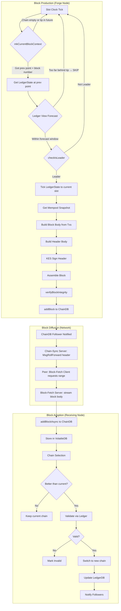
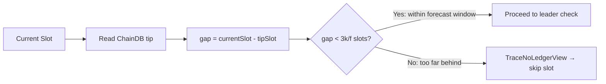
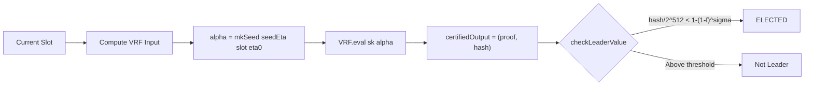
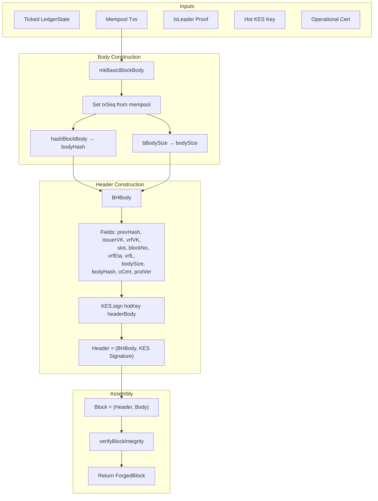
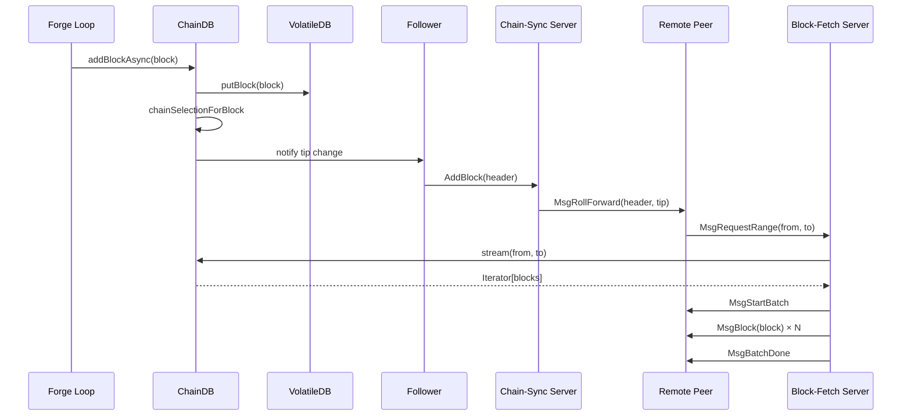
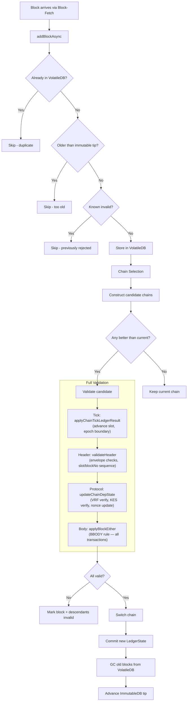
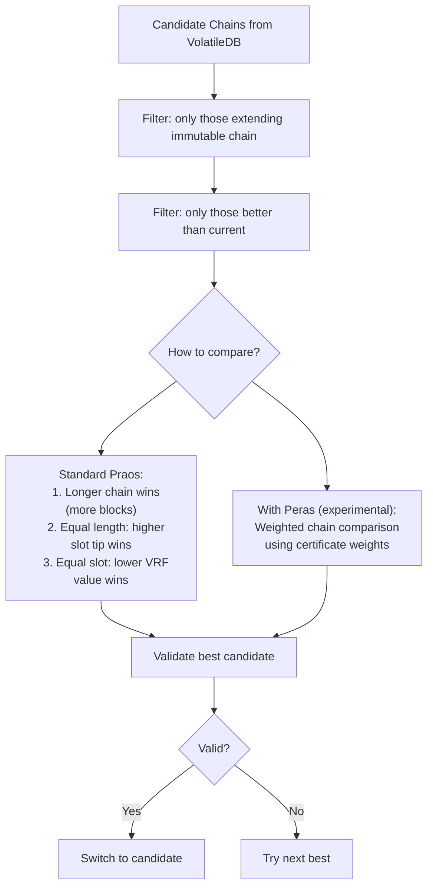
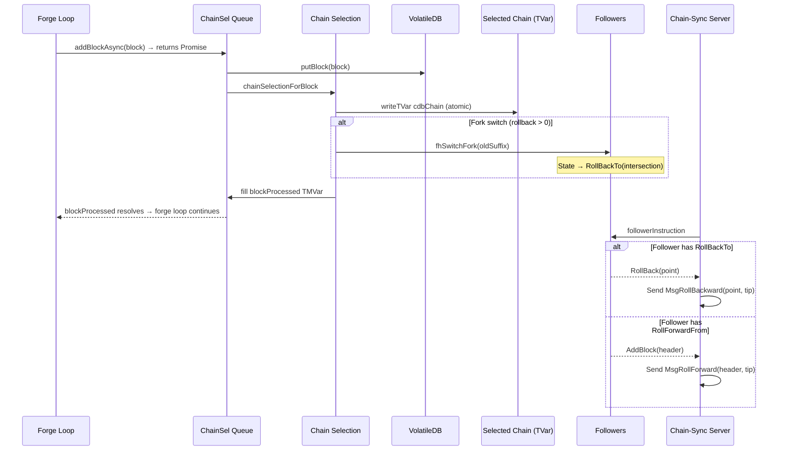

# Block Production & Validation Pipeline

This document traces the complete lifecycle of a Cardano block — from VRF leader election through forging, diffusion to peers, validation, and chain adoption. All references point to the Haskell implementation in `ouroboros-consensus` and `cardano-ledger`.

---

## Overview



---

## 1. Sync Gate (Must Be Caught Up Before Forging)

The Haskell forge loop does **not** have an explicit "am I synced?" check. Instead, it uses an implicit gate via the ledger view forecast.



**Haskell source:** `Ouroboros.Consensus.NodeKernel.forkBlockForging` (line 608-627)

At each slot, the forge loop:

1. **`mkCurrentBlockContext`** (line 574) — reads `ChainDB.getCurrentChain` to find the tip. If the chain is empty or the tip's slot is >= currentSlot, the forge exits early (`TraceSlotIsImmutable` or `TraceBlockFromFuture`).

2. **`getReadOnlyForkerAtPoint`** (line 594) — gets a ledger state snapshot at the previous block's point. If the chain switched and that point is no longer on it, gives up (`TraceNoLedgerState`).

3. **`ledgerViewForecastAt`** (line 608-627) — computes the protocol-level ledger view for the current slot. The forecast has a limited window: at most `3k/f` slots from the tip. On mainnet (`k=2160, f=0.05`): ~129,600 slots (~36 hours). On our devnet (`k=10, f=0.1`): ~300 slots (~60 seconds). **If the node is further behind than this, the forecast fails and the forge loop skips the slot** with `TraceNoLedgerView`.

This means the node naturally stops forging when it's far behind the chain tip, and resumes when it catches up. There is no explicit GSM check in the forge path — the GSM (`PreSyncing` / `Syncing` / `CaughtUp`) is used by the diffusion layer for peer selection, not by the forge loop.

**Implication for vibe-node:** Our forge loop must read `prev_hash` and `block_number` from ChainDB's current chain — NOT from an isolated counter. And we must skip forging when ChainDB's tip is more than `3k/f` slots behind the current wall-clock slot.

---

## 2. Leader Election

At each slot boundary, the node checks whether it is elected to produce a block.



**Haskell source:** `Ouroboros.Consensus.Protocol.TPraos.checkIsLeader` (vendor/ouroboros-consensus)

**Inputs:**
- `slot` — current slot number
- `eta0` — epoch nonce (evolves at epoch boundaries)
- `sk` — VRF secret key
- `sigma` — pool's relative stake (from 2-epoch-old snapshot)
- `f` — active slot coefficient (0.05 on mainnet)

**Two VRF evaluations:**
1. `seedEta` — for nonce contribution (accumulated into next epoch's nonce)
2. `seedL` — for leader eligibility check

The leader threshold check is: `certifiedNat(vrfOutput) / 2^512 < 1 - (1 - f)^sigma`

This is the Praos `φ(sigma)` function — the probability that a pool with relative stake `sigma` leads this slot.

---

## 3. Block Forging

Once elected, the node constructs a block from the current ledger state and mempool.



**Haskell source:** `Ouroboros.Consensus.Shelley.Ledger.Forge.forgeShelleyBlock`

### Header Body Fields (BHBody)

The header body is a CBOR array with these fields in order:

| # | Field | Type | Source |
|---|-------|------|--------|
| 0 | `bheaderBlockNo` | `BlockNo` | Previous block number + 1 |
| 1 | `bheaderSlotNo` | `SlotNo` | Current slot |
| 2 | `bheaderPrev` | `PrevHash` | Hash of previous block header |
| 3 | `bheaderVk` | `VKey` | Pool cold verification key |
| 4 | `bheaderVrfVk` | `VerKeyVRF` | VRF verification key |
| 5 | `bheaderEta` / `vrfResult` | `CertifiedVRF` | VRF nonce + leader proof |
| 6 | `bsize` | `Word32` | Block body size in bytes |
| 7 | `bhash` | `Hash` | Blake2b-256 of block body |
| 8-11 | `bheaderOCert` | `OCert` | 4 inline fields: kes_vk, n, c0, sigma |
| 12-13 | `bprotver` | `ProtVer` | Major + minor protocol version |

**Note:** Babbage+ uses a single `vrfResult` field (index 5) instead of separate `bheaderEta` and `bheaderL` fields. The format changed at the Babbage hard fork.

### Block Hash Computation

The **block hash** (used for identification in Points and chain-sync) is:

```
blockHash = Blake2b-256(CBOR(header))
```

Where `header = [headerBody, kesSignature]` — the full header including the KES signature. This is the `ShelleyHash` type in Haskell, computed as `hashAnnotated` over the memoized CBOR bytes.

---

## 4. Block Diffusion

After forging, the block must reach other nodes via the network layer.



**Key mechanism:** ChainDB maintains **Followers** — subscriber handles that receive chain updates. Each connected peer has a chain-sync server with its own follower. When ChainDB's selected chain changes (new block adopted), all followers are notified, and the chain-sync servers send `MsgRollForward` with the new header.

**Haskell source:**
- Chain-sync server: `Ouroboros.Consensus.MiniProtocol.ChainSync.Server`
- Block-fetch server: `Ouroboros.Consensus.MiniProtocol.BlockFetch.Server`
- ChainDB follower: `Ouroboros.Consensus.Storage.ChainDB.Impl.Follower`

---

## 5. Block Validation (Receiving Node)

When a block arrives from a peer, it goes through a multi-stage validation pipeline.



**Haskell source:** `Ouroboros.Consensus.Storage.ChainDB.Impl.ChainSel`

### 5a. Header Validation

Basic structural checks before fetching the full block body:

1. **Slot progression** — slot must be > previous block's slot
2. **Block number progression** — must be exactly previous + 1
3. **Protocol envelope** — header size within limits, VRF/KES field sizes correct

### 5b. Protocol State Transition (PRTCL Rule)

Verifies the consensus-layer fields in the header:

1. **VRF verification** — VRF proof verifies against the pool's registered VRF key
2. **VRF leader check** — output satisfies `φ(sigma)` threshold
3. **KES signature** — header body signature verifies against the opcert's KES key
4. **OCert validation** — cert counter is non-decreasing, KES period is valid
5. **Nonce accumulation** — VRF output folded into epoch nonce accumulator

**Haskell source:** `Cardano.Protocol.TPraos.Rules.Prtcl`

### 5c. Block Body Validation (BBODY Rule)

Full ledger validation of all transactions in the block:

1. **Body hash** — CBOR hash of body matches header's `bhash`
2. **Body size** — actual size matches header's `bsize`
3. **Transaction validation** (per era):
   - UTXO rules (value preservation, fee adequacy, TTL)
   - UTXOW rules (witness verification)
   - Script evaluation (Alonzo+ Plutus)
   - Governance (Conway)
4. **State transitions** — apply all valid transactions to produce new ledger state

---

## 6. Chain Selection

When multiple valid chains exist (forks), the node selects the best one.



**The SelectView for Praos includes:**
- Block number (higher = more blocks = better)
- Slot number (for tiebreaking)
- VRF tiebreaker value (lower = wins tie)

**Haskell source:** `Ouroboros.Consensus.Util.AnchoredFragment.preferAnchoredCandidate`

---

## Summary: What Must Be True for Block Acceptance

For a remote node to adopt a block we produce, ALL of these must hold:

1. **VRF proof verifies** — our VRF proof for the slot must verify against our registered VRF key with the correct epoch nonce
2. **Leader threshold met** — the VRF output must satisfy `φ(sigma)` for our pool's stake
3. **KES signature valid** — the header must be signed with a KES key matching the opcert
4. **OCert valid** — cert counter non-decreasing, KES period within range
5. **prev_hash correct** — must point to a block the receiving node knows about (on their current chain)
6. **block_number correct** — must be exactly prev_block_number + 1
7. **Body valid** — all transactions pass ledger rules
8. **Chain is preferred** — the chain including our block must be longer/better than their current chain

**If any of these fail, the block is rejected.**

---

## 7. Forge-to-Serve Pipeline: Preventing UnexpectedPrevHash

The most subtle block production bug is `UnexpectedPrevHash` — where the chain-sync server sends a block whose `prev_hash` doesn't match the hash of the previous block the client received. This happens when a fork switch removes a forged block from the served chain after the chain-sync server has already sent its header to a peer.

### The Haskell Architecture

The Haskell node prevents this with a **four-layer pipeline**:



### Layer 1: Synchronous Block Processing

**Haskell ref:** `NodeKernel.hs:740-752`

```haskell
result <- ChainDB.addBlockAsync chainDB noPunish newBlock
mbCurTip <- atomically $ ChainDB.blockProcessed result
```

The forge loop calls `addBlockAsync` (enqueues the block) but **immediately blocks** on `blockProcessed`. This TMVar is only filled after:
1. The block is stored in VolatileDB
2. Chain selection has run
3. The selected chain has been updated

**Implication:** The forge loop **cannot** read `getCurrentChain` for the next slot until chain selection from the current block is complete. This prevents building on a stale tip.

### Layer 2: VolatileDB + Chain Selection Queue

**Haskell ref:** `ChainDB.Impl.Types.hs:579-608`, `ChainDB.Impl.ChainSel.hs:404-446`

Blocks enter a queue (`ChainSelQueue`) and are processed by a background thread:

1. Block stored in VolatileDB (all candidate blocks, not just selected chain)
2. `chainSelectionForBlock` runs — evaluates all candidate chains
3. If the new block produces a better chain, `switchTo` is called
4. `deliverProcessed(newTip)` fills the `blockProcessed` TMVar

**Key insight:** The VolatileDB holds ALL blocks (including from different forks). Chain selection picks the best valid chain from all available blocks. The "selected chain" is a separate data structure.

### Layer 3: Atomic Chain Update

**Haskell ref:** `ChainDB.Impl.ChainSel.hs:874-931`

```haskell
atomically $ do
    writeTVar cdbChain $ InternalChain newChain newChainWithTime
    -- When rolling back, notify all followers
    when (getRollback chainDiff > 0) $ do
        followerHandles <- Map.elems <$> readTVar cdbFollowers
        let oldSuffix = AF.anchorNewest (getRollback chainDiff) curChain
        forM_ followerHandles $ \hdl -> fhSwitchFork hdl oldSuffix
```

The chain update **and** follower notification happen **in the same STM transaction**. This means:
- No reader can see the new chain without the followers being updated
- No chain-sync server can serve a post-fork-switch block without first sending a rollback
- The invariant is: if a follower's position is on the orphaned suffix, it MUST roll back before rolling forward

### Layer 4: Follower State Machine

**Haskell ref:** `ChainDB.Impl.Follower.hs:418-565`

Each chain-sync server has a **Follower** — a per-client state machine with two states:

```
┌─────────────────────┐     fork switch       ┌──────────────────┐
│ RollForwardFrom(pt) │ ──────────────────────>│  RollBackTo(pt)  │
└─────────────────────┘                        └──────────────────┘
         ▲                                              │
         │              instruction consumed             │
         └──────────────────────────────────────────────┘
```

- **`RollForwardFrom(pt)`** — client is at `pt`, next instruction is `AddBlock(next_header)`
- **`RollBackTo(pt)`** — client needs to roll back to `pt` before any new blocks

When `fhSwitchFork` is called during a fork switch:
```haskell
switchFork oldSuffix = \case
    RollForwardFrom pt
      | isOnOldSuffix pt -> RollBackTo intersectionPoint
    followerState -> followerState  -- not affected
```

If the follower's current position is on the orphaned suffix, its state transitions to `RollBackTo(intersection)`. The next time the chain-sync server asks for an instruction, it gets a `RollBack` → sends `MsgRollBackward` to the peer → peer rolls back → then normal forwarding resumes from the intersection.

### What vibe-node Must Implement

Our `NodeKernel` currently has none of this. The minimum viable fix:

1. **Follower objects** — Each chain-sync server gets a Follower that tracks `client_point` and has a `pending_rollback: Point | None` field
2. **Fork switch notification** — When `add_block` removes blocks from the chain (fork switch), iterate all followers. If a follower's `client_point` is in the removed set, set `pending_rollback` to the fork point.
3. **Rollback-aware next_block** — Before returning `roll_forward`, check if the follower has a `pending_rollback`. If so, return `roll_backward` to the fork point first, then clear the rollback.
4. **Forge loop sync gate** — After adding a forged block to the kernel, verify it was actually adopted (not immediately orphaned by a received block). If orphaned, don't report it as forged.

### Why This Bug Is So Persistent

The `UnexpectedPrevHash` error only manifests when:
1. vibe-node forges a block AND
2. A Haskell block at the same or higher height arrives within the same slot AND
3. The chain-sync server has already sent the forged block's header to the Haskell client

On a fast devnet (0.2s slots, 10% active), blocks arrive rapidly and the race window is wide. On slower networks the bug would be rarer but still present.
