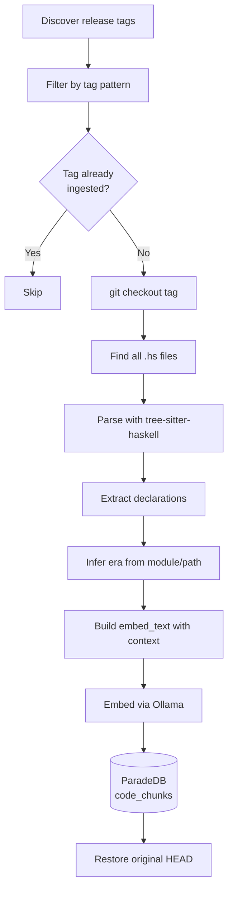

# Code Indexing Pipeline

The code indexing pipeline parses Haskell and Agda source code from the vendor submodules at every release tag, producing function-level chunks stored in ParadeDB's `code_chunks` table. This gives us searchable, era-tagged access to every function in the Cardano reference implementation across its entire release history.

## Pipeline Overview



After processing all pending tags for a repo, the pipeline restores the submodule to its original HEAD commit. The working tree is always left clean.

## Tracked Repositories

| Repo Name | Submodule Path | Tag Pattern | Example Tags |
|-----------|---------------|-------------|--------------|
| cardano-node | `vendor/cardano-node` | `^\d+\.\d+\.\d+$` | `8.7.3`, `10.1.4` |
| cardano-ledger | `vendor/cardano-ledger` | `^cardano-ledger-spec-\|^release/` | `cardano-ledger-spec-2024.04.03` |
| ouroboros-network | `vendor/ouroboros-network` | `^ouroboros-network-\d` | `ouroboros-network-0.16.0.0` |
| ouroboros-consensus | `vendor/ouroboros-consensus` | `^ouroboros-consensus-\d` | `ouroboros-consensus-0.21.0.0` |
| plutus | `vendor/plutus` | `^\d+\.\d+\.\d+\.\d+$` | `1.36.0.0` |
| formal-ledger-specs | `vendor/formal-ledger-specs` | `^conway-v` | `conway-v1.0` |

Tag patterns are compiled regex in `src/vibe_node/ingest/config.py`. They filter out pre-release tags, component sub-tags, and other noise that would bloat the index without adding value.

## tree-sitter-haskell Parsing

The parser extracts top-level declarations from every `.hs` file using tree-sitter-haskell. These are the node types recognized:

| Node Type | What It Captures |
|-----------|-----------------|
| `function` | Top-level function definitions (multi-equation grouped) |
| `bind` | Pattern bindings at the top level |
| `data_type` | `data` declarations |
| `newtype` | `newtype` declarations |
| `type_synomym` | `type` aliases (note: typo is in the grammar) |
| `type_family` | Type family declarations |
| `data_family` | Data family declarations |
| `class` | Type class declarations |
| `instance` | Type class instance declarations |
| `deriving_instance` | Standalone deriving instances |
| `foreign_import` | FFI import declarations |
| `foreign_export` | FFI export declarations |
| `pattern_synonym` | Pattern synonym declarations |
| `kind_signature` | Kind signature declarations |

### Multi-Equation Grouping

Haskell functions defined by pattern matching produce multiple consecutive `function` nodes with the same name. The parser groups these into a single chunk spanning from the first equation to the last. The chunk content includes all equations.

### Signature Attachment

Type signatures (`name :: Type -> Type`) are collected in a first pass and attached to the corresponding function definition in the second pass. They are stored in the `signature` field rather than as separate chunks, keeping the function and its type together.

### Minimum Size Filter

Chunks smaller than 2 lines are skipped unless they have a type signature attached. This filters out trivial one-liner bindings that add noise without value.

## Agda Parsing

For the `formal-ledger-specs` repo, an Agda parser (`agda_parser.py`) handles `.agda` and `.lagda` (literate Agda) files using regex-based extraction:

- Extracts `data`, `record`, type signatures (`name : Type`), and function definitions
- Handles literate Agda code blocks (`\begin{code}` / `\end{code}`), skipping hidden blocks
- Dedents code blocks to normalize indentation
- Module name extracted from `module ... where` line

This runs alongside tree-sitter Haskell parsing — the code ingestor detects file extension and routes to the appropriate parser.

## Era Inference

Every chunk is tagged with a Cardano era based on its module name and file path. Module-name patterns are checked first, then file-path patterns as a fallback. If neither matches, the era defaults to `"generic"`.

### Module Name Patterns

| Pattern | Era |
|---------|-----|
| `Cardano.Ledger.Byron` or `.Byron` | byron |
| `Cardano.Ledger.Allegra` | allegra |
| `Cardano.Ledger.ShelleyMA` or `Cardano.Ledger.Mary` | mary |
| `Cardano.Ledger.Shelley` or `Shelley.Spec` | shelley |
| `Cardano.Ledger.Alonzo` | alonzo |
| `Cardano.Ledger.Babbage` | babbage |
| `Cardano.Ledger.Conway` | conway |
| `Ouroboros.Consensus` | consensus |
| `Ouroboros.Network` | network |
| `PlutusCore` or `UntypedPlutusCore` | plutus |

### File Path Patterns (Fallback)

Directory names like `/byron/`, `/shelley/`, `/alonzo/`, `/plutus-core/`, `/consensus/`, `/network/` are matched case-insensitively against the file path when no module-name pattern hits.

## Idempotency Strategy

Deduplication operates at the **tag level**: before processing any tag, the pipeline queries for all distinct `release_tag` values already stored for that repo. Tags that are already present are skipped entirely. This means:

- Re-running the pipeline is safe and picks up only new tags
- If a tag was partially ingested (crash mid-way), re-running will attempt it again since partial tags are committed in 100-chunk batches
- Individual chunks have a unique constraint on `(repo, release_tag, file_path, function_name, content_hash)` with `ON CONFLICT DO NOTHING`
- **Content-hash dedup**: before embedding, checks if identical content exists at any previous tag — if so, reuses the embedding (no Ollama call). Dramatically reduces embedding cost for stable functions across releases.
- **Code tag manifest**: a separate `code_tag_manifest` table records `(repo, tag, file, function, content_hash)` for every function at every tag, enabling versioned codebase queries ("what existed at version X", "when was function Y removed").

## embed_text Construction

Each chunk's embedding is generated from a structured text that includes context beyond the raw source code:

```
Codebase: cardano-ledger
File: eras/shelley/impl/src/Cardano/Ledger/Shelley/Rules/Utxo.hs
Module: Cardano.Ledger.Shelley.Rules.Utxo
Function: validateUtxo
validateUtxo :: ... -> ... -> ...
<function body>
```

This contextual embedding allows vector search to distinguish between identically-named functions in different modules or codebases.

## CLI Usage

```bash
# Index all repos
vibe-node ingest code

# Single repo
vibe-node ingest code --repo cardano-ledger

# Limit to 3 tags per repo (for testing)
vibe-node ingest code --limit 3
```

## Key Files

| File | Purpose |
|------|---------|
| `src/vibe_node/ingest/code.py` | Pipeline orchestrator |
| `src/vibe_node/ingest/haskell_parser.py` | tree-sitter-haskell parser |
| `src/vibe_node/ingest/era_inference.py` | Module/path to era mapping |
| `src/vibe_node/ingest/config.py` | Repo paths and tag patterns |
| `infra/db/init.sql` | Database schema (`code_chunks` table) |
