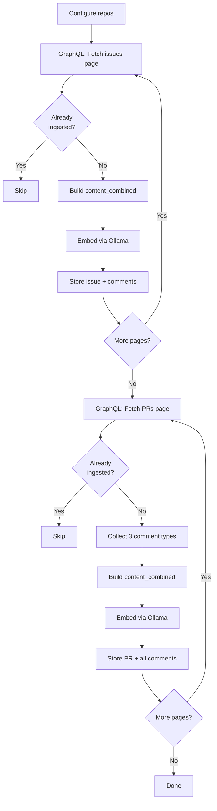

# GitHub Ingestion Pipeline

The GitHub ingestion pipeline fetches issues, pull requests, and their full discussion threads from 7 Cardano ecosystem repositories via GitHub's GraphQL API. The data is embedded and stored in ParadeDB for semantic search across design decisions, bug reports, and implementation context.

## Pipeline Overview



## Tracked Repositories

| Repository | Why |
|-----------|-----|
| IntersectMBO/cardano-node | Node implementation, configuration, deployment |
| IntersectMBO/cardano-ledger | Ledger rules, era transitions, validation |
| IntersectMBO/ouroboros-network | Network protocols, miniprotocol specs |
| IntersectMBO/ouroboros-consensus | Consensus logic, chain selection, storage |
| IntersectMBO/plutus | Script evaluation, cost models |
| IntersectMBO/formal-ledger-specifications | Formal specs in Agda, spec-vs-implementation gaps |
| cardano-foundation/CIPs | Cardano Improvement Proposals -- standards and design rationale |

## Database Tables

The pipeline populates 4 tables:

### github_issues

| Column | Type | Notes |
|--------|------|-------|
| `id` | UUID | Primary key |
| `repo` | VARCHAR(256) | e.g. `IntersectMBO/cardano-node` |
| `issue_number` | INTEGER | GitHub issue number |
| `title` | VARCHAR(512) | |
| `body` | TEXT | Original issue body |
| `state` | VARCHAR(16) | `open` or `closed` |
| `labels` | VARCHAR[] | Array of label names |
| `author` | VARCHAR(128) | GitHub login |
| `comment_count` | INTEGER | Number of comments |
| `content_combined` | TEXT | Title + body + all comments concatenated |
| `embedding` | vector(1536) | Embedding of content_combined |
| `linked_prs` | VARCHAR[] | Cross-references extracted from body |

### github_issue_comments

Individual comments stored separately for fine-grained retrieval. Each row references its parent `github_issues` row via `issue_id` with `ON DELETE CASCADE`.

### github_pull_requests

Same structure as issues, plus PR-specific fields: `merged`, `merge_commit_sha`, `base_branch`, `head_branch`, `merged_at`, `review_comment_count`, and `linked_issues`.

### github_pr_comments

PR comments come in three types, all stored in the same table:

| comment_type | Source | Extra Fields |
|-------------|--------|-------------|
| `comment` | General PR comments | -- |
| `review` | Review summary comments (APPROVE, CHANGES_REQUESTED, etc.) | -- |
| `review_comment` | Line-level review comments on specific code | `file_path`, `diff_hunk` |

The `file_path` and `diff_hunk` fields on review comments preserve the exact code context the reviewer was commenting on. This is gold for understanding why specific implementation choices were made or rejected.

## GraphQL Over REST

The choice to use GraphQL is not stylistic -- it is a hard requirement for practical ingestion at this scale.

**REST approach:** 1 API call per issue + 1 per comment page. A repo with 5,000 issues averaging 3 comments each would need ~20,000 API calls minimum. At GitHub's 5,000 req/hr rate limit, that is 4+ hours per repo.

**GraphQL approach:** 100 issues with their first 100 comments per request. The same 5,000 issues require ~100 API calls. Seven repos finish in minutes, not days.

The trade-off: GitHub's GraphQL API **requires authentication** even for public repos. A `GITHUB_TOKEN` with no special scopes is sufficient (it just needs to be present).

## Rate Limiting

The pipeline handles rate limiting automatically:

1. If a GraphQL response contains a rate limit error, the pipeline sleeps for 60 seconds and retries
2. Commits are issued every 100 items to avoid losing progress on long ingestion runs
3. A `GITHUB_TOKEN` provides 5,000 requests/hour; without one, the GraphQL API rejects all requests

## content_combined Construction

For both issues and PRs, the `content_combined` field concatenates:

```
# {title}

{body}

--- {author} ({date}) ---
{comment body}

--- {author} ({date}) ---
{comment body}
...
```

This field is what gets embedded and what powers full-text search. The structure preserves the conversational flow while keeping everything in a single searchable text.

## Idempotency

Each issue and PR is checked by `(repo, issue_number)` or `(repo, pr_number)` before processing. If a row exists, it is skipped. This makes the pipeline safe to re-run but does not update previously ingested items. For a full refresh, use `vibe-node db reset` first.

## CLI Usage

```bash
# Ingest all 7 repos
vibe-node ingest issues

# Single repo
vibe-node ingest issues --repo IntersectMBO/cardano-node

# Limit to 100 issues/PRs per repo (for testing)
vibe-node ingest issues --limit 100
```

Requires `GITHUB_TOKEN` to be set:

```bash
export GITHUB_TOKEN=ghp_your_token_here
# Or add to .env file in the project root
```

## Key Files

| File | Purpose |
|------|---------|
| `src/vibe_node/ingest/github.py` | GraphQL queries, issue/PR ingestion, comment storage |
| `src/vibe_node/ingest/config.py` | Repo list and token configuration |
| `infra/db/init.sql` | Database schema (4 GitHub tables) |
