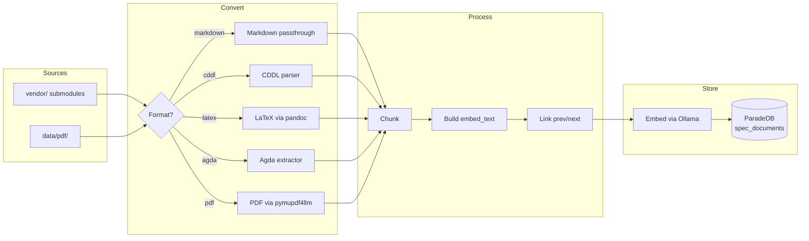

# Spec Ingestion Pipeline

The spec ingestion pipeline converts Cardano formal specifications from multiple formats into searchable, embeddable chunks stored in ParadeDB. It is the foundation of the project's spec consultation discipline -- every implementation decision starts by querying this database.

## Pipeline Overview



Converted files are cached at `data/specs/` keyed by `(source_repo, source_path, commit_hash)`. Re-runs skip the conversion step for any file whose cache entry already exists.

## Spec Sources

All 15 configured sources, ordered by format complexity:

| # | Repository | Glob Pattern | Format | Era |
|---|-----------|-------------|--------|-----|
| 1 | IntersectMBO/ouroboros-consensus | `docs/website/contents/**/*.md` | markdown | multi-era |
| 2 | IntersectMBO/cardano-ledger | `shelley/**/cddl-files/*.cddl` | cddl | shelley |
| 3 | IntersectMBO/cardano-ledger | `byron/cddl-spec/*.cddl` | cddl | byron |
| 4 | IntersectMBO/cardano-ledger | `shelley/chain-and-ledger/formal-spec/*.tex` | latex | shelley |
| 5 | IntersectMBO/cardano-ledger | `shelley/design-spec/*.tex` | latex | shelley |
| 6 | IntersectMBO/cardano-ledger | `byron/ledger/formal-spec/*.tex` | latex | byron |
| 7 | IntersectMBO/cardano-ledger | `byron/chain/formal-spec/*.tex` | latex | byron |
| 8 | IntersectMBO/cardano-ledger | `shelley-mc/formal-spec/*.tex` | latex | shelley-ma |
| 9 | IntersectMBO/cardano-ledger | `goguen/formal-spec/*.tex` | latex | alonzo |
| 10 | IntersectMBO/ouroboros-network | `docs/network-spec/*.tex` | latex | multi-era |
| 11 | IntersectMBO/ouroboros-network | `docs/network-design/*.tex` | latex | multi-era |
| 12 | IntersectMBO/ouroboros-consensus | `docs/report/**/*.tex` | latex | multi-era |
| 13 | IntersectMBO/plutus | `doc/plutus-core-spec/*.tex` | latex | plutus |
| 14 | IntersectMBO/formal-ledger-specifications | `src/Ledger/**/*.lagda` | agda | conway |
| 15 | IOG/ouroboros-papers | `*.pdf` | pdf | multi-era |

Sources are defined as `SpecSource` dataclasses in `src/vibe_node/ingest/specs/sources.py`. Adding a new source is one dataclass instance.

## Converters

### Markdown
Zero-dependency passthrough. The content is already in the target format. Used for the Ouroboros consensus website documentation.

### CDDL
Plain text format. The converter preserves CDDL type definitions as-is. Chunking uses a CDDL-aware splitter that keeps type definitions intact rather than splitting on arbitrary line counts.

### LaTeX
Converted to markdown via **pandoc**. For multi-file LaTeX documents (which is most of them), the `root_file` field in `SpecSource` identifies the main `.tex` file. The converter passes the source directory context so pandoc can resolve `\input` and `\include` references. Pandoc is an external dependency -- it must be installed on the host.

### Agda
Literate Agda (`.lagda`) files contain interleaved prose and formal Agda code. The converter extracts both, preserving code blocks as fenced code in the markdown output. The chunk type is overridden to `"agda"` for these sources.

### PDF
Converted via **pymupdf4llm**, which extracts text with layout awareness and outputs markdown directly. Used for the Ouroboros research papers (Praos, Genesis, Chronos, etc.) that exist only as PDFs. Binary files are passed by path rather than read into memory first.

## Chunking Strategy

After conversion to markdown, content is split into chunks using one of two strategies:

- **Markdown chunker** -- splits on heading boundaries (`#`, `##`, `###`), building a hierarchical title context. Each chunk carries `document_title`, `section_title`, and `subsection_title` fields.
- **CDDL chunker** -- splits on type definition boundaries, keeping each definition as a self-contained chunk.

### Hierarchical Titles

Every chunk stores three levels of title context:

| Field | Source |
|-------|--------|
| `document_title` | Derived from filename or top-level `#` heading |
| `section_title` | The nearest `##` heading above the chunk |
| `subsection_title` | The nearest `###` heading above the chunk |

### embed_text

The `embed_text` field prepends the full title hierarchy to the chunk content before embedding. This gives the embedding model the structural context it needs to distinguish between, say, a "Validation" section in the Shelley spec versus the Byron spec.

### prev/next Linking

Chunks within the same source file are linked as a doubly-linked list via `prev_chunk_id` and `next_chunk_id`. This allows retrieval to "expand context" by walking to adjacent chunks without re-parsing the original document.

## Idempotency

The pipeline checks for existing rows by `(source_repo, source_path, commit_hash)` before processing each file. If a row exists for that combination, the file is skipped entirely. This makes the pipeline safe to re-run -- it picks up where it left off.

## CLI Usage

```bash
# Ingest all spec sources
vibe-node ingest specs

# Only ingest markdown sources
vibe-node ingest specs --format markdown

# Only ingest sources matching "consensus"
vibe-node ingest specs --source consensus

# Limit to 5 files per source (for testing)
vibe-node ingest specs --limit 5

# Combine filters
vibe-node ingest specs --format latex --source ledger --limit 3
```

## Key Files

| File | Purpose |
|------|---------|
| `src/vibe_node/ingest/specs/pipeline.py` | Pipeline orchestrator |
| `src/vibe_node/ingest/specs/sources.py` | Source registry (15 sources) |
| `src/vibe_node/ingest/specs/chunker.py` | Markdown and CDDL chunkers |
| `src/vibe_node/ingest/specs/converters/` | Format-specific converters |
| `infra/db/init.sql` | Database schema |
