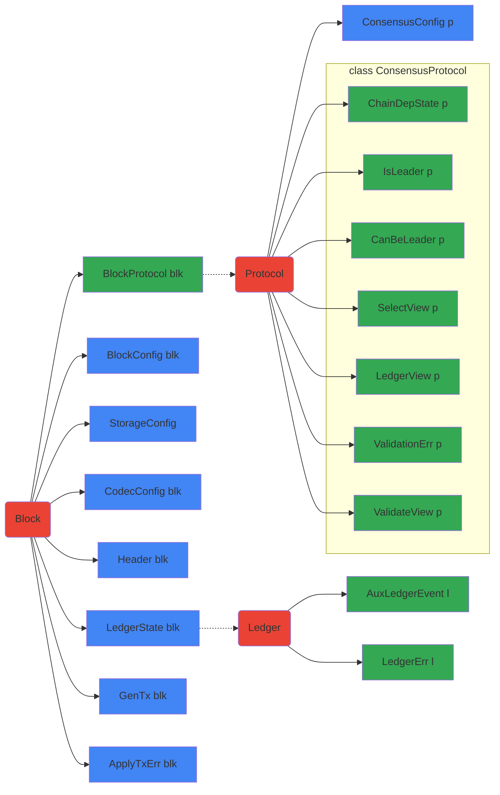

# Abstract Protocol

## Tutorials

### Overview

- [Ouroboros.Consensus.Tutorial.Simple](https://github.com/input-output-hk/ouroboros-consensus/blob/master/ouroboros-consensus/src/tutorials/Ouroboros/Consensus/Tutorial/Simple.lhs):
  Simple round-robin instantiation of the abstract Ouroboros consensus protocol.
- [Ouroboros.Consensus.Tutorial.WithEpoch](https://github.com/input-output-hk/ouroboros-consensus/blob/master/ouroboros-consensus/src/tutorials/Ouroboros/Consensus/Tutorial/WithEpoch.lhs):
  Example in which the leader schedule depends on data from the chain.

### Generating documents

From the `ouroboros-consensus` directory, run for your choice of `<output
file>`:

    pandoc -s -f markdown+lhs src-docs/Ouroboros/Consensus/Tutorial/Simple.lhs -o <output file>

## Key Type Families and Classes

The following diagram depicts the relation between various constructs in the
abstract specification of the protocol and the consensus-level view of th
ledger.
- Red boxes indicate concepts, or informal kinds (e.g., `ShelleyLedgerState`
  would have the informal kind `Ledger`).
- Blue boxes indicate data families.
- Green boxes indicate type families.
- Type or data families map the block attached to the incoming arrow to the
  block attached to the outgoing arrow. When there is no outgoing arrow, the
  family maps to any type (e.g., `BlockConfig blk`).


## Birds Eye Overview of Consensus Types (Galois)

See [Diagrammatic Conventions](#diagrammatic-conventions)

### Type Families (standalone and associated types)

From inspecting the directions of the arrows, it should be clear that `b<!-- B -->
fully determines---directly or indirectly---all the other types.

``` haskell
 P[rotocol]                       B[lock]                       L[edger]                     -- (the P,B,L "kinds")
===                              ===                           ===
                                                                                                  ┏━━━━━━━━━━━┓
 p  ──(ConsensusConfig<!-- P -->
 p  ◀──(BlockProtocol<!-- B -->
                                  b ──(LedgerState<!-- B -->
                                                                                                  ┗━━━━━━━━━━━┛

                                  b ──(LedgerState<!-- B -->
                                                              l ──(LedgerErr<!-- L -->


                                  b ──(CodecConfig<!-- B -->
                                  b ──(StorageConfig<!-- B -->
                                  b ──(Header<!-- B -->

                                              b,l ──(HeaderHash :: *→*)──────▶ hash   -- link block/ledger to a hash

  p ──(ChainDepState<!-- P -->
  p ──(IsLeader<!-- P -->
  p ──(CanBeLeader<!-- P -->
  p ──(SelectView<!-- P -->
  p ──(ValidateView<!-- P -->
  p ──(LedgerView<!-- P -->
  p ──(ValidationErr<!-- P -->

                     s ───(Ticked :: *→*)───▶ s'   -- time related changes applied to some state ('l', 'ledvw', 'cds')

                                  b ───(GenTx<!-- B -->
                                  b ───(ApplyTxErr<!-- B -->

                                  b,tx ───(Validated :: *→*)─────────────────▶ valb,valtx  -- add proof of validity to b,tx
```

### Type Constructors That are Type-Generic

These type constructors effectively function as type families (as type families are used in their definitions):
(This list is not exhaustive of all such types.)

```haskell
                                  b ────(Point<!-- B -->

                                  b ────(LedgerConfig<!-- B -->
                                  b ────(LedgerError<!-- B -->
                                  b ────(TickedLedgerState<!-- B -->

                                  b,l ──(HeaderFields :: *→*)────────▶ data .. = .. SlotNo .. BlockNo .. HeaderHash b ..
                                  b ────(ChainHash<!-- B -->
```

### Key Type Classes

The main `ConsensusProtocol` class:

```haskell
  class Ord (SelectView p) => ConsensusProtocol p where
    type family {ChainDepState, IsLeader, CanBeLeader, SelectView, LedgerView, ValidationErr, ValidateView}<!-- P -->
    checkIsLeader<!-- cc -->
    tickChainDepState<!-- cc -->
    updateChainDepState<!-- cc -->
    reupdateChainDepState<!-- cc -->
    protocolSecurityParam<!-- cc -->
```
Classes connected to headers and blocks:
```haskell
 class (StandardHash b, Typeable b) => HasHeader b where -- abstract over block headers
   getHeaderFields<!-- b -->

 class HasHeader (Header blk) => GetHeader blk where
   getHeader<!-- b -->
   blockMatchesHeader<!-- Header -->
   headerIsEBB<!-- Header -->
 
 class (HasHeader b, GetHeader b) => GetPrevHash b where   
   headerPrevHash<!-- Header -->
 
 -- construct the two views on block 'b' required by protocol 'p'
 class (GetPrevHash b, ConsensusProtocol p) => BlockSupportsProtocol b where              
   validateView<!-- bc -->
   selectView<!-- bc -->
```
Classes connected to ledgers:
```haskell
  class GetTip l where                         
    getTip<!-- l -->

  class (GetTip l, GetTip (Ticked l)) => IsLedger l where
    type family LedgerErr l<!-- Type -->
    type family AuxLedgerEvent l<!-- Type -->
    applyChainTickLedgerResult<!-- lc -->
        
  class (IsLedger l, HeaderHash l ~ HeaderHash b, HasHeader b, HasHeader (Header b)) => ApplyBlock l b where
    applyBlockLedgerResult<!-- lc -->
    reapplyBlockLedgerResult<!-- lc -->
    
  class ApplyBlock (LedgerState b) b => UpdateLedger b where
    {}

  -- | Link protocol to ledger
  class (BlockSupportsProtocol b, UpdateLedger b, ValidateEnvelope b) => LedgerSupportsProtocol b where
    protocolLedgerView<!-- lc -->
    ledgerViewForecastAt<!-- lc -->
      
  class (UpdateLedger b) => LedgerSupportsMempool b where
    txInvariant<!-- GenTx -->
    applyTx<!-- lc -->
    reapplyTx<!-- lc -->
    txsMaxBytes<!-- tls -->
    txInBlockSize<!-- tx -->
    txForgetValidated<!-- Validated -->
```

## Some Commonly Used Base Types (from pkgs ouroboros-consensus, cardano-base, and ouroboros-network)

``` haskell
data Forecast a = 
  Forecast { forecastAt<!-- WithOrigin -->
           , forecastFor<!-- SlotNo -->
           }

data LedgerResult l a = LedgerResult { lrEvents :: [AuxLedgerEvent l]        -- LedgerResult l a - The result of invoking 
                                     , lrResult :: !a                        -- a ledger function that does validation
                                     }

data WithOrigin t = Origin | At !t

newtype SlotNo = SlotNo {unSlotNo<!-- Word -->

data ChainHash b = GenesisHash | BlockHash !(HeaderHash b)

data HeaderFields b = HeaderFields { headerFieldSlot<!-- SlotNo -->
                                   , headerFieldBlockNo<!-- BlockNo -->
                                   , headerFieldHash<!-- HeaderHash -->
                                   }

-- | A point on the chain is identified by its 'Slot' and 'HeaderHash'.
newtype Point block = Point { getPoint<!-- WithOrigin -->

-- Point is commonly "viewed" as the following:
pattern GenesisPoint<!-- Point -->
pattern GenesisPoint = Point Origin
pattern BlockPoint<!-- SlotNo -->
pattern BlockPoint { atSlot, withHash } = Point (At (Point.Block atSlot withHash))
{-# COMPLETE GenesisPoint, BlockPoint #-}

```
  
## And Some Commonly Used Projections

``` haskell
blockHash<!-- HasHeader -->
blockHash = headerFieldHash . getHeaderFields

blockSlot<!-- HasHeader -->
blockSlot = headerFieldSlot . getHeaderFields

blockNo<!-- HasHeader -->
blockNo = headerFieldBlockNo . getHeaderFields
```

## Diagrammatic Conventions

- Code should all be viewed fixed-font, at least 140 chars wide.

- Regarding `P`, `B`, `L`
   - these are not kinds in the code, but "morally equivalent",  created for the sake of documentation.
   - `p`, `b`, and `l` are used as type names, respectively elements of the `P`,
     `B`, and `L` kinds.
  
- Associated types are not being distinguished from standalone type families.
  
- NOTE: For the sake of line-width, or clarity, "type variables" are sometimes
  used in place of "type-functions applied to variables".  This should not
  result in ambiguity.  E.g.,
   -  `p` in place of `BlockProtocol b`
   -  `cds` in place of `ChainDepState p`
  
- To reduce the "noise", these type-class constraints are being ignored:
  `NoThunks`, `Eq`, `Show`, `HasCallStack`; `Ord` is *not* being ignored.
