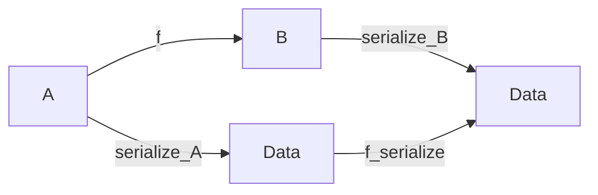

# Cryptographic primitives
Figure 1 introduces the cryptographic abstractions used in this document. Note that we define a family of serialization functions $\serialised{\wcard}_\type{A}$, for all types $\type{A}$ for which such serialization function can be defined. When the context is clear, we omit the type suffix, and use simply $\serialised{\wcard}$.

*Abstract types* $$\begin{equation*}
    \begin{array}{rlr}
      \var{vk} & \SKey & \text{signing key}\\
      \var{vk} & \VKey & \text{verifying key}\\
      \var{hk} & \KeyHash & \text{hash of a key}\\
      \sigma & \Sig  & \text{signature}\\
      \var{d} & \Data  & \text{data}\\
    \end{array}
\end{equation*}$$ *Derived types* $$\begin{equation*}
    \begin{array}{rlr}
      (sk, vk) & \SkVk & \text{signing-verifying key pairs}
    \end{array}
\end{equation*}$$ *Abstract functions* $$\begin{equation*}
    \begin{array}{rlr}
      \hash{} & \VKey \to \KeyHash
      & \text{hash function} \\
      %
      \fun{verify} & \VKey \times \Data \times \Sig
      & \text{verification relation}\\
      \serialised{\wcard}_\type{A} & \type{A} \to \Data
      & \text{serialization function for values of type $\type{A}$}\\
      \fun{sign} & \SKey \to \Data \to \Sig
      & \text{signing function}
    \end{array}
\end{equation*}$$ *Constraints* $$\begin{align*}
    & \forall (sk, vk) \in \SkVk,~ m \in \Data,~ \sigma \in \Sig \cdot
      \sign{sk}{m} = \sigma \Rightarrow \verify{vk}{m}{\sigma}
\end{align*}$$ *Notation* $$\begin{align*}
    & \mathcal{V}^\sigma_{\var{vk}}~{d} = \verify{vk}{d}{\sigma}
      & \text{shorthand notation for } \fun{verify}
\end{align*}$$

**Cryptographic definitions**
## A note on serialization
::: definition
For all types $\type{A}$ and $\type{B}$, given a function $\fun{f} \in \type{A} \to \type{B}$, we say that the serialization function for values of type $\type{A}$, namely $\serialised{ }_\type{A}$ distributes over $\fun{f}$ if there exists a function $\fun{f}_{\serialised{ }}$ such that for all $a \in \type{A}$: $$\begin{equation}
    \label{eq:distributivity-serialization}
    \serialised{\fun{f}~a}_\type{B} = \fun{f}_{\serialised{ }}~\serialised{a}_\type{A}
\end{equation}$$

The equality defined in eq:distributivity-serialization means that the following diagram commutes:

Throughout this specification, whenever we use $\serialised{\fun{f}~a}_\type{B}$, for some type $\type{B}$ and function $\fun{f} \in \type{A} \to \type{B}$, we assume that $\serialised{ }_\type{A}$ distributes over $\fun{f}$ (see for example Rule eq:utxo-witness-inductive). This property is what allow us to extract a component of the serialized data (if it is available) without deserializing it in the cases in which the deserialization function ($\serialised{\wcard}^{-1}_\type{A}$) doesn't behave as an inverse of serialization:

$$\begin{equation*}
  \serialised{\wcard}^{-1}_\type{A} \cdot \serialised{\wcard}_\type{A} \neq \fun{id}_\type{A}
\end{equation*}$$

For the cases in which such an inverse exists, given a function $\fun{f}$, we can readily define $\fun{f}_{\serialised{ }}$ as:

$$\begin{equation*}
  \fun{f}_{\serialised{ }} \dot{=} \serialised{\wcard}_\type{B}
                            . \fun{f}
                            . \serialised{\wcard}^{-1}_\type{A}
\end{equation*}$$
