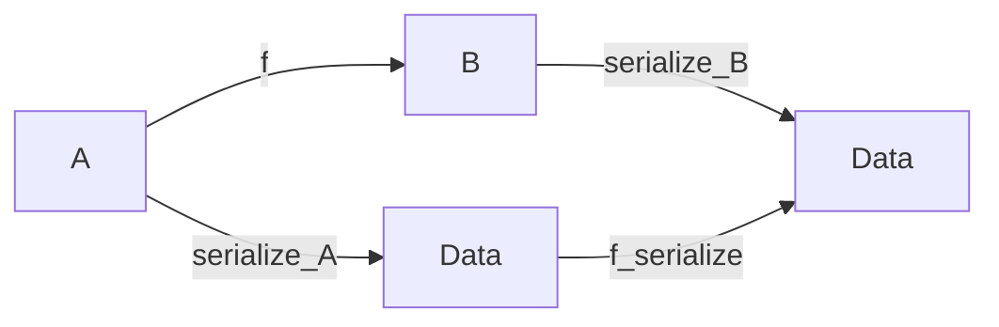

# Cryptographic primitives
Figure 1 introduces the cryptographic abstractions used in this document. Note that we define a family of serialization functions $\lbrack\!\lbrack \mathit{\underline{\phantom{a}}} \rbrack\!\rbrack_\mathsf{A}$, for all types $\mathsf{A}$ for which such serialization function can be defined. When the context is clear, we omit the type suffix, and use simply $\lbrack\!\lbrack \mathit{\underline{\phantom{a}}} \rbrack\!\rbrack$.

*Abstract types* $$\begin{equation*}
    \begin{array}{rlr}
      \mathit{vk} & \mathsf{SKey} & \text{signing key}\\
      \mathit{vk} & \mathsf{VKey} & \text{verifying key}\\
      \mathit{hk} & \mathsf{KeyHash} & \text{hash of a key}\\
      \sigma & \mathsf{Sig}  & \text{signature}\\
      \mathit{d} & \mathsf{Data}  & \text{data}\\
    \end{array}
\end{equation*}$$ *Derived types* $$\begin{equation*}
    \begin{array}{rlr}
      (sk, vk) & \mathsf{SkVk} & \text{signing-verifying key pairs}
    \end{array}
\end{equation*}$$ *Abstract functions* $$\begin{equation*}
    \begin{array}{rlr}
      \mathrm{hash}~ & \mathsf{VKey} \to \mathsf{KeyHash}
      & \text{hash function} \\
      %
      \mathsf{verify} & \mathsf{VKey} \times \mathsf{Data} \times \mathsf{Sig}
      & \text{verification relation}\\
      \lbrack\!\lbrack \mathit{\underline{\phantom{a}}} \rbrack\!\rbrack_\mathsf{A} & \mathsf{A} \to \mathsf{Data}
      & \text{serialization function for values of type $\mathsf{A}$}\\
      \mathsf{sign} & \mathsf{SKey} \to \mathsf{Data} \to \mathsf{Sig}
      & \text{signing function}
    \end{array}
\end{equation*}$$ *Constraints* $$\begin{align*}
    & \forall (sk, vk) \in \mathsf{SkVk},~ m \in \mathsf{Data},~ \sigma \in \mathsf{Sig} \cdot
      \mathsf{sign}~sk~m = \sigma \Rightarrow \mathsf{verify}~vk~m~\sigma
\end{align*}$$ *Notation* $$\begin{align*}
    & \mathcal{V}^\sigma_{\mathit{vk}}~{d} = \mathsf{verify}~vk~d~\sigma
      & \text{shorthand notation for } \mathsf{verify}
\end{align*}$$

**Cryptographic definitions**
## A note on serialization
::: definition
For all types $\mathsf{A}$ and $\mathsf{B}$, given a function $\mathsf{f} \in \mathsf{A} \to \mathsf{B}$, we say that the serialization function for values of type $\mathsf{A}$, namely $\lbrack\!\lbrack \mathit{ } \rbrack\!\rbrack_\mathsf{A}$ distributes over $\mathsf{f}$ if there exists a function $\mathsf{f}_{\lbrack\!\lbrack \mathit{ } \rbrack\!\rbrack}$ such that for all $a \in \mathsf{A}$: $$\begin{equation}
    \label{eq:distributivity-serialization}
    \lbrack\!\lbrack \mathit{\mathsf{f}~a} \rbrack\!\rbrack_\mathsf{B} = \mathsf{f}_{\lbrack\!\lbrack \mathit{ } \rbrack\!\rbrack}~\lbrack\!\lbrack \mathit{a} \rbrack\!\rbrack_\mathsf{A}
\end{equation}$$

The equality defined in eq:distributivity-serialization means that the following diagram commutes:

Throughout this specification, whenever we use $\lbrack\!\lbrack \mathit{\mathsf{f}~a} \rbrack\!\rbrack_\mathsf{B}$, for some type $\mathsf{B}$ and function $\mathsf{f} \in \mathsf{A} \to \mathsf{B}$, we assume that $\lbrack\!\lbrack \mathit{ } \rbrack\!\rbrack_\mathsf{A}$ distributes over $\mathsf{f}$ (see for example Rule eq:utxo-witness-inductive). This property is what allow us to extract a component of the serialized data (if it is available) without deserializing it in the cases in which the deserialization function ($\lbrack\!\lbrack \mathit{\underline{\phantom{a}}} \rbrack\!\rbrack^{-1}_\mathsf{A}$) doesn't behave as an inverse of serialization:

$$\begin{equation*}
  \lbrack\!\lbrack \mathit{\underline{\phantom{a}}} \rbrack\!\rbrack^{-1}_\mathsf{A} \cdot \lbrack\!\lbrack \mathit{\underline{\phantom{a}}} \rbrack\!\rbrack_\mathsf{A} \neq \mathsf{id}_\mathsf{A}
\end{equation*}$$

For the cases in which such an inverse exists, given a function $\mathsf{f}$, we can readily define $\mathsf{f}_{\lbrack\!\lbrack \mathit{ } \rbrack\!\rbrack}$ as:

$$\begin{equation*}
  \mathsf{f}_{\lbrack\!\lbrack \mathit{ } \rbrack\!\rbrack} \dot{=} \lbrack\!\lbrack \mathit{\underline{\phantom{a}}} \rbrack\!\rbrack_\mathsf{B}
                            . \mathsf{f}
                            . \lbrack\!\lbrack \mathit{\underline{\phantom{a}}} \rbrack\!\rbrack^{-1}_\mathsf{A}
\end{equation*}$$
