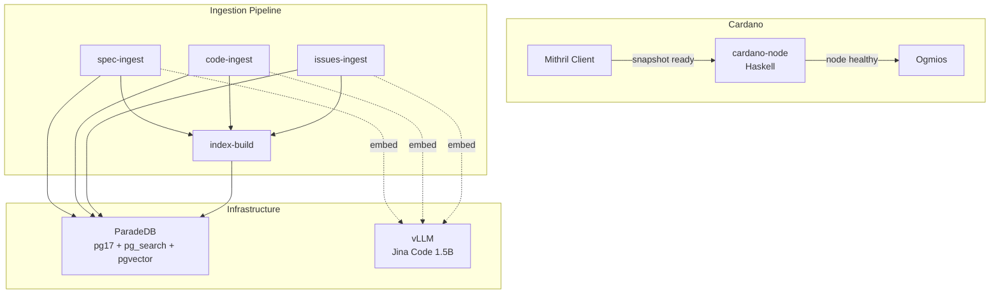
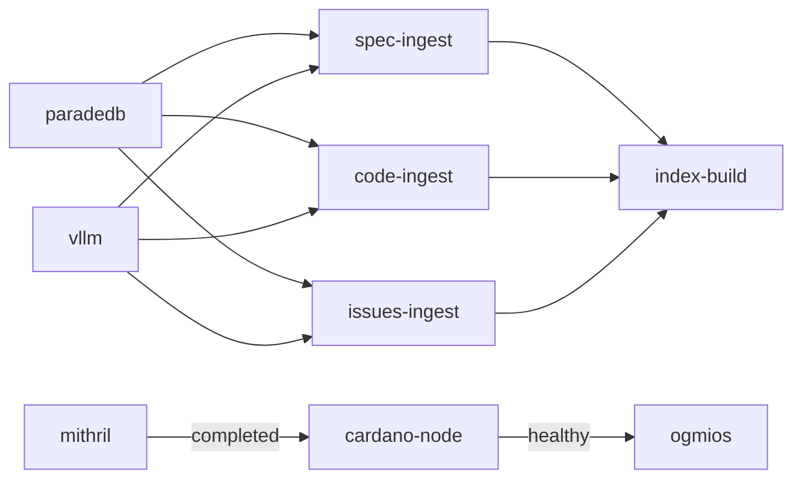
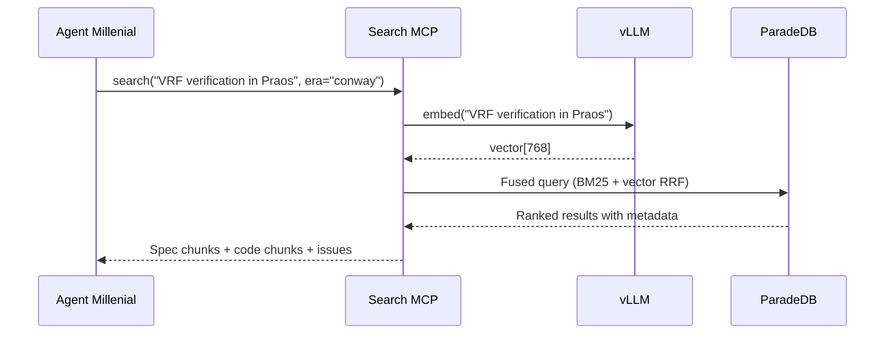
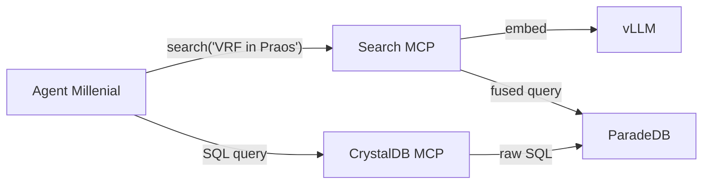

# Phase 0: Development Architecture — Design Spec

**Date:** 2026-03-14
**Status:** Approved
**Author:** Agent Millenial (Claude Opus 4.6)
**Reviewer:** Elder Millenial

---

## Overview

Phase 0 establishes the complete development infrastructure for vibe-node. It produces zero node code. Its purpose is to equip every subsequent phase with:

- A searchable, era-versioned knowledge base of every Cardano spec, Haskell source release, and GitHub issue
- A live Cardano node environment for conformance testing
- MCP integrations so Agent Millenial can query specs and code mid-implementation
- A containerized, reproducible pipeline that anyone can run from a fresh clone
- Documentation structure that serves both the general public and developers

This phase directly supports two objectives:

1. **Pi Lanningham's challenge** — build a spec-compliant Cardano node, vibe-coded in public
2. **Chris's spec gap analysis opportunity** — produce era-aware tooling that compares published specs against the Haskell node implementation, documenting divergences like errata in a scientific publication

The gap analysis is not a discrete phase — it is a discipline woven into every development step from Phase 1 onward. Phase 0 builds the infrastructure that makes this discipline possible.

---

## Docker Compose Stack

### Services



### Service Details

| Service | Image | Purpose | Depends On |
|---------|-------|---------|------------|
| **paradedb** | `paradedb/paradedb:latest` (pg17) | Document database with BM25 + vector search | — |
| **vllm** | `vllm/vllm-openai:latest` | Embedding inference (Jina Code 1.5B) | — |
| **mithril** | Custom Dockerfile | Download mainnet/testnet snapshot | — |
| **cardano-node** | `ghcr.io/intersectmbo/cardano-node` | Haskell reference node | mithril (completed) |
| **ogmios** | `cardanosolutions/ogmios` | JSON/WebSocket interface to cardano-node | cardano-node (healthy) |
| **spec-ingest** | Custom Dockerfile | Convert and ingest spec documents | paradedb (healthy), vllm (healthy) |
| **code-ingest** | Custom Dockerfile | Index Haskell source per release | paradedb (healthy), vllm (healthy) |
| **issues-ingest** | Custom Dockerfile | Index GitHub issues | paradedb (healthy), vllm (healthy) |
| **index-build** | Custom Dockerfile | Build BM25 + HNSW indexes, run smoke tests | spec-ingest, code-ingest, issues-ingest |

### Dependency Chain



Infrastructure services (paradedb, vllm) and Cardano services (mithril → cardano-node → ogmios) start independently. The ingestion pipeline depends on infrastructure services only.

### Volumes

| Volume | Purpose |
|--------|---------|
| `paradedb-data` | Persistent database storage |
| `cardano-node-data` | Chain state + Mithril snapshot |
| `mithril-data` | Snapshot downloads |
| `vllm-cache` | Model weights cache |

---

## Haskell Node Git Submodule

The following repositories are added as git submodules under `vendor/`:

| Submodule | Path | Purpose |
|-----------|------|---------|
| [cardano-node](https://github.com/IntersectMBO/cardano-node) | `vendor/cardano-node` | Node source, release tags, integration code |
| [cardano-ledger](https://github.com/IntersectMBO/cardano-ledger) | `vendor/cardano-ledger` | Ledger rules, formal specs, CDDL schemas |
| [ouroboros-network](https://github.com/IntersectMBO/ouroboros-network) | `vendor/ouroboros-network` | Networking protocols, miniprotocol implementations |

Each submodule provides:

- Direct source exploration without leaving the project
- Git history traversal for release-to-release diffing
- Tag-based checkout for the code indexing pipeline

Submodules are pinned to specific commits but the code-ingest pipeline walks all release tags independently across all three repositories.

---

## ParadeDB Schema & Search Architecture

### Tables

#### `spec_documents`

Stores converted spec content chunked by section, definition, or rule.

| Column | Type | Description |
|--------|------|-------------|
| `id` | uuid | Primary key |
| `title` | text | Section/chunk title |
| `source_repo` | text | Source repository (e.g. "IntersectMBO/cardano-ledger") |
| `source_path` | text | Original file path |
| `era` | text | byron, shelley, alonzo, babbage, conway |
| `spec_version` | text | Version/revision of the spec |
| `published_date` | timestamp | When this version was published |
| `content_markdown` | text | Mathpix markdown with math notation |
| `content_plain` | text | Stripped text for BM25 indexing |
| `embedding` | vector(768) | Jina Code 1.5B embedding |
| `chunk_type` | text | section, definition, rule, schema |
| `parent_document_id` | uuid | FK to parent document for section-level chunks |
| `metadata` | jsonb | Flexible extra fields |

#### `code_chunks`

Stores function-level Haskell source indexed per release.

| Column | Type | Description |
|--------|------|-------------|
| `id` | uuid | Primary key |
| `repo` | text | Source repo (e.g. "cardano-node", "cardano-ledger") |
| `release_tag` | text | Release version (e.g. "10.4.1") |
| `commit_hash` | text | Git commit SHA |
| `commit_date` | timestamp | When the release was committed |
| `file_path` | text | File path within the repo |
| `module_name` | text | Haskell module (e.g. "Cardano.Ledger.Alonzo.Rules") |
| `function_name` | text | Function or definition name |
| `line_start` | int | Starting line number |
| `line_end` | int | Ending line number |
| `content` | text | The actual Haskell source |
| `signature` | text | Type signature if available |
| `embedding` | vector(768) | Jina Code 1.5B embedding |
| `era` | text | Inferred from module path |
| `metadata` | jsonb | Flexible extra fields |

#### `github_issues`

Stores GitHub issues for historical bug/ambiguity awareness.

| Column | Type | Description |
|--------|------|-------------|
| `id` | uuid | Primary key |
| `repo` | text | Source repository |
| `issue_number` | int | GitHub issue number |
| `title` | text | Issue title |
| `body` | text | Issue body |
| `state` | text | open, closed |
| `labels` | text[] | Issue labels |
| `created_at` | timestamp | When the issue was created |
| `closed_at` | timestamp | When the issue was closed (if applicable) |
| `author` | text | Issue author |
| `content_combined` | text | Title + body concatenated for search |
| `embedding` | vector(768) | Jina Code 1.5B embedding |
| `metadata` | jsonb | Flexible extra fields |

### Search Indexes

Each table gets both index types:

- **BM25 index** via `pg_search` — on text content columns (`content_plain`, `content`, `content_combined`)
- **HNSW vector index** via `pgvector` — on `embedding` columns

### Search Flow



**Fused search** uses ParadeDB's native reciprocal rank fusion (RRF) to combine BM25 keyword matches with vector similarity scores. Results are filterable by era, release tag, date range, repo, and chunk type.

---

## Ingestion Pipelines

All pipelines are containerized, idempotent, and independently runnable.

### spec-ingest

**Sources:**

| Source | Format | Repository |
|--------|--------|------------|
| Shelley formal spec | LaTeX/PDF | IntersectMBO/cardano-ledger |
| Alonzo formal spec | LaTeX/PDF | IntersectMBO/cardano-ledger |
| Babbage formal spec | LaTeX/PDF | IntersectMBO/cardano-ledger |
| Conway formal spec (CIP-1694) | LaTeX/PDF | IntersectMBO/cardano-ledger |
| Byron CBOR spec | PDF | IntersectMBO/cardano-ledger |
| Ouroboros Classic/BFT/Praos/Genesis | Academic PDF | IOG research papers |
| Network design spec | PDF/Markdown | IntersectMBO/ouroboros-network |
| CIPs | Markdown | cardano-foundation/CIPs |
| CDDL schemas | CDDL | IntersectMBO/cardano-ledger |

**Pipeline:**

1. Pull source documents from known repositories
2. For PDFs: PaddleOCR → Mathpix markdown (preserves equations as `$...$` / `$$...$$`)
3. For LaTeX: pandoc → markdown with math delimiters
4. For existing markdown/CDDL: direct ingestion
5. Chunk by document structure (sections, definitions, rules) — not arbitrary token windows
6. Embed each chunk via vLLM/Jina Code 1.5B endpoint
7. Load into `spec_documents` with full metadata
8. Track ingested content by source path + content hash for idempotency

**Output:** Converted specs are also written to `docs/specs/` as browsable markdown pages in mkdocs (with MathJax/KaTeX rendering via `pymdownx.arithmatex`).

### code-ingest

**Repositories indexed:**

| Submodule | What it contains |
|-----------|-----------------|
| `vendor/cardano-node` | Node integration, CLI, topology, configuration |
| `vendor/cardano-ledger` | Ledger rules (the core spec implementation), CDDL schemas, era-specific logic |
| `vendor/ouroboros-network` | Networking stack, miniprotocol implementations, multiplexer |

**Pipeline:**

1. For each submodule, walk git tags (release tags only)
2. For each release tag: checkout the tag
3. Parse Haskell source files using **tree-sitter-haskell** for AST-aware function-level chunking
4. Extract: function definitions, type signatures, data declarations, class instances
5. For each chunk, record: repo, file path, module name, function name, line range, release tag, commit date, inferred era
6. Embed via vLLM/Jina Code 1.5B endpoint
7. Load into `code_chunks`
8. Skip already-indexed (repo, release_tag) pairs for idempotency

**Era inference:** Module paths map to eras (e.g. `Cardano.Ledger.Alonzo.*` → alonzo). A mapping table is maintained in the ingest config.

### issues-ingest

**Pipeline:**

1. Pull all issues (open + closed) via GitHub API from:
   - `IntersectMBO/cardano-node`
   - `IntersectMBO/cardano-ledger`
   - `IntersectMBO/ouroboros-network`
2. Store title, body, labels, dates, state, author
3. Embed title + body combined via vLLM endpoint
4. Load into `github_issues`
5. Track by repo + issue number; update changed issues on re-run

### index-build

**Pipeline:**

1. Create/refresh BM25 indexes via `pg_search` on all text columns
2. Create/refresh HNSW vector indexes via `pgvector` on all embedding columns
3. Run smoke tests: execute known queries against each table, verify results
4. Report index stats: row counts, index sizes, sample search latencies
5. Exit with success/failure code

### Logging & Observability

All containers emit structured JSON logs with:
- Timestamp, service name, operation
- Documents processed, chunks created, errors encountered
- Progress indicators (N of M releases indexed, etc.)

---

## Embedding Model

**Model:** Jina Code Embeddings 1.5B (`jinaai/jina-code-embeddings-1.5b`)

| Attribute | Value |
|-----------|-------|
| Parameters | 1.5B |
| Base | Qwen2.5-Coder-1.5B |
| Context window | 8,192 tokens |
| Embedding dimensions | 768 |
| vLLM support | Yes |
| License | Apache 2.0 |
| Code-specific | Yes — text-to-code, code-to-code retrieval |
| Haskell exposure | Via Qwen2.5-Coder pre-training (80+ languages) |

**Why this model:**
- Code-specialized with Qwen2.5-Coder base — understands code structure, not just text
- Small enough (~3GB VRAM) to run alongside the full compose stack
- vLLM-native for high-throughput batch embedding during ingestion
- Any deficiencies are mitigated by BM25 keyword search via fused retrieval — exact function names, type signatures, and error codes are captured by keyword matching even when the embedding model misses semantic nuance

---

## MCP Integrations

### Search MCP

The primary interface for spec and code consultation during development.

**Tool:** `search(query: str, filters: dict | None) → results`

- Accepts natural language, code snippets, or mixed queries
- Embeds the query via vLLM/Jina Code endpoint
- Executes RRF fused search (BM25 + vector) across all tables
- Returns ranked results with source metadata and content

**Filter schema:**

| Key | Type | Description | Example |
|-----|------|-------------|---------|
| `era` | str \| list[str] | Filter by Cardano era(s) | `"conway"` or `["alonzo", "babbage"]` |
| `release_tag` | str \| list[str] | Filter by Haskell node release(s) | `"10.4.1"` or `["9.0.0", "10.4.1"]` |
| `repo` | str \| list[str] | Filter by source repository | `"cardano-ledger"` |
| `date_range` | dict `{from: str, to: str}` | ISO 8601 date range | `{"from": "2023-01-01", "to": "2024-01-01"}` |
| `chunk_type` | str \| list[str] | Filter by content type | `"rule"` or `["definition", "rule"]` |
| `table` | str \| list[str] | Restrict to specific table(s) | `"spec_documents"` or `["code_chunks", "spec_documents"]` |

All filter keys are optional. When omitted, search spans all content.

### CrystalDB MCP

Raw SQL access to ParadeDB for ad-hoc queries.

- Direct SQL execution against the ParadeDB instance
- Used for: complex joins, aggregations, specific lookups, schema exploration
- Available when the search MCP's ranked retrieval isn't the right tool

### MCP Architecture



---

## CLI Commands

The `vibe-node` CLI is the single entry point for all infrastructure operations.

### Infrastructure Management

```
vibe-node infra up          # docker compose up the full stack
vibe-node infra down        # tear down all services
vibe-node infra status      # healthcheck status of all services
vibe-node infra logs        # tail logs across services
```

### Ingestion

```
vibe-node ingest specs      # run spec ingestion pipeline
vibe-node ingest code       # run code indexing pipeline
vibe-node ingest issues     # run GitHub issues indexing
vibe-node ingest all        # run full pipeline (specs → code → issues → index-build)
```

### Database

```
vibe-node db snapshot       # pg_dump the current ParadeDB state
vibe-node db restore        # restore from a snapshot
vibe-node db search "query" # quick fused search from the terminal
```

### Node (future)

```
vibe-node serve             # start the Cardano node (Phase 1+)
```

All infra/ingest/db commands are thin wrappers around `docker compose` and container exec — the containers do the work.

**Failure behavior:** `vibe-node ingest all` runs pipelines sequentially (specs → code → issues → index-build). If a pipeline fails, the CLI reports the error and halts — it does not continue to the next pipeline, since index-build depends on all three completing. Individual pipelines (`vibe-node ingest specs`) can be re-run independently after fixing the issue.

---

## Documentation Structure

### mkdocs nav

```yaml
nav:
  - Home: index.md
  - How We Build:
    - Methodology: methodology/index.md
    - Toolchain: methodology/toolchain.md
    - Agent Architecture: methodology/agents.md
    - Coordination: methodology/coordination.md
    - Workflow: methodology/workflow.md
  - Specs:
    - Overview: specs/index.md
    - Byron: specs/byron/...
    - Shelley: specs/shelley/...
    - Alonzo: specs/alonzo/...
    - Babbage: specs/babbage/...
    - Conway: specs/conway/...
    - Ouroboros: specs/ouroboros/...
    - Network: specs/network/...
    - CIPs: specs/cips/...
    - CDDL: specs/cddl/...
  - Gap Analysis:
    - Overview: gap-analysis/index.md
  - Architecture:
    - Overview: architecture/overview.md
  - Roadmap:
    - Milestones: roadmap/milestones.md
  - Development Log:
    - Journal: devlog/index.md
```

### Content by Section

| Section | Phase 0 Content |
|---------|----------------|
| **How We Build** | Full methodology docs: Claude Code + Opus 4.6, MCPs, skills, Plane coordination, Agent Millenial orchestrator, worker agent approach, step-by-step workflow |
| **Specs** | All converted spec documents, browsable with math rendering |
| **Gap Analysis** | Methodology page only — entries fill during Phase 1+ development |
| **Architecture** | Node architecture — empty until Phase 1 |
| **Roadmap** | Updated milestones reflecting Phase 0 completion |
| **Dev Log** | Phase 0 journal entries |

### Math Rendering

mkdocs-material supports MathJax/KaTeX via the `pymdownx.arithmatex` extension. Mathpix markdown uses `$...$` (inline) and `$$...$$` (display) delimiters which render natively. This must be enabled in `mkdocs.yml`.

---

## CLAUDE.md Updates

The following development discipline is added to CLAUDE.md:

### Spec Consultation Discipline

Every implementation step must:

1. **Consult the spec** — Use the search MCP to find the relevant spec sections before writing implementation code
2. **Implement against the spec** — Code should trace back to specific spec definitions and rules
3. **Test against the Haskell node** — The Haskell node is the oracle of truth
4. **Document observed gaps** — Any divergence between spec and Haskell implementation is recorded in `docs/gap-analysis/`

### Gap Analysis Entry Format

Each entry in `docs/gap-analysis/` follows this structure:

```markdown
## [Subsystem] — [Brief description of divergence]

**Spec reference:** [Document, section, page/equation number]
**Era:** [Which era this applies to]
**Spec says:** [What the spec defines]
**Haskell does:** [What the Haskell node actually implements]
**Delta:** [The specific difference]
**Implications:** [How this affects our implementation]
**Discovered during:** [Which phase/task uncovered this]
```

---

## Snapshot & Restore

After the full ingestion pipeline completes:

1. `vibe-node db snapshot` runs `pg_dump --format=custom --compress=zstd` against ParadeDB
2. The dump file is stored locally at `snapshots/<timestamp>.dump` (and optionally uploaded to a known location)
3. `vibe-node db restore` runs `pg_restore` to load the dump into a fresh ParadeDB instance
4. This allows new developers to skip the full ingestion pipeline (which may take hours for 80+ releases across 3 repositories)

**Format:** PostgreSQL custom format with zstd compression — portable across pg17 instances, supports parallel restore, and compresses well for large vector data.

The snapshot mechanism is also useful for CI — restore a known-good database state before running tests.

---

## What Phase 0 Does NOT Include

- Node implementation code (no networking, consensus, ledger, or protocol logic)
- Gap analysis content (the section exists but entries are written during Phase 1+)
- Performance benchmarks or conformance tests (these arrive with the code they test)

---

## Success Criteria

Phase 0 is complete when:

1. `vibe-node infra up` brings up the full compose stack (ParadeDB, vLLM, Mithril, cardano-node, Ogmios)
2. `vibe-node ingest all` populates the knowledge base from source
3. `vibe-node db search "Ouroboros Praos VRF"` returns relevant spec chunks, code chunks, and issues
4. The search MCP and CrystalDB MCP are functional and configured in `.mcp.json`
5. `docs/specs/` contains browsable, math-rendered spec documents
6. `docs/methodology/` documents the complete development approach
7. `uv run mkdocs serve` renders the full documentation site
8. `vibe-node db snapshot` and `vibe-node db restore` round-trip successfully
9. A fresh clone can reproduce the entire setup via documented steps
